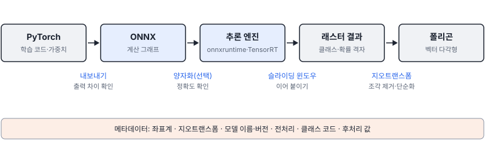
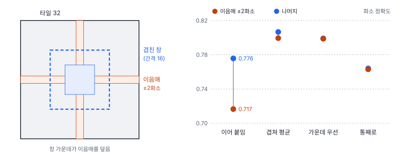
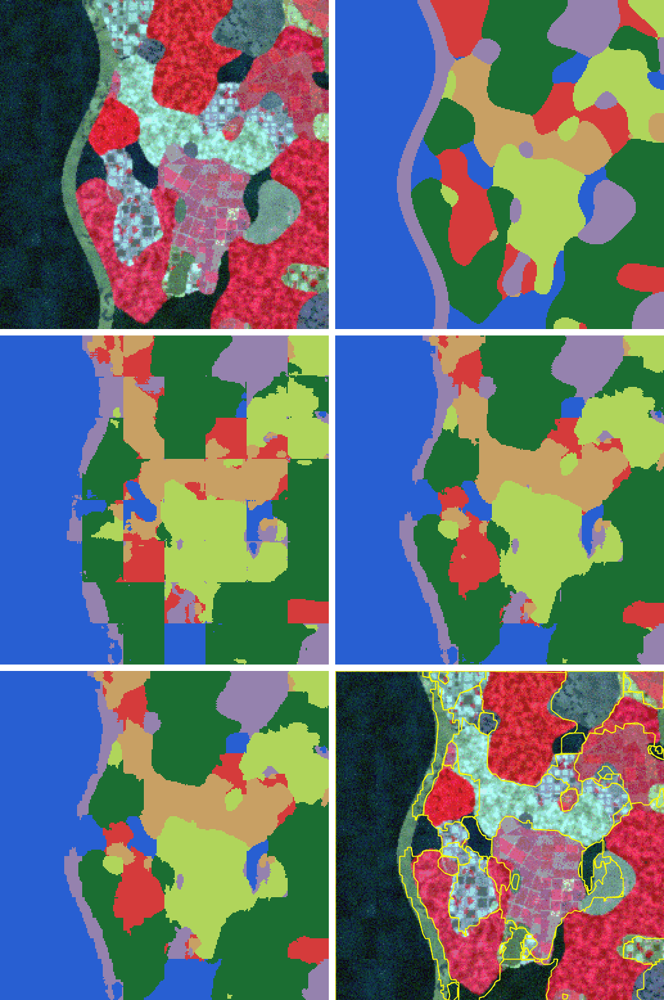

# 50강 내보내기와 배포

## 이 강에서 얻는 것

- 학습한 모델을 ONNX로 내보내고 출력 차이를 확인한 뒤, 추론 엔진과 int8 양자화를 정확도와 함께 판단할 수 있음
- 지연시간과 처리량을 구분해 재고, 큰 장면을 슬라이딩 윈도우로 이음매 없이 추론할 수 있음
- 지오트랜스폼으로 래스터 결과를 지도 좌표에 놓고, 폴리곤화·조각 제거·단순화를 거쳐 메타데이터와 함께 납품할 수 있음

## 1. 학습 코드에서 배포 형식으로

학습이 끝난 모델은 파이썬 클래스와 가중치 파일로 남아 있어, 같은 코드와 라이브러리가 있어야 돌아감. 배포에서는 이것을 **ONNX(개방형 신경망 교환 형식, Open Neural Network Exchange)**로 내보내는 경우가 많음. ONNX는 연산 순서를 적은 **계산 그래프**와 가중치를 프레임워크와 상관없이 담는 형식이라, 여러 추론 엔진이 같은 파일을 읽음.



내보낼 때 정할 것이 둘임. **opset**은 ONNX 연산자 정의의 버전 번호로, 엔진이 그 버전을 지원해야 읽힘. **동적 축**은 크기를 비워 둔 입력 축으로, 보통 배치 축을 비워 한 장도 64장도 넣을 수 있게 함. 내보내기 전에 `model.eval()`로 추론 모드로 바꿈(29강).

```python
m.eval()                                              # 추론 모드(29강)
torch.onnx.export(m, torch.zeros(1, 4, 32, 32), "vdcnn.onnx",
    opset_version=17, input_names=["x"], output_names=["logits"],
    dynamic_axes={"x": {0: "n"}, "logits": {0: "n"}}, dynamo=False)
s = ort.InferenceSession("vdcnn.onnx")                # onnxruntime으로 읽음
diff = abs(s.run(None, {"x": x})[0] - m(torch.tensor(x)).detach().numpy()).max()
```

PyTorch 2.14의 기본은 `dynamo=True`인 새 방식이고 여기서는 예전 방식을 썼음. 5부 VD-CNN(27강)을 opset 17로 내보내니 96.3 KB였음. 배치 정규화가 앞 합성곱에 합쳐져 그래프에는 합성곱·ReLU·풀링·선형 층만 남고, 그래프에 담긴 값은 파라미터 24,342개보다 적은 24,118개였음(배치 정규화를 뺀 수, 30강). 시험 타일 900장에서 PyTorch와의 로짓 차이는 최대 $3.8 \times 10^{-6}$이고 예측 클래스는 100% 같았음. 반올림 수준이면 정상이고, 클래스가 바뀔 만큼 다르면 전처리나 모드를 의심함. 밴드 순서와 표준화 평균·표준편차는 그래프에 들어가지 않으므로 모델과 함께 넘김.

## 2. 추론 엔진: onnxruntime과 TensorRT

**onnxruntime**은 ONNX를 읽어 실행하는 엔진으로, 실행 공급자(execution provider)를 바꿔 CPU·NVIDIA GPU 등에서 같은 파일을 돌림. **TensorRT(TRT)**는 NVIDIA GPU 전용 최적화 도구로, ONNX를 읽어 그 GPU에 맞춘 엔진 파일을 빌드함. 빌드 때 여러 층을 한 커널로 합치고(층 융합, 앞의 배치 정규화 합치기가 한 예), 허용한 정밀도(FP32·FP16·INT8 등) 가운데 층마다 고르고, 그 GPU에서 가장 빠른 커널을 고름. 그래서 엔진은 빌드한 GPU 종류와 TensorRT 버전에 묶여, 기본 설정에서는 배포 장비에서 다시 빌드함. 이 강은 GPU가 없어 TensorRT를 실험하지 않았으므로 여기까지는 일반론임.

## 3. 양자화 기초

**양자화(quantization)**는 32비트 실수인 가중치와 활성값(층의 출력)을 int8(8비트 정수, −128~127)처럼 적은 비트로 나타내는 것임. 실수 $x$를 축척 $s$와 영점 $z$로 바꿈.

$$q = \operatorname{clip}\!\left(\operatorname{round}(x/s) + z,\; -128,\; 127\right), \qquad \hat{x} = s\,(q - z)$$

$s$는 정수 한 칸이 나타내는 실수 폭, $z$는 실수 0에 대응하는 정수임. 보정 범위의 양 끝을 −128과 127에 맞춰 255칸으로 나눈다는 뜻임. VD-CNN의 표준화된 입력은 **보정(calibration) 자료**(범위를 정하려고 미리 넣어 보는 자료, 학습 타일 500장)에서 범위가 −1.91~7.84라서 $s = 9.75/255 \approx 0.0382$, $z = -78$이 되었음. 1.00은 $q = 26 - 78 = -52$로 저장되고 0.994로 되돌아옴. 반올림 오차는 $s/2$ 이하이고, 범위 밖 값은 끝 칸에 잘림. 그래서 보정 자료는 배포 때 들어올 자료를 대표해야 함.

**정적 양자화**는 보정 자료로 활성값 범위를 미리 정해 두고, **동적 양자화**는 활성값 범위를 추론 때마다 입력에서 계산함. 동적은 보정 자료가 필요 없지만 실행 중 계산이 붙어, 흔히 합성곱 신경망에는 정적을, 트랜스포머·순환망의 행렬곱에는 동적을 씀. 학습 중에 양자화 오차를 흉내 내는 양자화 인식 학습도 있음.

정적 양자화(onnxruntime, 양자화·역양자화 노드를 끼우는 QDQ 형식) 결과는 33.3 KB임. 가중치는 4분의 1이 되었지만 축척·영점과 노드가 붙어 파일은 약 3분의 1임. 시험 정확도는 0.974로 같고 예측도 fp32와 100% 같았음. 연무·계절 시험(48강)에서는 0.716(fp32 0.708)으로, 900장 중 7장 차이라 오차 범위임. 양자화 뒤에는 어려운 조건의 자료까지 정확도를 다시 재고, 손실 원인 진단은 60강에서 다룸.

## 4. 지연시간과 처리량

**지연시간(latency)**은 입력 하나를 넣고 결과를 받기까지의 시간이고, **처리량(throughput)**은 초당 처리하는 입력 수임. 아래는 CPU 1스레드에서 잰 중앙값임.

| 엔진 | 배치 1 (ms) | 배치 64 (ms) | 배치 64 처리량 (타일/초) |
|---|---|---|---|
| PyTorch fp32 | 0.55 | 18.5 | 3,468 |
| onnxruntime fp32 | 0.07 | 4.2 | 15,183 |
| onnxruntime int8 | 0.06 | 3.6 | 17,683 |

PyTorch는 배치를 64로 키우자 처리량이 1.9배(1,834 → 3,468)가 되었지만, 한 번 부르는 시간은 34배가 됨. 배치는 처리량을 올리고 한 장의 응답은 늦춤. 해석에 주의할 점이 있음. 이 모델은 아주 작아서 파이썬·프레임워크 호출 부담이 시간에서 큰 몫을 차지할 수 있어, 배치 1에서 PyTorch와 onnxruntime의 7.6배 차이(배치 64에서는 4.4배)는 큰 모델에서 그대로 기대하기 어려움. 같은 장비에서 세 번 다시 재니 배치 64의 onnxruntime fp32가 4.3~8.3 ms로 두 배 가까이 흔들렸음(다른 작업과 CPU를 나눠 쓴 탓으로 보임). int8이 fp32보다 14% 빠른 차이는 이 흔들림보다 작음. 장비가 바뀌면 숫자가 바뀌므로 배포 장비에서 예열 후 여러 번 재어 중앙값과 꼬리 값(61강)을 봄.

## 5. 슬라이딩 윈도우 추론

모델은 32화소 타일로 학습했는데 장면은 그보다 큼. **슬라이딩 윈도우 추론**은 장면을 창 크기로 겹쳐 잘라 추론하고, 결과를 원래 위치에 이어 붙임. 겹치지 않게 이어 붙이면 타일 경계에서 예측이 끊기는 **이음매** 오류가 생김. 창 가장자리 화소는 주변 맥락이 없어 덜 정확하기 때문으로 보임.

43강에서 소개한 7부 장면 0~5로 학습한 U-Net(33강, 검증 화소 정확도 0.828)을 시험 장면 8·9에 적용했음. 이음매는 타일 경계 2화소 안(화소의 20.7%)임.

| 방식 | 추론 횟수 | 화소 정확도 | 이음매 / 나머지 | mIoU |
|---|---|---|---|---|
| 겹침 없이 이어 붙임 | 64 | 0.763 | 0.717 / 0.776 | 0.556 |
| 간격 16, 확률 평균 | 225 | 0.805 | 0.799 / 0.807 | 0.616 |
| 간격 16, 가운데 우선 | 225 | 0.799 | 0.799 / 0.799 | 0.606 |
| 장면 통째로 | 1 | 0.764 | 0.763 / 0.764 | 0.550 |



겹쳐 놓으면 이음매가 다른 창의 가운데에 들어가고, 여러 창의 확률을 평균해 끊김이 사라짐. 가운데 우선(창 가장자리 8화소의 무게를 0.05로 낮춤)은 평균과 비슷했음. 겹쳐 평균하면 이음매가 아닌 곳도 0.776 → 0.807로 올라, 이득의 일부는 여러 창의 예측을 평균한 효과로 보임. 통째로 넣으면 이음매는 없지만 평균 효과도 없어 나머지 정확도(0.764)가 이어 붙인 쪽과 비슷했음. 비용은 겹침이 3.5배임. 탐지의 슬라이스 추론(37강)은 상자를 모아 NMS로 합치고, 분할은 화소 확률을 평균한다는 점이 다름.

## 6. 지오트랜스폼과 폴리곤화

**지오트랜스폼(geotransform)**은 화소 (열, 행)을 지도 좌표로 바꾸는 어파인 변환임(25강). 저장된 원점은 왼쪽 위 화소의 **모서리**라서, 화소 중심을 쓰려면 0.5를 더함.

$$X = x_0 + (c + 0.5)\,\Delta x, \qquad Y = y_0 + (r + 0.5)\,\Delta y$$

장면 8(가상 지오트랜스폼, EPSG:32652)은 $x_0 = 376{,}000$, $y_0 = 3{,}890{,}000$, $\Delta x = 10$, $\Delta y = -10$임. 열 100, 행 50의 중심은 377,005 m E, 3,889,495 m N이고, 0.5를 빠뜨리면 5 m씩 어긋난 모서리가 나옴.

**폴리곤화(polygonization)**는 같은 값으로 이어진 화소 덩어리를 벡터 다각형으로 바꾸는 일임. 장면 8의 겹쳐 평균 예측을 rasterio로 지오트랜스폼을 넣어 폴리곤화하니 다각형이 109개(정답 45개)였고, 51개가 10화소 미만 조각이었음. 10화소(0.1 ha) 미만을 이웃에 합치니(sieve, 23강의 최소 지도화 단위) 58개가 되었고 바뀐 화소는 137개뿐임. 화소 경계를 따른 계단 외곽선은 더글러스-포이커 방법(23강)으로 10 m 허용 오차 안에서 단순화해 꼭짓점이 약 3분의 1(0.29~0.37배)이 되었고, 클래스 면적은 0.24 ha 안에서 움직였음. 다만 여기처럼 다각형마다 따로 단순화하면 공유 경계가 어긋나 겹침 2.35 ha, 틈 2.78 ha가 생김. shapely의 `preserve_topology=True`도 다각형 하나가 꼬이지 않게만 지킬 뿐이라, 공유 경계를 한 번만 단순화하는 위상 보존 도구를 씀. 면적은 도 단위가 아니라 미터 단위 투영 좌표에서 잼(25강).

| 클래스 | 정답 개수 | 예측 개수(그대로 → 조각 제거) | 정답 면적(ha) | 예측 면적(ha, 단순화 뒤) |
|---|---|---|---|---|
| 산림 | 5 | 17 → 7 | 171.3 | 198.9 (+16%) |
| 농경지 | 7 | 9 → 7 | 85.2 | 94.6 (+11%) |
| 시가지 | 9 | 25 → 13 | 69.8 | 38.4 (−45%) |
| 수계 | 8 | 13 → 7 | 206.9 | 206.9 (0%) |
| 나지 | 6 | 16 → 9 | 44.0 | 62.7 (+43%) |
| 갯벌 | 10 | 29 → 15 | 78.1 | 53.5 (−32%) |

장면 8의 화소 정확도가 0.858인데도 시가지 면적은 45% 모자라므로, 면적을 납품하면 클래스별 면적 오차를 따로 보고함(40강).



산출물에는 **메타데이터**를 붙임. 좌표계(EPSG 코드)·지오트랜스폼, 모델 이름·버전, 전처리, 클래스 코드표, 후처리 값, 촬영일이 없으면 결과를 다시 만들거나 비교할 수 없음.

## 현장에서는

분기마다 Sentinel-2 장면으로 토지피복도를 갱신해 시군에 폴리곤으로 납품하는 상황임. U-Net을 ONNX로 내보내 출력 차이를 확인하고, CPU 서버에서 int8 정확도가 검증 장면(연무 장면 포함)에서 유지될 때만 int8을 씀. 장면은 창 절반 간격으로 겹쳐 확률을 평균하고, 원본의 좌표계·지오트랜스폼을 그대로 GeoTIFF에 씀. 폴리곤화 뒤 최소 지도화 단위로 조각을 지우고 위상 보존 단순화를 거쳐, 투영 좌표에서 면적을 계산함. 메타데이터의 모델 버전으로 분기 간 면적 변화가 모델 교체 때문인지 가림.

## 헷갈리는 쌍

- **지연시간 vs 처리량**: 지연시간은 한 장의 응답 시간, 처리량은 초당 처리 수임. 배치를 키우면 처리량은 늘지만 한 장의 대기는 늘 수 있음. 실시간 응답은 지연시간, 대량 장면 처리는 처리량을 봄.
- **ONNX vs TensorRT**: ONNX는 모델을 담는 파일 형식이고, TensorRT는 그 파일을 NVIDIA GPU용 엔진으로 빌드하는 도구임. ONNX 파일은 엔진 사이를 오가지만 TensorRT 엔진은 GPU·버전에 묶임.
- **정적 vs 동적 양자화**: 정적은 보정 자료로 활성값 범위를 미리 정하고, 동적은 추론 때마다 범위를 계산함. 정적은 보정 자료가 대표적이어야 함.
- **슬라이딩 윈도우 추론 vs 슬라이스 추론**: 분할은 겹친 창의 화소 확률을 평균하고, 탐지(37강)는 타일 상자를 전역 좌표로 옮겨 NMS로 합침.

## 이렇게 지시받음

> 지시: "ONNX로 뽑아서 넘겨. opset 17, 배치는 가변으로."

opset 17로 내보내고 배치 축을 동적 축으로 지정하라는 뜻임. 받는 쪽 엔진이 opset 17을 지원하는지 확인하고, 배치 1·여러 장 모두에서 PyTorch와의 출력 차이와 예측 일치율을 같이 넘김.

> 지시: "GPU 서버에서 TensorRT int8로 돌려. 정확도 떨어지면 안 돼."

엔진은 그 서버의 GPU와 TensorRT 버전으로 빌드함. int8 보정 자료는 실제 장면처럼 계절·연무가 섞이게 뽑고, fp32와 int8의 정확도를 시험 자료와 어려운 조건별로 비교해 표로 남김. 떨어지면 일부 층을 FP16으로 남기는 것을 검토함.

> 지시: "결과 지도에 바둑판 무늬가 보여. 타일 경계 처리해."

겹침 없이 이어 붙여 생긴 이음매임. 창을 절반 간격으로 겹쳐 확률을 평균하고, 이음매 근처 정확도를 따로 재어 나머지와 같아졌는지 확인함. 추론 횟수가 몇 배로 느는 것도 미리 알림.

## 요약

- ONNX는 계산 그래프와 가중치를 프레임워크와 무관하게 담고, opset과 동적 축을 정해 내보낸 뒤 출력 차이와 예측 일치율을 확인함
- onnxruntime은 여러 장비에서 ONNX를 돌리고, TensorRT는 층 융합·정밀도 선택으로 NVIDIA GPU용 엔진을 만들지만 GPU·버전에 묶임
- int8 양자화는 축척·영점으로 값을 8비트에 담고, 정적은 보정 자료로 범위를 정함. 크기가 줄어도 정확도는 다시 잼
- 배치는 처리량을 올리고 지연시간을 늘림. 작은 모델의 속도 차이는 과장되기 쉬워 배포 장비에서 여러 번 잼
- 큰 장면은 겹쳐 평균해 이음매를 없애고, 화소 중심(+0.5)으로 지도 좌표를 잡아 폴리곤화·조각 제거·위상 보존 단순화 후 메타데이터와 함께 냄

## 핵심 용어

| 한글 | 영문 |
|---|---|
| 개방형 신경망 교환 형식 / 계산 그래프 | Open Neural Network Exchange (ONNX) / Computation Graph |
| 연산자 집합 버전 / 동적 축 | Opset / Dynamic Axis |
| 추론 엔진 / 텐서RT | Inference Engine / TensorRT (TRT) |
| 층 융합 | Layer Fusion |
| 양자화 / 축척 / 영점 | Quantization / Scale / Zero Point |
| 보정 자료 | Calibration Data |
| 정적 양자화 / 동적 양자화 | Static / Dynamic Quantization |
| 지연시간 / 처리량 | Latency / Throughput |
| 슬라이딩 윈도우 추론 / 이음매 | Sliding Window Inference / Seam |
| 지오트랜스폼 | Geotransform |
| 폴리곤화 / 단순화 | Polygonization / Simplification |
| 메타데이터 | Metadata |
