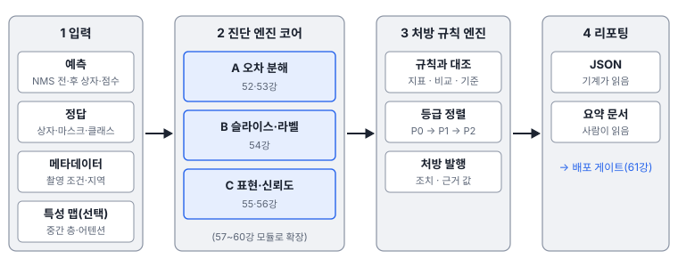
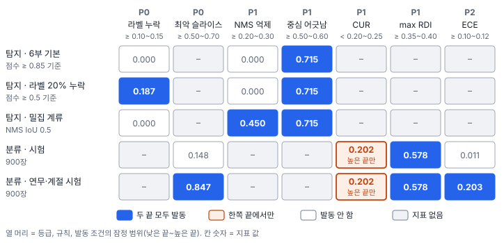

# 51강 진단 체계 한눈에

## 이 강에서 얻는 것

- 점수 하나로는 무엇을 고칠지 모르는 이유와, 회귀진단(7·8강)처럼 오차를 쪼개 보는 진단의 틀을 설명할 수 있음
- 4계층 진단 파이프라인과 처방 규칙 엔진이 지표를 처방으로 바꾸는 과정, P0·P1·P2 등급의 뜻을 말할 수 있음
- 진단 결과 JSON을 읽고, 임계 범위의 어느 끝을 쓰느냐에 따라 처방이 달라지는 것을 판단할 수 있음

## 1. 점수 하나로는 고칠 곳을 모름

5부 VD-CNN(27강)의 시험 정확도는 0.974인데, 같은 타일에 연무와 계절 변화를 넣은 시험(48강)에서는 0.708임. 이 숫자는 "나빠졌다"만 알려 줌. 어느 클래스가 무너졌는지, 확신이 엉터리가 됐는지, 자료가 모자란지 모델 구조가 문제인지는 말해 주지 않음. 6부 가상 탐지기(34강)의 mAP50 0.645도 같음. 분류 오차를 모두 고치면 0.103, 위치 오차를 고치면 0.051 오른다는 분해(52강)가 있어야 어디에 힘을 쓸지 정해짐.

2부에서 회귀모형을 $R^2$ 하나로 믿지 않고 잔차를 쪼개 본 것(7강)과 같은 사정임. 회귀진단은 진단마다 정해진 조치가 있었음. 이분산이면 강건 표준오차·가중최소제곱(7강), 공선성이면 변수 정리·릿지(8·11강), 영향점이면 원인 확인·로버스트 회귀(8강)였음. 8부는 비전 모델에 같은 틀을 세운 **Diagnostics 노트**(8부가 바탕으로 삼은 연구 노트)의 체계를 따름.

| 회귀진단(2부) | 비전 진단(8부) | 묻는 것 |
|---|---|---|
| 잔차 플롯·이분산 검정(7강) | 오차 분해(52·53강) | 어떤 종류의 오차인가 |
| 집단별로 잔차가 커지는가 | 취약 슬라이스(54강) | 어디서 무너지는가 |
| 영향점·쿡의 거리(8강) | 라벨 누락·잡음 격리(54강) | 모델 탓인가 자료 탓인가 |
| VIF·조건수(8강) | 유효 랭크·차원 붕괴(56강) | 표현이 겹치거나 낭비되는가 |

8부의 실험은 이 체계를 앞 부의 작은 가상 자료로 **직접 구현해 본 것**이며 Diagnostics의 실제 구현물이 아님.

## 2. 4계층 진단 파이프라인

**4계층 진단 파이프라인(four-layer diagnostic pipeline, 프로젝트 정의)**은 예측과 정답을 받아 진단 보고서와 처방을 내는 네 단계 구조임.

1. **입력 계층**: NMS 전·후 예측(상자·마스크·점수·클래스), 정답, 영상 메타데이터(촬영 조건·지역), 필요하면 중간 특성 맵·어텐션. NMS 전 예측이 있어야 NMS가 정답을 지웠는지 볼 수 있음(53강)
2. **진단 엔진 코어**: 오차 분해, 슬라이스·라벨 진단, 표현·신뢰도 진단 모듈이 따로 돌아감. 표준 형식만 받으므로 YOLO든 U-Net이든 모델 구조와 상관없음
3. **처방 의사결정 계층**: 지표를 규칙과 대조해 처방을 내고 등급순으로 정렬함
4. **리포팅 계층**: 기계가 읽는 JSON과 사람이 읽는 요약 문서를 냄



## 3. 처방 규칙 엔진과 P0·P1·P2

**처방 규칙 엔진(prescription rule engine, 프로젝트 정의)**은 규칙 목록을 하나씩 대조함. 규칙 하나는 **지표, 비교, 임계 범위, 처방, 등급**으로 이루어짐. 지표 $m$이 기준 $\tau$를 넘으면(나쁠수록 작은 지표는 밑돌면) 그 처방을 냄.

$$m \ge \tau \;\;\text{또는}\;\; m < \tau, \qquad \tau \in [\tau_{\text{lo}},\, \tau_{\text{hi}}]$$

$\tau$는 한 값이 아니라 낮은 끝 $\tau_{\text{lo}}$와 높은 끝 $\tau_{\text{hi}}$ 사이의 **잠정 범위**임. 노트 안에서도 문서마다 기준값이 달라서(라벨 누락 10%와 15%, NMS 과잉 억제 20·25·30%, ECE 0.10과 0.12, CUR 20%와 25%), 이 자습서는 그 값들을 포함하는 범위로 씀. 아래 7개 규칙은 노트의 규칙에 강건성 규칙(max RDI, 04장의 심각 경계 0.35와 배포 게이트 0.40)을 더해 이 자습서에서 정리한 것임. 노트에 값이 하나뿐인 중심 어긋남(0.60)과 치명적 슬라이스(0.70)는 낮은 끝을 이 자습서에서 정했음.

| 규칙 | 등급 | 지표(강) | 발동 조건(잠정) | 처방 요지 |
|---|---|---|---|---|
| RX-DATA-01 | P0 | 고신뢰 배경 오탐 비율(52강) | 0.10~0.15 이상 | 라벨 누락 전수 검수 |
| RX-DATA-02 | P0 | 최악 슬라이스 미탐률(54강) | 0.50~0.70 이상 | 그 조건의 자료 수집·증강 |
| RX-MODEL-01 | P1 | NMS 과잉 억제 비율(53강) | 0.20~0.30 이상 | 반발 손실(Repulsion Loss)·NMS 없는 구조 |
| RX-MODEL-02 | P1 | 위치 오차 중 중심 어긋남 비율(52강) | 0.50~0.60 이상 | CIoU 계열 손실·이동 증강 |
| RX-MODEL-03 | P1 | CUR(유효 랭크 ÷ 채널 수, 56강) | 0.20~0.25 미만 | 직교 규제·채널 수 재검토 |
| RX-MODEL-04 | P1 | max RDI(교란별 성능 하락률의 최댓값, 57강) | 0.35~0.40 이상 | 가장 약한 교란을 겨냥한 증강 |
| RX-INF-01 | P2 | ECE(확신과 실제 정확도의 차이, 55강) | 0.10~0.12 이상 | 온도 스케일링 등 사후 보정 |

**처방 우선순위 등급(P0/P1/P2, 프로젝트 정의)**은 피해 크기가 아니라 **조치의 성격**으로 나눔.

- **P0 = 데이터·라벨 결함**: 라벨이 빠졌거나 어떤 조건의 자료가 없음. 먼저 고치지 않으면 손실을 바꾸든 증강을 하든 헛수고라 맨 앞에 둠
- **P1 = 재학습이 필요한 조치**: 손실 함수, 증강, 헤드·구조 변경
- **P2 = 재학습 없는 조치**: 후처리 값 조정, 확률 보정. 당일 배포도 가능함

같은 결함이라도 조치에 따라 등급이 달라짐. NMS 과잉 억제는 노트 안에서도 P0·P1로 엇갈리는데, 손실을 바꿔 다시 학습하면 P1, 탐욕적 NMS를 Soft-NMS로 바꾸는 후처리만 하면 P2임. 53강의 밀집 계류 타일에서는 후처리만 바꿔도 mAP50이 0.852에서 0.902로 올랐음.

## 4. 진단 결과 스키마와 치명적 취약 슬라이스

**진단 결과 스키마(DiagnosticResult schema, 프로젝트 정의)**는 리포팅 계층이 내는 JSON의 틀임. 노트는 `summary`(요약 지표), `error_decomposition`(오차 분해), `slice_vulnerabilities`(취약 슬라이스), `prescriptions`(처방) 네 칸을 둠. 연무·계절 시험의 VD-CNN을 진단한 결과를 줄이면 다음과 같음(높은 끝 기준, 분류기라 오차 분해 칸은 뺌).

```json
{
  "summary": {"model": "VD-CNN v1", "data": "연무·계절 시험 900장", "acc": 0.708},
  "slice_vulnerabilities": [{"slice": "클래스=산림", "n": 150, "miss_rate": 0.847, "p": 1.0e-50}],
  "prescriptions": [
    {"id": "RX-DATA-02", "priority": "P0", "metric": "critical_slice_miss", "value": 0.847, "threshold": 0.70},
    {"id": "RX-INF-01", "priority": "P2", "metric": "ece", "value": 0.203, "threshold": 0.12}
  ]
}
```

실제 결과에는 처방 4건과 조치 문구, 기준 범위, 진단 날짜·기준값 출처가 함께 들어감. 기계가 읽는 형식이라 모델 버전끼리 비교하거나 배포 게이트(61강)가 자동으로 판정할 수 있음.

첫 처방은 **치명적 취약 슬라이스(critical failure slice, 프로젝트 정의)**임. 특정 조건(야간, 원거리, 연무 등)의 슬라이스에서 미탐률이 70%를 넘고 $p < 0.001$로 유의하면, 노트는 이를 P0로 격상함(수치는 잠정치). 그 조건의 자료가 모자란 탓으로 보고 자료부터 보강하라는 뜻임. 연무·계절 시험에서 산림 타일 150장의 정확도가 0.153이라 미탐률은 0.847이고, 전체 대비 $z = -14.9$, $p \approx 1.0 \times 10^{-50}$이었음(검정 방법은 54강). 이 자습서의 엔진은 미탐률만 범위와 비교하고, 유의성은 54강의 검정 결과로 따로 확인함. 원래 시험에서 가장 나쁜 슬라이스(경계에 걸친 농경지 타일 54장)의 미탐률은 0.148이라 발동하지 않았음.

## 5. 같은 지표, 다른 처방: 임계 범위의 두 끝

사례 다섯 개에 엔진을 낮은 끝과 높은 끝으로 한 번씩 돌렸음. 지표 값은 각 강의 실험에서 가져왔음.



- **밀집 계류**: NMS 과잉 억제 비율 0.45가 어느 끝(0.20, 0.30)이든 넘어 처방이 나감. 6부 탐지기의 위치 오차 200개 중 71.5%가 중심 어긋남 위주라 RX-MODEL-02(P1)도 늘 나감
- **분류기의 CUR**: VD-CNN의 CUR는 0.202로, 64채널 특징 공간 가운데 실제로 고루 쓰이는 몫이 5분의 1 정도라는 뜻임(56강). 작을수록 나쁜 지표라 "0.20 미만"(낮은 끝)이면 안 나가고 "0.25 미만"(높은 끝)이면 나감. 그래서 원래 시험과 연무·계절 시험 모두 **높은 끝에서만** CUR 처방이 추가됨. 비교 방향에 따라 어느 끝이 민감한 쪽인지가 바뀌므로 범위만 보지 말고 부등호를 같이 봄. 다만 클래스가 6개인 작은 분류기는 CUR가 원래 낮게 나와(56강) 이 처방은 오경보에 가까움
- **라벨 누락**: 라벨 20%를 지운 결과에서 점수 0.5 이상 배경 오탐 비율은 0.187이라 두 끝 모두 P0가 나감. 라벨이 온전한 원래 결과는 같은 기준으로 0.057이라 범위(0.10~0.15) 안에서는 안 나가지만, 범위를 원문보다 낮게 0.05로 잡으면 **결함이 없는데도** P0가 나감(오경보). 반대로 노트의 점수 기준 0.85를 그대로 쓰면 라벨 20% 누락도 0.012라 어느 끝에서도 안 잡힘. 이 탐지기는 점수 0.85 이상인 오탐이 거의 없기 때문임. 비율의 정의(점수 기준)까지 자료에 맞춰야 함

정리하면, 기준을 민감한 쪽으로 잡으면 처방이 일찍·자주 나가 결함을 빨리 잡지만 오경보와 불필요한 재학습 비용이 늘어남. 둔한 쪽으로 잡으면 확실할 때만 나가지만 실제 결함을 늦게 발견함. 현장에서는 데이터 규모, 재학습 비용, 배포 주기에 맞춰 조정함.

처방은 결론이 아니라 **가설**임. 연무·계절 시험의 ECE 0.203에 엔진은 P2 온도 스케일링을 냈지만, 실제로 해 보면 ECE가 0.219로 오히려 커짐(55강). 보정에 쓴 검증 자료와 분포가 다르기 때문으로 보임. 처방의 근거 지표도 열어 봄. 탐지기의 위치 오차 200개 중 190개는 이미 찾은 정답 둘레에 덜 지워진 두 번째 상자라, 엔진이 낸 손실 교체(P1)보다 NMS 조정(P2)을 먼저 해 보는 편이 맞음(52강). 처방을 적용한 뒤에는 같은 진단을 다시 돌려 지표가 실제로 나아졌는지 확인함.

## 6. 8부 지도와 표시 읽는 법

| 강 | 다루는 것 | 노트의 성숙도 |
|---|---|---|
| 52 | TIDE 계열 6대 오차와 오라클 ΔAP, 중심·스케일 편차 | PoC 구현 |
| 53 | NMS 누수·교차 클래스 억제, 분할 경계·병합·구멍 | PoC 구현 |
| 54 | 취약 슬라이스 검정, 라벨 품질, 분포 거리 | PoC 구현 |
| 55 | 과신, ECE·온도 스케일링, 불확실성 | PoC 구현 |
| 56 | 유효 랭크·차원 붕괴, 뉴럴 콜랩스, 유효 수용영역 | 일부 구현 |
| 57 | 10대 교란, mCE·RDI, 대기 산란 | 설계 완료·미구현 |
| 58 | 광학+SAR 융합, 모달리티 붕괴, 섀플리 값 | 설계 완료·미구현 |
| 59 | 바로가기 학습, 구조적 인과 모델, do 연산자 | 설계 완료·미구현 |
| 60 | SQNR, SmoothQuant, 루프라인 | 로드맵 |
| 61 | 5대 배포 게이트, 플립 오차, 카나리 | 로드맵 |

8부에서는 지표·절차가 처음 나올 때 두 꼬리표 중 하나를 붙임. **업계 표준**은 논문이나 널리 쓰는 도구에서 온 것(TIDE, ECE, 온도 스케일링, mCE, 섀플리 값 등)이라 밖에서도 그대로 통함. **프로젝트 정의**는 Diagnostics가 새로 정의하거나 조합한 것(4계층 파이프라인, 처방 규칙, P0~P2, RDI, OFI, CUR 등)이라 밖에서 쓸 때는 정의를 함께 밝힘. 임계값은 모두 범위로 쓰고 잠정치로 봄. 성숙도는 노트가 장마다 밝힌 구현 단계로, 오차 분해·슬라이스·신뢰도·처방 엔진은 PoC 구현(표현은 일부 구현), 환경 교란·다종 센서·인과는 설계만 끝남, 하드웨어·배포 게이트는 로드맵임. 설계·로드맵 단계일수록 기준값이 바뀔 여지가 큼.

## 현장에서는

분기마다 연안 양식장 탐지 결과를 폴리곤으로 납품하는데, 이번 분기 겨울 장면에서 재현율이 떨어졌음. 새 모델의 mAP만 보고하지 않고 진단을 돌리니 처방 셋이 나왔음. P0는 "해무 낀 장면 슬라이스 미탐률 0.78", P1은 "위치 오차 중 중심 어긋남 우세", P2는 "ECE 0.15"였음. 해무 장면 자료를 모아 라벨링하는 일(P0)을 먼저 시작하고, 손실 교체(P1)는 그 자료로 다시 학습할 때 함께 함. P2 보정은 겨울 장면이 들어간 검증 자료로 맞춘 뒤 ECE를 다시 재어 나아진 경우에만 배포함.

## 헷갈리는 쌍

- **평가 vs 진단**: 평가는 얼마나 잘하는지를 점수로 매기고, 진단은 왜 틀리는지와 무엇을 고칠지를 찾음. 진단은 평가 결과를 쪼개는 데서 시작함.
- **처방 등급 vs 심각도**: P0~P2는 조치의 성격(자료 정제·재학습·후처리)과 처리 순서임. P2라고 피해가 작은 것은 아님.
- **취약 슬라이스 vs 치명적 취약 슬라이스**: 앞은 전체보다 유의하게 나쁜 부분집합이고(54강), 뒤는 그중 미탐률이 매우 높아 P0로 격상된 것임.

## 이렇게 지시받음

> 지시: "mAP 말고, 뭘 고쳐야 하는지를 가져와."

점수 대신 진단 결과를 달라는 뜻임. NMS 전·후 예측과 메타데이터를 함께 넣어 파이프라인을 돌리고, 처방을 등급순으로 정리한 JSON과 요약을 넘김. 기준 범위와 어느 끝을 썼는지도 적음.

> 지시: "처방 엔진이 너무 예민해. 오경보 좀 줄여."

기준을 둔한 쪽으로 옮기라는 뜻임. "이상" 규칙은 높은 끝으로, CUR처럼 "미만" 규칙은 낮은 끝으로 옮김. 지난 진단 결과에 새 기준을 다시 적용해, 사라지는 처방 중 실제 결함이었던 것이 없는지 확인함.

> 지시: "P0 끝나기 전엔 재학습 돌리지 마."

라벨 누락이나 자료 공백을 그대로 두고 다시 학습하면 결함까지 배운다는 뜻임. P0 정제를 마치고 같은 진단을 다시 돌려 P0가 사라진 것을 확인한 뒤 P1에 들어감.

## 요약

- mAP·정확도 하나로는 무엇을 고칠지 모름. 회귀에서 잔차를 쪼개 보듯 오차를 종류·조건·원인별로 쪼갬
- 4계층 진단 파이프라인은 입력 → 진단 엔진 코어 → 처방 규칙 엔진 → 리포팅 순이며 모델 구조와 상관없음
- 규칙은 지표·비교·임계 범위·처방·등급으로 이루어지고, P0는 자료·라벨, P1은 재학습, P2는 재학습 없는 조치임
- 진단 결과 스키마(JSON)는 요약·오차 분해·취약 슬라이스·처방을 담고, 치명적 취약 슬라이스는 P0로 격상됨
- 임계 범위의 어느 끝을 쓰느냐(와 부등호 방향)에 따라 처방이 달라지며, 처방은 다시 재어 확인할 가설임

## 핵심 용어

| 한글 | 영문 |
|---|---|
| 4계층 진단 파이프라인 | Four-layer Diagnostic Pipeline |
| 진단 엔진 코어 / 리포팅 계층 | Diagnostic Engine Core / Reporting Layer |
| 처방 규칙 엔진 | Prescription Rule Engine |
| 처방 우선순위 등급 | P0/P1/P2 Prescription Priority |
| 진단 결과 스키마 | DiagnosticResult Schema |
| 치명적 취약 슬라이스 | Critical Failure Slice |
| 임계 범위 / 잠정치 | Threshold Range / Provisional Value |
| 업계 표준 / 프로젝트 정의 | Industry Standard / Project-defined |
