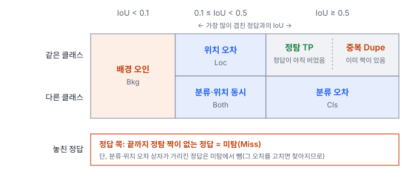
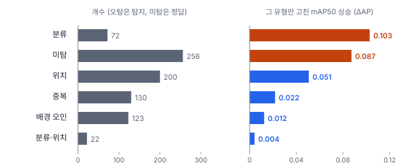
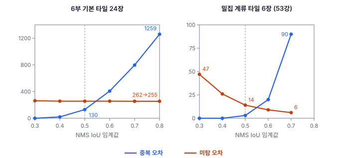

# 52강 탐지 오차 분해

## 이 강에서 얻는 것

- 탐지 결과의 틀린 몫을 TIDE 계열 여섯 가지 오차(분류·위치·분류·위치 동시·중복·배경 오인·미탐)로 판정 규칙에 따라 나눌 수 있음
- 오라클 ΔAP로 "무엇을 고치면 mAP가 얼마나 오르나"를 재고, 오차 개수와 영향이 다르다는 것을 설명할 수 있음
- 위치 오차의 중심·스케일 분해, 크기별 분해, 고신뢰 배경 오탐(라벨 누락 신호), 오차 교환 탄력도를 읽고, 처방 전에 무엇을 확인할지 알 수 있음

## 1. 여섯 가지 오차와 판정 규칙

mAP 하나로는 어디를 고칠지 모름(51강). 2부에서 잔차를 나눠 가정 위반·영향점을 찾았듯(7·8강), 탐지의 틀린 결과를 유형별로 나눠 셈. Diagnostics 노트는 이를 회귀의 SST = SSR + SSE 분해(6강)에 빗댐. 뼈대는 **TIDE**(볼야 등, 2020년 공개)의 여섯 가지 오차이고(업계 표준), Diagnostics 노트 01장(PoC 구현 단계)은 여기에 위치 오차 세분·크기별 분해·처방을 얹었음(프로젝트 정의). 이 강의 수치는 34강의 항만 타일 24장과 가상 탐지기의 기본 탐지 결과(클래스별 NMS 0.5, 탐지 1,494개, 정답 1,234개, mAP50 0.645)에 이 체계를 직접 구현해 본 것이며, Diagnostics의 구현물이 아님.

임계값은 두 개임. **전경 IoU 임계값** $t_f = 0.5$ 이상이면 "그 객체를 잡음", **배경 IoU 임계값** $t_b = 0.1$ 미만이면 "어느 객체와도 무관"으로 봄. 탐지를 점수 높은 것부터 보며, 같은 클래스의 아직 짝 없는 정답과 IoU가 0.5 이상이면 정탐(TP)으로 짝짓고, 아니면 다음 중 하나로 판정함.

- **분류 오차**($E_{\text{cls}}$): 다른 클래스 정답과 IoU ≥ 0.5. 자리는 맞혔는데 클래스를 틀림
- **위치 오차**($E_{\text{loc}}$): 같은 클래스 정답과 0.1 ≤ IoU < 0.5. 클래스는 맞는데 상자가 헐거움
- **분류·위치 동시 오차**($E_{\text{both}}$): 다른 클래스 정답과 0.1 ≤ IoU < 0.5
- **중복 검출 오차**($E_{\text{dupe}}$): 같은 클래스·IoU ≥ 0.5인데 그 정답은 더 높은 점수 탐지가 이미 가져감
- **배경 오인 오차**($E_{\text{bkg}}$): 모든 정답과 IoU < 0.1. 흰 물결·컨테이너를 배로 본 허위 경보
- **미탐 오차**($E_{\text{miss}}$): 끝까지 정탐 짝이 없는 정답(FN). 단 분류·위치 오차가 가리킨 정답은 뺌. 그 오차를 고치면 찾아지므로 두 번 세지 않으려는 것임(TIDE 방식)

결과는 정탐 947개, 오탐 547개(위치 200·중복 130·배경 오인 123·분류 72·동시 22), 미탐 256개(뺀 정답 31개)임. 분류 오차는 차량→소형선박 42개, 소형선박→선박 25개가 대부분임.

## 2. 오라클 ΔAP: 무엇을 고치면 얼마나 오르나

개수가 많다고 mAP를 많이 깎는 것은 아님. 그래서 한 유형만 가상으로 고친(오라클 교정) 뒤 mAP50을 다시 재어 오른 폭을 봄.

$$\Delta \mathrm{AP}_k = \mathrm{AP}_{\text{oracle}(k)} - \mathrm{AP}_{\text{base}}$$

분류 오차는 클래스를 정답 것으로, 위치 오차는 상자를 정답 상자로 바꾸고, 동시·중복·배경 오인은 그 탐지를 지우고, 미탐은 놓친 정답을 정답 목록에서 뺌(탐지를 지어낼 수 없으므로 분모를 줄임). 분류·위치 오차를 고친 상자가 이미 짝 있는 정답을 가리키면 새 중복이 되므로 그 탐지는 지우고, 짝 없는 정답 하나를 분류·위치 오차 여럿이 가리키면 점수 1위 하나만 고치고 나머지는 지움(TIDE 방식). 지우지 않는 단순 구현은 이 몫을 놓쳐 ΔAP를 낮게 잼.

분류 오차가 큰 것은 mAP가 클래스 평균(39강)이기 때문임. 정답이 22척뿐인 선박 클래스에 소형선박을 선박으로 낸 오탐 25개가 끼어 있어, 이것만 고쳐도 선박 AP가 0.552에서 0.817로 뜀. 미탐은 차량 AP를 0.539에서 0.741로 올림.

ΔAP는 더해서 맞아떨어지지 않음. 여섯을 더하면 0.279인데 1 − 0.645 = 0.355임. 여러 오차가 같은 정답·순위를 두고 얽혀 있어, 하나씩 고친 몫의 합과 한꺼번에 고친 몫이 다름. 한꺼번에 고치면 0.984이고, 나머지는 이미지당 상위 100개만 넣는 상한(39강)에 걸린 차량 몫임(상한을 풀면 1.000). 그래서 몫을 나누는 분해가 아니라 우선순위 표로 씀.

## 3. 위치 오차를 중심과 스케일로 쪼개기

Diagnostics는 위치 오차를 두 기하 요소로 더 나눔(프로젝트 정의).

$$\Delta_{\text{center}} = \frac{\lVert \mathbf{c} - \mathbf{c}^* \rVert}{\sqrt{w^* h^*}}, \qquad \Delta_{\text{scale}} = \left\lvert \ln\frac{w}{w^*} \right\rvert + \left\lvert \ln\frac{h}{h^*} \right\rvert$$

앞은 상자 중심 $\mathbf{c}$의 어긋남을 정답 상자의 한 변(√넓이)으로 나눈 값, 뒤는 폭·높이 비의 로그 절댓값 합임(별표가 정답). 중심이 지배적이면 특성 맵 보폭과 수용영역(30강)의 어긋남을, 스케일이 지배적이면 앵커·FPN 층 배정을 의심함. 두 값은 단위가 달라 원문은 "지배적"의 판정법을 정하지 않았음. **이 자습서에서는** $\Delta_{\text{center}} \ge \Delta_{\text{scale}}$인 위치 오차를 중심 위주로 셈.

위치 오차 200개의 중앙값은 $\Delta_{\text{center}}$ 0.312, $\Delta_{\text{scale}}$ 0.225임. 한 변 약 6.3화소인 차량이면 중심이 2화소쯤 비킨 셈이고, 0.225는 한 변만 25% 길어진 정도(ln 1.25 ≈ 0.223)임. 중심 위주가 143개(71.5%)로 원문 기준 0.60을 넘어, 이 판정만 보면 IoU 계열 손실 교체(35강의 CIoU, 원문은 EIoU도 듦)와 이동 증강이 나감(원문 의사코드는 위치 ΔAP가 클 때만 이 판정을 봄). 재학습이 드는 P1 조치임(51강).

처방 전에 그 오차가 어떤 상자에서 났는지 봄. 위치 오차 200개 중 190개는 이미 정탐 짝이 있는 정답 둘레의 두 번째 상자였음(184개는 정탐보다 점수가 낮음). 정탐 상자와의 IoU 중앙값이 0.39라 NMS 0.5를 빠져나온 것임. 위치 ΔAP 0.051 중 0.048이 이 190개를 지운 몫이라, 고칠 곳은 회귀 헤드보다 NMS이고, NMS 임계값을 0.3으로 낮추면 위치 오차가 53개로 줄고 mAP50이 0.705가 됨(37강). 재학습 없는 P2 조치를 먼저 시험함.

## 4. 크기별로 나누기

COCO 크기 구간(39강)으로 나눠 크기별 오차 비율, 곧 $P(\text{오차 유형} \mid \text{크기})$를 봄(스케일 조건부 오차 분해). 소형은 **넓이** 32² = 1,024화소²(한 변 약 32화소) 미만임. 원문은 소형에서 미탐·배경 오인이 유난히 많으면 얕은 층 특성 소실로 봄.

이 자료는 정답 1,234개 중 1,208개가 소형이라 오차도 거의 다 소형임(위치 197/200, 미탐 255/256, 배경 오인 123/123. 배경 오인은 짝 정답이 없어 탐지 상자 넓이로 나눔). 소형 미탐률은 255/1,208 = 21%, 중형 이상은 1/26 ≈ 4%임. 원문 의사코드는 소형 미탐률 0.40 초과를 최우선으로 올리므로 여기서는 걸리지 않지만, 미탐 ΔAP는 2위임. 한 구간에 거의 다 몰리면 변별력이 없으므로 실제 길이 구간(39강)으로 다시 나눔.

## 5. 고신뢰 배경 오탐과 라벨 누락

점수가 아주 높은데 짝이 없는 배경 오인은 라벨이 빠진 객체일 수 있음(44강). Diagnostics는 고신뢰 오탐 비율이 높으면 튜닝을 멈추고 라벨부터 검수하라고 함(데이터·라벨 결함이라 P0). 다만 원문 01장의 기준이 점수 0.8 초과, 점수 × 영상-텍스트 유사도 0.75 이상, 오탐의 15%로 셋이고(처방 엔진은 점수 0.85 이상) 관계가 정리되어 있지 않음. **이 자습서에서는** (점수가 기준 이상인 배경 오인) ÷ (전체 오탐)으로 정함. 탐지는 그대로 두고 정답을 하나씩 20% 확률로 무작위로 지워(265개, 21%) 비교했음.

| 점수 기준 | 원래 라벨 | 정답 20% 지움 |
|---|---|---|
| 0.5 이상 | 5.7% (31/547) | 18.7% (137/734) |
| 0.7 이상 | 0% (0/547) | 4.8% (35/734) |
| 0.85 이상 | 0% (0/547) | 1.2% (9/734) |

신호는 분명함. 0.7 이상 배경 오인은 원래 없다가 35개가 생겼고, 늘어난 것은 모두 지운 정답과 겹치던 탐지임. 그러나 비율은 점수 기준에 크게 좌우됨. 이 가상 탐지기는 점수가 낮은 편이라 0.85 이상이 1,494개 중 39개뿐이어서, 라벨 20%가 빠져도 1.2%로 원문 15%에 닿지 않음. "고신뢰"는 그 모델의 점수 분포에서 정하고, 비율보다 목록을 열어 원본 영상을 보는 것이 확실함. 체계적인 방법(신뢰 학습)은 54강에서 다룸.

이 강의 판정 기준은 모두 잠정치임. 낮게 잡으면 처방이 일찍·자주 나가 문제를 빨리 잡지만 오경보와 불필요한 검수·재학습 비용이 늘고, 높게 잡으면 확실할 때만 나가 실제 결함을 늦게 발견함. 자료 규모·재학습 비용·배포 주기에 따라 조정함.

| 규칙 | 원문 값 | 잠정 범위 | 이 자료 |
|---|---|---|---|
| 중심 위주 비율 → 위치 손실·증강 | 0.60 | 0.5~0.6 | 0.715 |
| 소형 미탐률 → 고해상도 헤드·슬라이스 추론 | 0.40 | 0.4 안팎 | 0.21 |
| 고신뢰 오탐 비율 → 라벨 검수 | 15% (라벨 잡음 10%) | 10~15% | 점수 기준에 따라 0~18.7% |

## 6. 오차 교환 탄력도

한 오차를 줄이면 다른 오차가 늘기도 함. 점수 임계값이 배경 오인과 미탐을 맞바꾸듯(38강), NMS IoU 임계값은 중복과 미탐을 맞바꿈. Diagnostics는 이를 **오차 교환 탄력도**로 정의함(프로젝트 정의).

$$\mathcal{E}_{\text{nms}}(t) = -\frac{dE_{\text{dupe}} / E_{\text{dupe}}}{dE_{\text{miss}} / E_{\text{miss}}}$$

임계값 $t$를 올릴 때 중복의 상대 증가를 미탐의 상대 감소로 나눈 값임. 1보다 훨씬 크면 임계값을 올려도 미탐은 거의 안 줄고 중복만 늘고, 1보다 훨씬 작으면 임계값을 내려도 중복은 별로 안 줄고 미탐만 늚. 여기서는 이웃한 임계값 두 개 사이에서 두 값의 평균을 기준으로 상대 변화를 계산했음.

기본 타일은 0.6 → 0.7에서 탄력도가 약 166이고, 0.4 → 0.5, 0.5 → 0.6처럼 미탐이 그대로인 구간은 무한대임. 객체가 드문드문해 NMS가 진짜 이웃을 지울 일이 거의 없음. 밀집 계류 타일(53강)은 0.4 → 0.7 내내 3.2~3.4임. 상대 변화의 비라 개수가 적은 쪽(중복 3개 → 20개)이 부풀려지므로, 운영점은 원문처럼 가중 합 $w_{\text{dupe}} E_{\text{dupe}} + w_{\text{miss}} E_{\text{miss}}$이 가장 작은 곳으로 고름. 1:1이면 기본 타일은 0.3(262개), 밀집 계류는 0.5(17개)라, 장면·클래스별 임계값을 검토할 근거가 됨. 37강의 "남은 중복"은 IoU 0.5 미만으로 붙은 상자도 세어 여기 중복 오차와 개수가 다름.

원문 처방표는 중복 우세에 Soft-NMS를 적었지만, Soft-NMS는 상자를 지우지 않고 점수만 낮춰 중복 개수는 오히려 늘 수 있음(37강). 중복을 순위 뒤로 밀어 AP를 지키는 조치임.

NMS 전후를 나눠 보는 과잉 억제와 NMS 누수 오차, 클래스 무관 NMS의 교차 클래스 억제율(CCSR), NMS 없이 가도 되는지 보는 원-투-원 예측 집중도 지수(OFI), 분할 오차의 경계 오차 비율(BER)은 53강에서 다룸.

## 현장에서는

0.3 m 위성영상으로 양식장 부표를 세는 탐지 모델의 mAP50이 재학습을 거듭해도 제자리인 상황임.

오차 분해를 돌려 점수 상위 배경 오인 목록부터 엶. 새로 생긴 양식 구역의 부표가 통째로 라벨 없이 남아 있었음. P0이므로 학습을 멈추고 그 구역 라벨을 보완한 뒤 다시 분해함. 그다음 ΔAP 1위가 소형에 몰린 미탐이면 재학습 없는 슬라이스 추론(37강)부터 시험하고, 모자라면 고해상도 헤드를 붙여 재학습함. 위치 오차가 많아 보여도 이미 찾은 부표 둘레의 두 번째 상자인지 확인하고, 그렇다면 NMS 임계값부터 조정함.

## 헷갈리는 쌍

- **오차 개수 vs 오라클 ΔAP**: 개수는 얼마나 자주, ΔAP는 고치면 mAP가 얼마나 오르는지임. 이 자료에서 위치 오차는 오탐 중 개수 1위지만 ΔAP는 3위임.
- **위치 오차 vs 중복 검출 오차**: 둘 다 같은 클래스 정답 근처의 여분 상자일 수 있음. IoU 0.5 이상이고 정답이 이미 짝 있으면 중복, 0.1~0.5면 위치로 판정함. 이 자료의 위치 오차는 대부분 사실상 헐거운 중복이었음.
- **배경 오인 오차 vs 라벨 누락**: 판정 규칙으로는 같은 칸임. 고신뢰 배경 오인은 원본을 확인하기 전까지 모델 탓으로 단정하지 않음.

## 이렇게 지시받음

> 지시: "mAP 0.64에서 안 움직여. TIDE 돌려서 뭐부터 고칠지 가져와."

여섯 유형의 개수와 오라클 ΔAP를 함께 내고 ΔAP 순으로 줄 세우되, 그 전에 고신뢰 배경 오인으로 라벨 누락(P0)을 확인함. 분류 오차가 1위면 헷갈린 클래스 짝과 클래스별 AP까지 붙임. 이 자료라면 정답이 적은 선박 클래스에 소형선박이 섞여 든 것이 핵심임.

> 지시: "위치 오차가 제일 많네. CIoU로 바꿔서 다시 학습 돌려."

재학습(P1) 전에 위치 오차 상자가 이미 찾은 객체 둘레의 두 번째 상자인지, 중심·스케일 중 어느 쪽이 큰지 확인함. 두 번째 상자가 대부분이면 NMS 임계값 조정(P2)부터 해 보고, 정탐 상자 자체가 어긋날 때만 손실을 바꿈.

> 지시: "NMS 임계값별로 중복이랑 미탐 표 만들고 탄력도 붙여."

임계값별 중복·미탐 개수와 구간별 오차 교환 탄력도를 내라는 뜻임. 탄력도는 개수가 작으면 부풀려지므로 가중 합의 최소점을 함께 적고, 밀집 장면과 성긴 장면을 나눠 봄.

## 요약

- TIDE 계열 분해는 전경 IoU 0.5·배경 IoU 0.1과 클래스 일치 여부로 오탐을 분류·위치·동시·중복·배경 오인으로, 놓친 정답을 미탐으로 나눔
- 오라클 ΔAP는 한 유형만 고쳤을 때 mAP 상승폭이고, 개수와 순위가 다르며 더해서 맞지 않으므로 우선순위 표로 씀
- 위치 오차는 중심·스케일로 더 나누되(중심 위주 판정은 이 자습서의 정의), 처방 전에 그 상자가 두 번째 상자인지 확인함
- 크기별 분해는 넓이 기준이고, 고신뢰 배경 오탐은 라벨 누락의 신호지만 비율은 점수 기준에 크게 좌우됨
- 오차 교환 탄력도는 NMS 임계값에 따른 중복과 미탐의 상대 변화 비이고, 운영점은 가중 합으로 고름. 모든 기준값은 잠정치임

## 핵심 용어

| 한글 | 영문 |
|---|---|
| TIDE 오차 분해 | TIDE Error Decomposition |
| 전경 / 배경 IoU 임계값 | Foreground / Background IoU Threshold |
| 분류 오차 | Classification Error ($E_{\text{cls}}$) |
| 위치 오차 | Localization Error ($E_{\text{loc}}$) |
| 분류·위치 동시 오차 | Both Error ($E_{\text{both}}$) |
| 중복 검출 오차 | Duplicate Error ($E_{\text{dupe}}$) |
| 배경 오인 오차 | Background Error ($E_{\text{bkg}}$) |
| 미탐 오차 | Missed Ground Truth Error ($E_{\text{miss}}$) |
| 오라클 ΔAP | Oracle ΔAP |
| 중심 편향 / 스케일 편차 | Center Shift / Scale Mismatch |
| 스케일 조건부 오차 분해 | Scale-conditional Error Decomposition |
| 고신뢰 배경 오탐 | High-confidence Background False Positive |
| 오차 교환 탄력도 | Error Exchange Elasticity |
