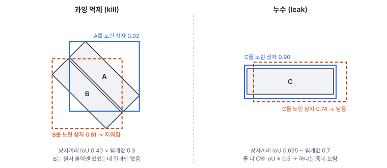
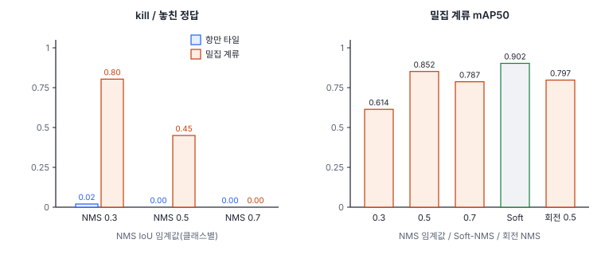
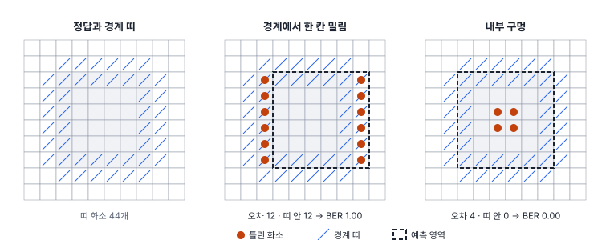

# 53강 NMS·분할 오차 진단

## 이 강에서 얻는 것

- NMS 전후 출력을 맞대어, 놓친 객체가 모델이 못 찾은 것인지 NMS가 지운 것인지(과잉 억제)와, NMS가 못 지운 중복(누수)을 가려낼 수 있음
- 교차 클래스 억제율과 OFI로 클래스 무관 NMS와 NMS 프리 전환이 안전한지 판단하고, OFI를 로짓으로 계산해야 하는 이유를 설명할 수 있음
- 분할 오차를 경계 오차 비율, 소형 영역 소실, 병합·쪼개짐, 구멍으로 나누어 읽을 수 있음

## 1. NMS 전후를 따로 보는 이유

최종 출력을 분류 오차·배경 오인 오차·중복 검출 오차·미탐 오차로 나누는 법과 오차 교환 탄력도는 52강에서 다룸. 그런데 최종 출력만 보면 미탐 하나가 "모델이 객체를 못 찾음"인지 "찾았는데 NMS(37강)가 이웃의 중복으로 알고 지움"인지 구별되지 않음. 고칠 곳이 앞은 모델·자료, 뒤는 후처리라서 갈라 봐야 함.

그래서 NMS 전 원시 출력과 NMS 뒤 출력을 맞대어 두 결함을 셈. 과잉 억제·누수·CCSR·OFI·BER의 이름과 판정식은 Diagnostics 노트가 정한 **프로젝트 정의**이고, NMS·Soft-NMS·회전 NMS는 **업계 표준**임. 병합·쪼개짐·구멍은 분할 평가에서 흔한 개념이지만 세는 규칙은 이 자습서에서 정함. 실험은 이 체계를 6부 항만 타일과 가상 탐지기(34강), 7부 U-Net(50강)에 작은 규모로 직접 구현해 본 것이며 Diagnostics의 실제 구현물이 아님.

## 2. 과잉 억제(kill)와 누수(leak)

**NMS 과잉 억제(NMS-induced miss, kill)**는 모델이 찾은 정답을 NMS가 지운 경우임. 이 자습서는 놓친 정답 하나가 아래를 모두 만족하면 kill로 셈.

1. NMS 전 원시 출력에 그 정답과 클래스가 같고 IoU 0.5 이상인 상자(점수 0.05 이상)가 있었음
2. 그런 상자가 NMS에서 모두 지워짐
3. 지운 상자 가운데 하나가 **다른 정답**과 IoU 0.5 이상임

원문 본문에는 3번이 있지만 원문 의사코드는 1번만 확인함. 3번이 없으면, 자기 객체를 엉뚱하게 감싼 고득점 상자(위치 오차, 52강)에 지워진 경우까지 NMS 탓이 됨. 원문은 점수 문턱을 0.25로 두었고, 여기서는 낮은 점수 후보까지 보려고 0.05로 정함. **kill 비율**은 kill 수 ÷ 놓친 정답 수임.

반대 방향 결함이 **NMS 누수 오차(NMS leakage)**임. 한 정답에 IoU 0.5 이상인 같은 클래스 상자가 둘 이상 살아남은 경우로, 서로의 IoU가 NMS 임계값보다 낮아 지워지지 않은 것임. 여기서는 살아남은 상자 가운데 중복 판정(52강)을 받은 수로 셈.

항만 타일 24장(클래스별 NMS)의 결과임.

| NMS 임계값 | 놓친 정답 | 원시 출력에 후보 없음 | kill (비율) | 누수 상자 |
|---|---|---|---|---|
| 0.3 | 297 | 286 | 6 (0.020) | 0 |
| 0.5 | 287 | 286 | 0 (0) | 130 |
| 0.7 | 285 | 285 | 0 (0) | 797 |

놓친 정답의 거의 전부가 원시 출력에 후보조차 없었음. 이 탐지기의 미탐은 모델 탓이라 NMS를 만져도 소용없음. 0.3에서는 kill 6건 외에 자기 객체의 상자에 지워진 5건이 따로 있었는데, 3번 조건이 이 둘을 갈라 냄. 임계값을 올리면 누수가 크게 늘어남. (37강의 '남은 중복' 391개는 클래스가 틀리거나 정답과 IoU 0.5 미만인 상자까지 센 값임.)

처방 기준인 kill 비율은 원문 값(20%·25%·30%)을 아우르는 대략 20~30%이며 잠정치임. 낮게 잡으면 NMS 교체를 일찍 권해 밀집 장면을 빨리 잡지만, 모델 탓인 미탐에 후처리만 바꾸는 헛수고가 늘어남. 높게 잡으면 확실할 때만 권하지만 밀집 구역의 손실을 늦게 알아챔. 처방 등급은 조치에 따라 달라짐. 손실·헤드를 바꾸면 재학습이 드는 P1, Soft-NMS로 후처리만 바꾸면 P2임(51강).

## 3. 밀집 계류에서는 크게 나타남

kill은 이웃 정답끼리 수평 박스가 많이 겹칠 때 생김. 가상 밀집 계류 타일 6장(길이 12~16 m 소형선박 24척씩, 45°로 나란히, 옆 배와 간격 약 1 m, 정답 144척)을 만들어 같은 탐지기를 돌렸음. 정답마다 가장 많이 겹친 이웃과의 수평 박스 IoU는 중앙값 0.389, 최대 0.732로, 37강 45° 주차장(중앙값 0.24)보다 훨씬 겹침.

| 설정 | 놓친 정답 | kill (비율) | 누수 상자 | 재현율 | mAP50 |
|---|---|---|---|---|---|
| NMS 0.3 | 56 | 45 (0.80) | 0 | 0.611 | 0.614 |
| NMS 0.5 | 20 | 9 (0.45) | 3 | 0.861 | 0.852 |
| NMS 0.7 | 11 | 0 (0) | 90 | 0.924 | 0.787 |
| 회전 NMS 0.5 | 15 | | 63 | | 0.797 |
| Soft-NMS | | | | | 0.902 |

평가는 수평 박스 기준임. 임계값을 올리면 kill은 사라지지만 누수가 늘어 0.7에서 mAP50이 다시 떨어짐. 미탐과 중복이 맞바뀌는 이 관계가 52강의 오차 교환 탄력도임. 남은 11척은 원시 출력에 후보가 없던 모델 미탐임.

Soft-NMS(가우시안, σ 0.5, 37강)가 가장 좋았음. 이웃 배의 상자를 지우지 않고 점수만 낮춰 남기고, 중복은 순위 뒤로 밀리기 때문으로 보임. 회전 NMS(41강)는 회전 박스끼리는 거의 겹치지 않아 놓친 배가 20척에서 15척으로 줄었지만, 각도가 흔들린 중복끼리도 회전 IoU가 낮아 중복이 3개에서 63개로 늘었음. 회전 NMS를 쓰려면 임계값을 다시 맞춰야 함(41강).

## 4. 교차 클래스 억제율(CCSR)

클래스 무관 NMS(37강)는 다른 클래스 상자끼리도 지움. **교차 클래스 억제율(CCSR, cross-class suppression rate)**은 그 부작용을 잼.

$$\mathrm{CCSR} = \frac{\text{다른 클래스 상자에 지워진 NMS 전 TP 수}}{\text{NMS 전 TP 수}}$$

NMS 전 TP는 원시 출력 가운데 정답과 클래스가 같고 IoU 0.5 이상인 상자임. 항만 타일의 NMS 전 TP 2,470개 가운데 클래스 무관 NMS 0.3에서 2개(0.0008)가 지워졌고 0.5·0.7에서는 0이었음. 차는 땅, 배는 물에 있고 이 가상 장면은 배끼리도 떨어뜨려 놓아서 다른 클래스끼리 겹칠 일이 드묾. 큰 선박에 붙은 예인선처럼 다른 클래스가 맞붙는 자료라면 커짐. 원문 기준은 3% 하나뿐이라 대략 3% 안팎으로 둠(잠정치). 넘으면 클래스별 NMS로 돌아감. 낮게 잡으면 속도 이득을 일찍 포기하고, 높게 잡으면 붙어 있는 다른 클래스 객체의 손실을 놓침.

## 5. OFI: NMS 없이 버틸 수 있는가

NMS 프리 탐지(37강)로 가려면 모델이 객체마다 상자 하나에 점수를 몰아줘야 함. **원-투-원 예측 집중도 지수(OFI, one-to-one focus index)**는 정답마다 그 정답을 노린 상위 $K$개 상자의 점수 $s_k$를 소프트맥스로 바꿔 엔트로피를 잼.

$$p_k = \frac{e^{s_k}}{\sum_{m=1}^{K} e^{s_m}}, \qquad \mathrm{OFI} = 1 - \frac{\operatorname{mean}_j\left(-\sum_k p_k \ln p_k\right)}{\ln K}$$

한 상자에 확률이 몰리면 엔트로피가 0이라 OFI가 1, 고르게 퍼지면 OFI가 0임. 이 자습서에서는 $K$ = min(4, 후보 수)로 두고 후보가 둘 이상인 정답만 썼음.

원문은 $s_k$의 척도를 정하지 않았는데, **NMS 전 헤드 로짓**(시그모이드·소프트맥스 전 값)으로 정함. 0~1 신뢰도를 그대로 넣으면 점수 차가 1을 넘지 못해, $K$ = 4에서 가장 극단인 1·0·0·0도 소프트맥스를 거치면 0.475·0.175·0.175·0.175로 퍼져 OFI 상한이 0.085임. 로짓이면 한 상자 +4, 나머지 −4(확률 0.98·0.02)만 되어도 0.993까지 감. 점수 0.95·0.60·0.30·0.10인 정답 하나로 계산하면 로짓 2.94·0.41·−0.85·−2.20에서는 0.721, 확률 그대로는 0.038임. "OFI가 1에 가까우면 NMS 프리 가능"이라는 원문 해석은 로짓에서만 성립함.

가상 탐지기의 점수를 로짓 $\ln\left(s/(1-s)\right)$으로 되돌려 정답 754개에서 계산하니 OFI는 0.065였음(확률로는 0.003). 1위와 2위 점수의 중앙값이 0.53과 0.42로 비슷해서, 이 탐지기는 NMS를 빼면 중복이 쏟아짐. 일대다 할당을 흉내 낸 탐지기라 예상대로임. 원문은 OFI의 판정 기준값을 두지 않았음.

## 6. 분할 오차 분해

7부 장면 0~5로 학습한 U-Net(10 m, 50강)을 시험 장면 8·9에 적용했음. 틀린 화소는 클래스마다 정답과 예측의 대칭차로 세므로, 잘못 칠한 화소 하나가 정답 클래스와 예측 클래스에 한 번씩 들어감(합계 51,082개).

**경계 오차 비율(BER, boundary error ratio)**은 틀린 화소 가운데 정답 경계 근처 띠 안에 든 비율임.

$$\mathrm{BER}_c = \frac{\lvert E_c \cap B(Y_c) \rvert}{\lvert E_c \rvert}, \qquad B(Y_c) = (Y_c \oplus D) \setminus (Y_c \ominus D)$$

$E_c$는 클래스 $c$의 틀린 화소, $Y_c$는 정답 영역, $\oplus$·$\ominus$는 팽창·침식(23강)임. 띠 폭은 원문이 정하지 않아 1화소 팽창 − 1화소 침식으로 정함. 1에 가까우면 내부는 맞고 경계만 흐린 것이라 디코더 해상도·경계 손실을, 0에 가까우면 내부까지 다른 클래스로 칠한 것이라 문맥·수용영역(56강)을 의심함.

전체 BER은 0.190이었음(수계 0.308, 갯벌 0.278, 농경지 0.243, 산림 0.220, 나지 0.126, 시가지 0.113). 다만 기준선과 비교해야 함. 띠는 정답∪예측 화소의 10.4%라서, 오차가 아무 데나 생겨도 BER은 0.1 안팎임. 수계는 띠가 7.6%인데 BER이 0.308이라 오차가 물가에 네 배 몰렸고, 시가지는 0.113 대 0.107로 경계 쏠림이 없어 내부 혼동(나지를 시가지로 칠한 화소가 가장 많음)이 주임. 팽창·침식을 2화소로 늘리면 전체 BER이 0.327이 되므로 띠 폭을 함께 적음.

형태 오차는 연결 요소(23강) 단위로 셈.

- **소형 영역 소실**: 넓이 100화소²(1 ha, 한 변 약 10화소) 미만 정답 영역 35개 중 28개(0.80)가 예측과 한 화소도 겹치지 않았음. 다만 22개는 상하좌우 이웃으로만 묶어 대각선 연결이 끊긴 한 화소 조각이고, 대각선까지 묶으면 12개 중 9개(0.75)임. 35개 중 29개가 넓이 16화소²(약 4×4) 미만이라 형상을 알아보기 어려운 한계 아래였고, 100~400화소² 영역은 25개 중 4개만 사라졌음
- **병합·쪼개짐**: 예측 덩어리 하나가 같은 클래스 정답 덩어리 둘 이상과 20화소 이상씩 겹치면 병합(4건), 정답 하나가 예측 둘 이상으로 나뉘면 쪼개짐(12건)으로 셈(겹침 기준은 이 자습서에서 정함). 정답 덩어리 109개에 예측 덩어리 259개였고, 그중 113개는 같은 클래스 정답과 전혀 닿지 않는 허위 섬이었음
- **구멍**: 덩어리에 둘러싸인 빈 곳(구멍 메우기로 채워지는 화소, 23강). 예측에 61곳 404화소, 정답에는 0이라 모두 모델이 만든 것임

원문은 under-segmentation을 구멍(내부 미탐)과 인스턴스 병합 두 곳에 함께 씀. 원격탐사 객체 기반 분석에서도 under-segmentation은 보통 여러 객체가 한 덩어리로 묶인 병합 쪽을 뜻하므로, 구멍은 구멍으로 부르고 이 영문 용어는 병합에만 씀.

## 현장에서는

마리나의 계류 선박 수를 분기마다 세는 과제에서 붐비는 구역의 집계가 실제보다 적게 나옴. NMS 전후 출력을 함께 저장해 놓친 배를 kill과 모델 미탐으로 가름. kill 비율이 20~30%를 넘으면 재학습 없이 Soft-NMS부터 바꿔 보고(P2), 모자라면 회전 박스 라벨이나 손실 변경(P1)으로 감. 임계값을 바꿀 때마다 누수 상자 수를 같이 보고, 점수 임계값은 다시 정함.

## 헷갈리는 쌍

- **과잉 억제(kill) vs 누수(leak)**: kill은 NMS가 지나치게 지워 생긴 미탐, 누수는 덜 지워 남은 중복임. NMS 임계값을 올리면 앞이 줄고 뒤가 늘어남.
- **BER vs 경계 F1**: 경계 F1(40강)은 경계선이 얼마나 맞는지의 점수이고, BER은 틀린 화소가 경계에 몰렸는지의 비율임. BER은 띠가 차지하는 비율과 비교해 읽음.
- **구멍 vs 병합**: 둘 다 원문에서 under-segmentation으로 불렸지만, 구멍은 한 영역 안의 미탐, 병합은 두 영역이 하나로 묶인 것임.

## 이렇게 지시받음

> 지시: "붙어 있는 배가 자꾸 빠져. NMS 문제인지 모델 문제인지 갈라 봐."

놓친 배마다 kill 세 조건을 확인하라는 뜻임. kill이 대부분이면 Soft-NMS·회전 NMS를 시험하고, 후보조차 없으면 자료·모델 쪽으로 감.

> 지시: "NMS 빼는 구조로 갈 수 있는지 OFI 뽑아 봐."

헤드 로짓으로 OFI를 계산함. 0~1 점수로 계산하면 K = 4에서 0.085(K = 2여도 0.16)를 넘을 수 없어 무조건 "불가"로 나오므로, 어느 척도로 계산했는지 적어서 보고함.

> 지시: "수계 마스크 오차가 경계 쪽인지 내부인지 봐."

수계의 BER과 띠가 차지하는 비율을 함께 냄. BER이 띠 비율보다 훨씬 크면 해안선 쪽이라 디코더 해상도·경계 손실을, 비슷하면 내부 혼동(갯벌과의 혼동 등)을 먼저 봄.

## 요약

- NMS 전후를 맞대어 미탐을 kill(모델은 찾았는데 다른 객체의 상자에 지워짐)과 모델 미탐으로 가르고, 덜 지워 남은 중복은 누수로 셈
- 원문 의사코드에 없던 "다른 정답을 노린 상자에 지워짐" 조건을 넣어야 위치 오차와 섞이지 않음. 항만 타일은 kill이 거의 0, 밀집 계류는 0.3에서 0.80
- 밀집 계류에서 임계값을 올리면 kill이 줄고 누수가 늘었고, Soft-NMS가 mAP50 0.902로 가장 좋았음
- CCSR은 클래스 무관 NMS가 지운 다른 클래스 TP의 비율, OFI는 정답당 점수 집중도이며 반드시 로짓으로 계산함(확률로는 K = 4에서 상한 0.085)
- 분할 오차는 BER(띠 비율과 비교), 소형 영역 소실(넓이 기준, 연결 규칙 명시), 병합·쪼개짐, 구멍으로 나누어 읽음

## 핵심 용어

| 한글 | 영문 |
|---|---|
| NMS 과잉 억제 오차 | NMS-induced Miss (kill) |
| NMS 누수 오차 | NMS Leakage |
| NMS 전·후 출력 | Pre-NMS / Post-NMS Predictions |
| 교차 클래스 억제율 | Cross-Class Suppression Rate (CCSR) |
| 원-투-원 예측 집중도 지수 | One-to-One Focus Index (OFI) |
| 경계 오차 비율 | Boundary Error Ratio (BER) |
| 경계 띠 | Boundary Band |
| 소형 영역 소실 | Small Object Vanishing |
| 병합 / 쪼개짐 | Merging / Splitting |
| 구멍 | Hole |
| 허위 섬 | Spurious Island |
