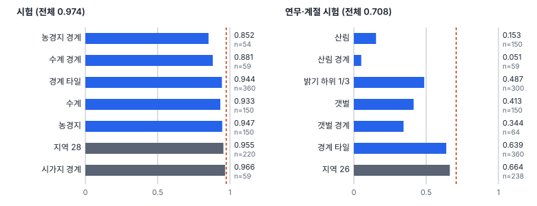
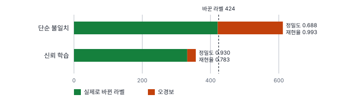
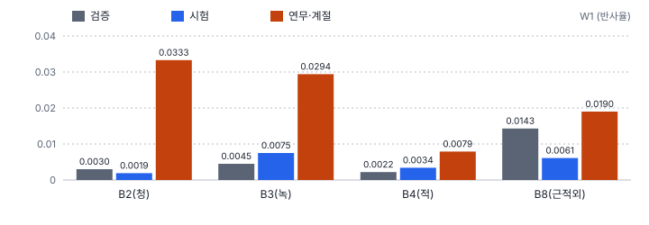

# 54강 데이터 슬라이스와 라벨 품질 진단

## 이 강에서 얻는 것

- 자료를 조건별로 잘라 성능이 유의하게 낮은 취약 슬라이스를 Z-검정과 BH 보정으로 골라내고, 최소 슬라이스 성능을 함께 보고할 수 있음
- 신뢰 학습·라벨 누락 판정·박스 좌표 모호성 지수로 고칠 라벨 후보를 추릴 수 있음
- W1·MMD로 분포 이동을, PMI·지니 계수로 자료의 치우침을 재고, 시간당 기대 개선도로 검수 순서를 정할 수 있음

## 1. 평균이 가리는 곳: 취약 슬라이스

**슬라이스**는 조건 하나(또는 조건의 교집합)로 잘라 낸 자료의 부분집합임. 조건은 메타데이터(지역·촬영일·센서), 영상에서 계산한 물리 통계량(밝기·대비·선명도), 사전학습 모델 임베딩의 군집에서 나옴. 전체보다 성능이 통계적으로 유의하게 낮은 슬라이스가 **취약 슬라이스**임(업계 표준). 회귀에서 잔차를 집단별로 나눠 특정 집단만 크게 빗나가는지 보던 것(7강)을 모델 성능에 옮긴 셈임.

27강 VD-CNN의 시험 900장(정확도 0.974)을 이 자습서에서 정한 21개 슬라이스로 잘랐음. 클래스 6개, 시험 지역 4곳, 경계 타일(다른 클래스가 섞인 타일)과 단일 클래스 타일, 밝기(청·녹·적 반사율 평균) 하위·상위 1/3, 밝은 점 상위 10%(구름 의심), 클래스 × 경계 타일 6개임. 슬라이스 정확도 $\hat p_s$가 전체 정확도 $p$보다 낮은지 이항 비율의 Z-검정(4강)으로 봄.

$$Z = \frac{\hat p_s - p}{\sqrt{p(1-p)/n_s}}$$

농경지 경계 타일 54장 중 46장을 맞혀 $\hat p_s = 0.852$이고, 분모가 0.0215라 $Z = -5.71$, 한쪽 p값은 $5.7 \times 10^{-9}$임. 정확도가 낮아도 표본이 적으면 우연과 가리기 어려움. 10장 중 9장(0.900)이면 $Z = -1.49$, p = 0.068임.

## 2. 한꺼번에 검정하기: BH 보정과 최소 슬라이스

21번 검정하면 우연히 낮게 나오는 슬라이스가 섞임. 그래서 BH 절차(벤자미니-호크버그, 4강)로 거짓 발견율을 묶음. p값을 작은 순으로 세워 $p_{(i)} \le iq/M$을 만족하는 가장 큰 $i$까지 기각함. 그러면 취약하다고 고른 목록 중 실제로는 멀쩡한 슬라이스의 비율이 기댓값으로 $q$ 이하가 됨. BH의 보장은 검정이 독립이거나 같은 방향으로 얽힌(양의 의존) 경우에 성립함(4강). 경계 타일과 농경지 경계처럼 겹친 슬라이스는 양의 의존에 가깝지만, 경계 타일과 단일 클래스 타일처럼 자료를 나눠 가진 슬라이스는 같은 전체 정확도와 비교하므로 한쪽이 낮으면 다른 쪽이 높아지는 반대 방향의 의존이 있어 보장이 엄밀하지 않음. 여기서는 근사로 쓰고, 엄밀함이 필요하면 의존 구조와 상관없이 성립하는 보수적인 변형(4강)을 씀.

시험 자료에서 p < 0.05는 6개였음. $q = 0.1$(이 자습서의 설정)로는 5개가 남고, 6위 지역 28(p = 0.031)은 기준 $6 \times 0.1/21 = 0.029$를 넘어 빠짐. 원문의 $q = 0.05$나 본페로니($0.05/21$)로는 4개임. $q$는 0.05~0.1을 잠정치로 봄. 낮게 잡으면 확실한 것만 남지만 실제 결함을 늦게 찾고, 높게 잡으면 더 찾는 대신 헛걸음(재수집·재학습)이 늘어남.

연무·계절 시험(48강, 전체 0.708)에서는 p < 0.05인 6개가 BH로도 모두 기각되었고 산림이 0.153으로 무너졌음. 근적외 반사를 줄인 계절 변화가 산림을 가장 크게 바꿨기 때문으로 보임.

**최소 슬라이스 mAP**(프로젝트 정의)는 슬라이스별 mAP의 최솟값으로, 가장 나쁜 조건의 하한임. 분류라면 정확도로 같은 계산을 함. 시험은 전체 0.974인데 최소 0.852(농경지 경계), 연무·계절 시험은 0.708인데 0.051(산림 경계 59장)임. 6부 항만 자료(34강)의 mAP50은 전체 0.645, 항만 0.653, 외해 0.639, 마리나 0.881이라 최소는 외해임. 다만 외해 정답은 77개뿐이라 값이 흔들림. 작은 슬라이스일수록 최솟값이 잡음으로 뽑히므로 최소 크기를 정하고 $n$과 함께 적음. 연무·계절 시험에서 값이 가장 낮은 슬라이스(산림 경계)와 Z가 가장 작은 슬라이스(산림 150장)가 다른 것도 같은 이유임.

어떤 조건의 조합이 문제인지는 오답 여부를 얕은 결정트리(16강)에 맞춰 규칙으로 읽거나, 조건 조합을 열거하며 가지치는 SliceLine으로 찾음. 원문은 SliceLine을 결정트리 기반이라 적었는데, 원 논문의 방식은 열거·가지치기임.

## 3. 라벨 품질 진단

**신뢰 학습**(confident learning, 노스컷 등 2021, 업계 표준)은 라벨 오표기를 추정함. 자료를 나눠 학습하고 학습에 쓰지 않은 쪽을 예측한 확률(교차 예측)을 씀. 자기 라벨을 외운 모델은 틀린 라벨에도 동의하기 때문임. 라벨이 $j$인 표본들의 $P(j)$ 평균을 클래스별 문턱 $t_j$로 두고, 다른 클래스 $k$가 $P(k) \ge t_k$이면서 문턱을 넘은 클래스 중 가장 높으면 오표기 후보로 격리함. 원 논문의 여러 판정 방식 중 가장 단순한 것이고, 오표기 수를 추정해 확신 차이 순으로 자르는 방식 등도 있음.

5부 학습 라벨 4,200개 중 424개(10%)를 무작위로 바꾸고 2겹 교차 예측으로 실험했음(시드 고정, CPU 한 스레드 기준). 문턱은 0.71~0.77이었음.

단순 불일치는 모델이 원래 헷갈리는 경계 타일까지 모두 올림. 신뢰 학습은 "그 클래스 평소 확신만큼 확신할 때"만 올려 정밀도 0.930, 재현율 0.783이 되었음. 검수 인력이 적으면 정밀도가 높은 신뢰 학습 쪽을 택함.

**라벨 누락**(missing GT)은 객체가 있는데 정답 상자가 없는 것임. 탐지에서는 52강의 고신뢰 배경 오탐, 곧 점수가 높은데(원문 예 0.85 이상) 어느 정답과도 IoU 0.1 미만인 탐지가 후보임. 원문은 여기에 영상-텍스트 모델의 유사도(0.70 이상, 01장은 점수와 곱해 0.75 이상)를 더해 판정함(프로젝트 정의의 조합). 52강에서 정답 20%를 지우자 점수 0.5 이상 배경 오탐이 전체 오탐의 5.7%에서 18.7%로 늘었음. 점수 기준을 0.5 쪽으로 낮추면 후보가 많아 검수 부담이 커지고, 0.85 쪽으로 높이면 확실한 것만 남지만 점수가 낮게 나오는 흐린 소형 객체의 누락을 놓침(0.5~0.85를 잠정 범위로 봄). 51강 처방 엔진은 이 비율이 0.10~0.15(잠정 범위) 이상이면 P0를 냄. 5.7%는 범위 아래, 18.7%는 위임. 원문 허용 기준인 누락 비율 2%, 오표기 비율 1.5% 미만(잠정치)은 정답 수 대비 비율이라 오탐 중 비율인 이 값과 분모가 다름.

**박스 좌표 모호성 지수**(BAS, 프로젝트 정의)는 상자 네 변의 예측 분포 분산의 평균임.

$$\mathrm{BAS} = \frac{1}{4}\sum_{e \in \{l,r,t,b\}} \mathrm{Var}(e)$$

분포는 DFL(변 위치를 확률분포로 내는 손실)이나 MC 드롭아웃(55강)으로 얻음. 이 자습서에서 만든 예로, 네 변 표준편차가 0.5~0.7화소인 선박은 0.365화소², 2.6~4.0화소인 양식장은 10.8화소²임. 값이 크면 윤곽이 흐려 라벨러마다 상자가 달라지므로 가이드(44강)부터 통일함.

## 4. 분포가 옮겨 갔는가: W1과 MMD

**바서슈타인 거리**(W1, 업계 표준)는 한 분포를 다른 분포로 옮기는 최소 운반 비용이고, 1차원에서는 두 누적분포의 차이를 적분한 값임. 원래 단위(여기서는 반사율)로 읽음.

$$W_1 = \int \lvert F_{\text{학습}}(x) - F_{\text{대상}}(x) \rvert \, dx$$

**최대 평균 불일치**(MMD, 업계 표준)는 커널 $k$로 비교함. $a, a'$은 학습 쪽, $b, b'$은 대상 쪽 표본임.

$$\mathrm{MMD}^2 = \mathbb{E}[k(a,a')] - 2\,\mathbb{E}[k(a,b)] + \mathbb{E}[k(b,b')]$$

학습끼리, 대상끼리의 평균 유사도가 서로 간의 유사도보다 높을수록 커지고, 같은 분포면 0 근처임. 타일별 밴드 평균의 W1과 VD-CNN 특징(64차원) 400장씩의 MMD²(RBF 커널: 거리가 멀수록 0에 가까워지는 가우시안 유사도, 그 거리 척도인 대역폭은 특징 간 거리의 중앙값 9.86)를 학습 자료와 비교했음.

MMD²는 검증 0.0038, 시험 0.0047, 연무·계절 0.0431로 9배임. p값은 해석에 주의함. 순열 100회라 연무·계절의 p = 0.0099는 낼 수 있는 최솟값이고, 시험의 0.059는 "같다"는 증거가 아님. 시험·검증은 학습과 다른 지역이라 차이가 조금 있고, 표본을 늘리면 작은 차이도 유의해짐. 판단은 크기로 함. 학습 타일 밴드 평균의 표준편차와 비교하면 시험 W1은 0.22배 이하, 연무·계절의 청색 밴드는 1.13배임.

## 5. 자료의 치우침: PMI와 지니 계수

**점별 상호정보량**(PMI, 업계 표준)은 클래스 $c$와 배경 $b$가 독립일 때보다 얼마나 자주 함께 나오는지 봄.

$$\mathrm{PMI}(c,b) = \ln\frac{P(c,b)}{P(c)P(b)}$$

6부 정답 1,234개에서 마리나 정답 199개는 모두 소형선박이라 PMI(소형선박, 마리나) = ln(1,234/311) = 1.38임. 차량은 항만에만 있어 외해·마리나와 함께 나온 적이 없음(PMI = −∞, 실무에서는 작은 수를 더해 피함). 그런데 PMI(차량, 항만)은 0.25뿐임. 항만이 정답의 78%라 독립이어도 대부분 항만에서 나오기 때문이므로, 흔한 배경은 함께 나온 수의 표도 같이 봄. 높은 PMI는 모델이 객체 대신 배경을 볼 위험이 있다는 신호임(59강).

**지니 계수**(업계 표준)는 클래스별 표본 수의 불균등을 잼.

$$G = \frac{\sum_i \sum_j \lvert N_i - N_j \rvert}{2C\sum_i N_i}$$

6부 정답(선박 22, 소형선박 311, 차량 901)은 0.475임. 원문은 $G > 0.6$을 극단적 롱테일로 보지만, 최댓값이 $(C-1)/C$라 클래스 3개면 0.667임. 900:90:10도 0.593이라 기준을 넘지 못함. 클래스 수가 적으면 $G$를 최댓값으로 나눠 비교함(이 자습서의 제안). 6부 정답은 0.475 ÷ 0.667 = 0.71임.

## 6. 어디부터 고칠까: 시간당 기대 개선도

진단은 처방으로 이어짐(51강). 라벨 오표기·누락은 P0라 먼저 고침. 그대로 두면 다른 조치가 틀린 정답을 배우기 때문임. 취약 슬라이스는 목표형 증강(저대비면 대비 증강, 소형이면 복사-붙여넣기), 높은 PMI는 배경 교체 증강, 큰 지니 계수는 클래스 가중 손실로 다루며 모두 재학습이 드는 P1임. 다만 미탐률이 아주 높은 치명적 취약 슬라이스는 그 조건의 자료가 빠진 것으로 보고 자료 수집부터 하는 P0로 올림(51강). 큰 MMD는 대상 환경 자료를 모아 의사 라벨링(모델 예측을 임시 정답으로 씀)해 다시 학습하는 쪽(P1)으로 감. 고칠 라벨이 많으면 순서가 필요함.

**시간당 기대 개선도**(EIAH, 프로젝트 정의)는 재라벨링으로 기대되는 손실 감소를 예상 작업 시간으로 나눈 값임.

$$\mathrm{EIAH} = \frac{\Delta \mathcal{L}}{\text{예상 라벨링 시간}}$$

이 자습서에서 만든 예로, 상자 60개를 다 봐야 하는 항만 타일(손실 감소 0.90, 30분)은 1.8/시간, 누락 의심 1개인 외해 타일(0.35, 2분)은 10.5/시간, 오표기 의심 3개인 마리나 타일(0.40, 5분)은 4.8/시간이라 외해 → 마리나 → 항만 순으로 맡김. $\Delta\mathcal{L}$은 신뢰 학습 확률 등으로 추정한 값이라 순서를 정하는 데만 씀. 원문은 새로 라벨링할 표본을 불확실성·취약 슬라이스 근접도·다양성의 가중합으로 고르는데, 근접도를 마할라노비스 거리로만 적어 방향이 분명하지 않음. 거리를 그대로 더하면 취약 슬라이스에서 먼 표본이 뽑히므로 부호를 뒤집어 씀.

## 현장에서는

연안 토지피복 분류기를 가을 장면에 적용했더니 산림 면적이 크게 줄어든 상황임. 슬라이스 검정과 BH로 산림·갯벌·어두운 타일이 취약 슬라이스로 남았고, W1은 청·녹 밴드에서 컸음. 라벨보다 입력 이동이 원인이라 보고 계절 자료를 추가함(48강). 반대로 W1·MMD가 작은데 한 클래스만 낮으면 신뢰 학습으로 오표기 후보를 뽑아 EIAH 순으로 검수함. Diagnostics 노트에서 이 장은 PoC 구현 단계이고, 이 강의 실험은 작은 가상 자료로 직접 구현해 본 것임.

## 헷갈리는 쌍

- **취약 슬라이스 vs 최소 슬라이스**: 취약 슬라이스는 검정·보정을 통과한 슬라이스 목록이고, 최소 슬라이스 성능은 값 하나(하한)임. 작은 슬라이스의 최솟값은 우연일 수 있음.
- **W1 vs MMD**: W1은 1차원 값의 분포를 원래 단위로 비교하고, MMD는 고차원 특징 분포 전체를 커널로 비교함.
- **지니 계수 vs 지니 불순도**: 지니 계수는 표본 수의 불균등(한 클래스에 몰리면 최대), 지니 불순도(16강)는 섞인 정도(균등하면 최대)임. 클래스 3개에서 최댓값이 둘 다 0.667이라 섞어 쓰기 쉬움.

## 이렇게 지시받음

> 지시: "전체 mAP 말고 구름 그림자 타일만 떼서 따로 봐. 다른 조건들도 같이 돌리고."

여러 슬라이스를 검정하라는 뜻이므로 p값을 BH로 보정하고, 슬라이스마다 $n$과 성능, 최소 슬라이스 값을 함께 보고함.

> 지시: "부표랑 폐어구 라벨 섞인 것 같아. 신뢰 학습으로 후보부터 뽑아."

교차 예측 확률로 클래스별 문턱을 정해 후보를 뽑음. 검수 시간이 적으면 정밀도가 높은 신뢰 학습 목록을 EIAH 순으로 넘김.

> 지시: "새 센서 영상이랑 학습셋 밝기 분포 W1부터 봐. 전처리로 풀릴지."

밴드별 W1을 학습 표준편차와 비교함. 특정 밴드만 크면 전처리나 정규화 통계 재계산(48강)을 먼저 해 봄.

## 요약

- 취약 슬라이스는 Z-검정 후 BH로 보정함. 시험 21개 중 p < 0.05는 6개, BH(q = 0.1)는 5개였음
- 최소 슬라이스 성능은 평균이 가리는 하한임. 시험 0.974 대 0.852, 연무·계절 0.708 대 0.051
- 신뢰 학습은 단순 불일치보다 정밀도가 높음(0.930 대 0.688). 라벨 누락은 고신뢰 배경 오탐에서, 상자 모호성은 BAS로 봄
- W1·MMD는 크기로 판단하고 p값은 표본 수와 순열 횟수를 함께 읽음
- PMI는 배경 편향을, 지니 계수는 불균형을 재되 최댓값이 $(C-1)/C$임. 검수 순서는 EIAH로 정함

## 핵심 용어

| 한글 | 영문 |
|---|---|
| 슬라이스 / 취약 슬라이스 | Slice / Vulnerable Slice |
| 최소 슬라이스 mAP | Min-Slice mAP |
| 신뢰 학습 | Confident Learning (CL) |
| 교차 예측 확률 | Out-of-Fold Predicted Probability |
| 라벨 누락 | Missing Ground Truth (Missing GT) |
| 박스 좌표 모호성 지수 | Box Ambiguity Score (BAS) |
| 바서슈타인 거리 | Wasserstein Distance (W1) |
| 최대 평균 불일치 | Maximum Mean Discrepancy (MMD) |
| 점별 상호정보량 | Pointwise Mutual Information (PMI) |
| 지니 계수 | Gini Coefficient |
| 시간당 기대 개선도 | Expected Improvement per Annotation Hour (EIAH) |
