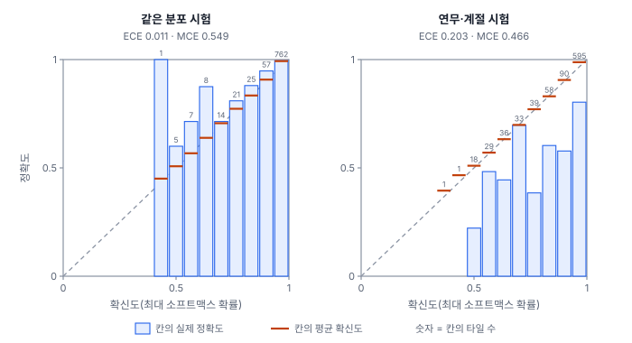
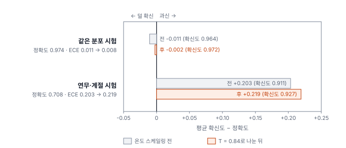
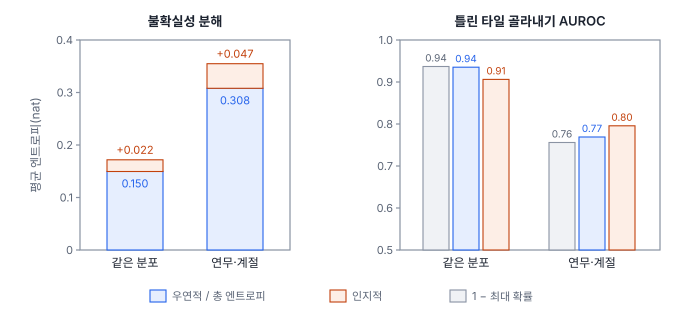

# 55강 믿을 만한 확신인가

## 이 강에서 얻는 것

- 신뢰도 도표를 그리고 ECE·MCE를 계산해, 모델이 과신하는지 덜 확신하는지 판단할 수 있음
- 온도 스케일링이 무엇을 바꾸고 무엇을 바꾸지 않는지, 분포가 바뀐 자료에서는 왜 믿을 수 없는지 설명할 수 있음
- MC 드롭아웃으로 불확실성을 우연적·인지적으로 나누고, 그 값을 오류 탐지에 쓸 때의 한계를 말할 수 있음

## 1. 확신도와 적중률

분류 모델의 소프트맥스 최대 확률을 **확신도(confidence)**라 부름. 확신도 0.9인 예측들을 모았을 때 실제로 열에 아홉이 맞으면 그 모델은 **보정(calibration)**이 잘 된 것임. 확신도가 적중률보다 높으면 **과신(overconfidence)**, 낮으면 덜 확신(underconfidence)임. 27강에서 확률이 보정을 보장하지 않는다는 것을, 29강에서 과적합이 정확도보다 과신으로 먼저 드러나는 것을 봤음. 정확도와 ROC-AUC(17강)는 맞힌 개수와 점수의 순서만 보므로 확률의 크기가 맞는지는 따로 재야 함.

이 강은 Diagnostics 노트 03장(표현·신뢰도 진단) 앞부분을 다룸. 원문은 이 장을 PoC 구현 단계로 밝힘. 아래 실험은 이 체계를 5부 타일 자료와 VD-CNN(27강)으로 직접 구현해 본 것이며 Diagnostics의 실제 구현물이 아님. 시험은 같은 분포 시험 900장과, 같은 타일에 연무와 계절 변화를 넣은 연무·계절 시험(48강) 900장임.

## 2. 신뢰도 도표와 ECE·MCE

확신도 0~1을 $M$개 칸으로 나누고 칸마다 평균 확신도와 실제 정확도를 비교함. 막대로 그린 것이 **신뢰도 도표(reliability diagram)**이고, 막대가 대각선에 붙을수록 보정이 잘 된 것임.

$$\mathrm{ECE} = \sum_{m=1}^{M} \frac{n_m}{N}\,\bigl\lvert \mathrm{acc}_m - \mathrm{conf}_m \bigr\rvert, \qquad \mathrm{MCE} = \max_m \bigl\lvert \mathrm{acc}_m - \mathrm{conf}_m \bigr\rvert$$

**기대 보정 오차(ECE)**는 칸별 차이를 칸에 든 표본 비율로 가중 평균한 값이고, **최대 보정 오차(MCE)**는 가장 크게 어긋난 칸의 차이임(둘 다 업계 표준). 칸은 보통 10~15칸 등간격으로 나누며 여기서는 15칸을 썼음. ECE는 절댓값이라 어긋난 방향을 알려 주지 않으므로, 평균 확신도 − 정확도의 부호(+면 과신, −면 덜 확신)를 함께 적음.



같은 분포 시험은 정확도 0.974, 평균 확신도 0.964, ECE 0.011임. 타일 762장(85%)이 0.93 이상 칸에 몰려 있고 이 칸의 정확도는 0.995로 확신도와 거의 같음. 그런데 MCE는 0.549임. 0.40~0.47 칸에 타일이 **단 1장**뿐이고, 그 타일이 확신도 0.451로 맞혔기 때문임. 같은 개수 칸(칸마다 60장)으로 나누면 MCE가 0.077로 떨어짐. MCE는 표본이 적은 칸 하나에 흔들리므로 칸별 표본 수와 함께 보고, 칸마다 표본 수가 같게 나누는 방식도 함께 씀.

연무·계절 시험은 정확도 0.708인데 평균 확신도는 0.911이고 ECE는 0.203임. 0.93 이상 칸 595장의 정확도가 0.803이고, 틀린 263장 중 139장이 0.9 넘게 확신했음. 모든 칸이 과신 쪽으로 어긋나면 ECE는 "평균 확신도 − 정확도"와 같아져, 칸을 10·20칸이나 같은 개수 칸으로 바꿔도 0.203 그대로였음.

탐지에서는 맞음의 기준을 정해 같은 식을 쓰고(D-ECE, 논문에서 쓰는 확장. 맞음 판정 IoU는 연구마다 다르며 Diagnostics는 IoU 0.5 이상·클래스 일치로 정함), 분할에서는 화소 확률로 재되 Diagnostics는 경계와 내부를 따로 내도록 정함(프로젝트 정의).

## 3. 온도 스케일링: 같은 분포에서만 통함

**온도 스케일링(temperature scaling)**은 로짓을 하나의 수 $T$로 나눈 뒤 소프트맥스를 거는 사후 보정임(업계 표준). $T$는 학습이 끝난 뒤 검증 자료의 음의 로그 우도(NLL, 정답 클래스 확률의 로그에 음수를 붙인 평균)가 최소가 되게 고름.

$$p_k = \frac{\exp(z_k / T)}{\sum_j \exp(z_j / T)}$$

$T > 1$이면 확률이 평평해지고, $T < 1$이면 뾰족해짐(27강). 모든 로짓을 같은 수로 나누므로 1위 클래스가 바뀌지 않아 정확도는 그대로임.

검증 900장(정확도 0.960, 평균 확신도 0.954)으로 맞춘 $T$는 0.837이었음. 이 모델은 같은 분포에서 약간 덜 확신했으므로 $T < 1$로 확률을 뾰족하게 한 것임.

| 시험 | 정확도 | ECE 전 → 후 | MCE 전 → 후 | NLL 전 → 후 |
|---|---|---|---|---|
| 같은 분포 | 0.974 | 0.011 → 0.008 | 0.549 → 0.232 | 0.080 → 0.078 |
| 연무·계절 | 0.708 | 0.203 → 0.219 | 0.466 → 0.415 | 1.025 → 1.184 |



같은 분포에서는 ECE와 NLL이 줄었음. 온도 뒤 MCE 0.232도 7장짜리 칸에서 나온 값임. 연무·계절 시험에서는 오히려 커졌음. 이미 과신하는 자료에서 확률을 더 뾰족하게 만들었기 때문임. 이동 자료의 라벨로 맞췄다면 $T$는 2.36이 되고 ECE는 0.066이 됨(비교용 계산. 실무에서는 이 라벨이 없음). 그래서 **검증 자료로 맞춘 온도 하나는 분포 이동을 따라가지 못한다**고 보는 것이 가설임. 연무가 로짓 크기와 적중률의 관계 자체를 바꾸는데, 같은 분포의 검증 자료에는 그 정보가 없기 때문으로 보임.

1위 클래스는 그대로여도 타일 사이의 확신도 순서는 조금 바뀔 수 있음(같은 분포 시험에서 최대 확률로 틀린 타일을 고르는 AUROC가 0.938 → 0.937). 그래서 확신도 임계값으로 정한 운영점(38강)은 보정한 확률로 다시 정함. 확신도를 적중률로 옮기는 단조 함수를 직접 맞추는 등위 회귀(isotonic regression)도 있지만, 자유도가 커서 검증 자료가 더 필요함.

## 4. MC 드롭아웃과 불확실성 둘

**몬테카를로 드롭아웃(MC Dropout)**은 추론 때 드롭아웃을 켠 채 같은 입력을 $T_s$번 넣어 확률 $\mathbf{p}^{(t)}$ 여러 벌을 얻는 방법임(업계 표준). 29강에서 추론 때는 드롭아웃을 끈다고 했는데, 일부러 켜서 모델 여러 개를 흉내 냄.

```python
model.eval()                                   # 배치 정규화는 러닝 통계
for mod in model.modules():
    if isinstance(mod, nn.Dropout): mod.train()  # 드롭아웃만 켬
with torch.no_grad():
    P = torch.stack([model(x).softmax(1) for _ in range(30)])
```

샘플 수는 온도 $T$와 구별해 $T_s$로 씀. 총 불확실성은 평균 확률 $\bar{\mathbf{p}}$의 엔트로피(예측 엔트로피)이고, 여기서 각 회 엔트로피의 평균을 빼서 둘로 나눔(자연로그로 잰 단위가 nat이고, 6클래스에서 최댓값은 $\ln 6 = 1.79$).

$$\underbrace{H(\bar{\mathbf{p}})}_{\text{총}} = \underbrace{\frac{1}{T_s}\sum_t H(\mathbf{p}^{(t)})}_{\text{우연적}} + \underbrace{\Bigl[H(\bar{\mathbf{p}}) - \frac{1}{T_s}\sum_t H(\mathbf{p}^{(t)})\Bigr]}_{\text{인지적}}$$

**우연적 불확실성(aleatoric uncertainty)**은 매번 일관되게 망설이는 몫으로, 혼합 화소나 연무처럼 자료 자체가 모호해서 생기며 자료를 더 모아도 줄지 않음. **인지적 불확실성(epistemic uncertainty)**은 회마다 답이 달라지는 몫(상호정보량)으로, 모델이 그런 입력을 덜 배워서 생기며 자료를 보태면 줄어듦.

VD-CNN의 마지막 선형 층 앞에 드롭아웃 0.3을 넣어 새로 학습(시험 0.968, 연무·계절 0.782)하고 30번 샘플링했음. 시드 0, CPU 한 스레드 기준이며 환경이 다르면 소수 셋째 자리쯤 달라질 수 있음.

| 시험 | 총 | 우연적 | 인지적 (맞음 / 틀림) | 오류 탐지 AUROC: 최대 확률 · 총 · 인지적 |
|---|---|---|---|---|
| 같은 분포 | 0.172 | 0.150 | 0.022 (0.020 / 0.084) | 0.937 · 0.935 · 0.906 |
| 연무·계절 | 0.355 | 0.308 | 0.047 (0.036 / 0.085) | 0.756 · 0.769 · 0.796 |



오류 탐지 AUROC는 틀린 타일을 양성으로 놓고 불확실성 점수로 순서를 매긴 ROC-AUC(17강)임. 같은 분포에서는 최대 확률이 가장 좋았고, 연무·계절에서는 인지적 불확실성이 가장 좋았음. 이동 자료에서 총·우연적·인지적 불확실성이 모두 약 2.1배가 되어 인지적 몫만 따로 커지지는 않았고, 인지적 불확실성만으로 이동 타일과 시험 타일을 가르는 AUROC는 0.681로 약했음. 드롭아웃이 마지막 층 한 곳에만 있어 모델 불확실성을 작게 잡았을 가능성이 있음(가설). 같은 드롭아웃 모델을 드롭아웃 없이 한 번 추론했을 때와 비교하면, MC 평균 확률의 ECE는 연무·계절에서 0.112 → 0.085로 줄었지만, 원래 덜 확신하던 같은 분포에서는 확률이 더 평평해져 0.016 → 0.028로 늘었음. 추론 비용은 30배임.

## 5. 진단 기준과 처방

Diagnostics는 ECE가 대략 0.10~0.12를 넘으면 보정 처방을 냄(원문 간 차이가 있는 잠정치, 프로젝트 정의). 기준을 낮게 잡으면 작은 어긋남에도 처방이 나가 빨리 잡지만 오경보와 불필요한 재학습이 늘고, 높게 잡으면 확실할 때만 나가 실제 과신을 늦게 발견함. 이 실험의 연무·계절 시험(0.203)은 어느 쪽으로 잡아도 걸림. 배포 게이트(61강)는 이보다 엄한 ECE 0.08 이하를 쓰므로(역시 잠정치), 0.08~0.10 사이는 처방은 안 나가도 게이트에서 걸릴 수 있음. 처방은 재학습 없이 온도 스케일링을 붙이는 P2와, 라벨 스무딩(29강)·드롭아웃 강화로 다시 학습하는 P1로 나뉨. 단, 위에서 봤듯 P2는 이동한 자료로 다시 재어 확인함. 인지적 불확실성이 높은 타일에서 틀리면 그 조건의 자료를 더 모으고(모델이 헷갈리는 것부터 라벨링하는 능동 학습), 우연적이 높으면 라벨 정제(P0)와 확률적 손실(P1)을 검토함.

같은 03장 뒷부분의 유효 랭크·차원 붕괴·비활성 채널 비율·뉴럴 콜랩스(특징 공간), 유효 수용영역과 수용영역-객체 스케일 불일치(RFM), 어텐션 엔트로피는 56강에서 다룸.

## 현장에서는

분기마다 토지피복 확률 지도를 만들고, 확신도 0.9 이상 격자는 자동 확정, 나머지는 검수자에게 넘기는 상황임. 봄 장면 검증에서는 0.9 이상 칸의 정확도가 0.99여서 기준을 정했는데, 가을 연무 장면에서 같은 칸의 정확도가 0.80으로 떨어짐. 검증으로 맞춘 온도는 이 장면을 더 과신하게 만들 수 있음. 그래서 장면마다 검수 표본 수십 장으로 0.9 이상 칸의 적중률을 먼저 재고, 모자라면 자동 확정 임계값(운영점, 38강)을 올리거나 그 장면은 전부 검수로 돌림. 검수 순서를 인지적 불확실성으로 잡을지는, 연무 장면 표본에서 최대 확률보다 틀린 격자를 더 잘 고르는지 확인하고 정함.

## 헷갈리는 쌍

- **ECE vs MCE**: ECE는 표본 비율로 가중한 평균 어긋남, MCE는 가장 나쁜 칸 하나임. MCE는 표본 1장짜리 칸에도 크게 바뀜.
- **보정 vs 정확도·AUC**: 정확도와 AUC는 맞힌 개수와 순서를 보고, 보정은 확률의 크기를 봄. 온도 스케일링은 정확도를 바꾸지 않고 보정만 바꿈.
- **우연적 vs 인지적 불확실성**: 우연적은 자료가 모호해서 생겨 자료를 더 모아도 남고, 인지적은 모델이 덜 배워서 생겨 자료를 보태면 줄어듦.
- **온도 스케일링 vs 라벨 스무딩**: 온도 스케일링은 학습 뒤 로짓을 나누는 후처리, 라벨 스무딩은 학습 목표를 바꿔 다시 학습하는 규제임.

## 이렇게 지시받음

> 지시: "자동 확정 기준 정하기 전에 신뢰도 도표부터 뽑아. 칸마다 개수도 같이."

확신도 구간별 실제 적중률을 보고 기준을 정하라는 뜻임. 칸별 표본 수를 함께 적어 표본이 적은 칸의 어긋남(MCE를 키우는 칸)을 과하게 해석하지 않게 함.

> 지시: "온도 스케일링 붙였으니 연무 장면도 괜찮겠지? 확인해 봐."

같은 분포에서 줄어든 ECE가 이동한 자료에서도 줄었는지 보라는 뜻임. 연무 장면 검수 표본으로 ECE와 0.9 이상 칸 적중률을 온도 전후로 재고, 오히려 커지면 온도 하나로는 따라가지 못한다고 보고함.

> 지시: "검수 물량 줄여야 해. MC 드롭아웃 돌려서 불확실한 것만 넘겨."

불확실성 점수로 틀릴 만한 타일을 골라 넘기라는 뜻임. 같은 분포에서는 최대 확률만으로도 비슷하게 골라졌으므로, 30배 추론 비용에 맞는 이득이 있는지 오류 탐지 AUROC로 비교해 보고함.

## 요약

- 보정은 확신도와 실제 적중률이 맞는지이고, 신뢰도 도표·ECE·MCE로 잼. MCE는 표본이 적은 칸에 흔들림
- VD-CNN은 같은 분포에서 약간 덜 확신(ECE 0.011)하고, 연무·계절 시험에서는 크게 과신(ECE 0.203)했음
- 온도 스케일링은 정확도를 두고 확률의 세기만 바꿈. 검증으로 맞춘 $T = 0.837$은 같은 분포에서만 ECE를 줄이고 이동 자료에서는 키웠음
- MC 드롭아웃은 추론 때 드롭아웃을 켜고 여러 번 돌려 불확실성을 우연적·인지적으로 나눔. 이동 자료에서 인지적 몫만 커지지는 않았음
- ECE 처방 기준(대략 0.10~0.12)은 잠정치이고, 온도 스케일링(P2)은 이동한 자료로 다시 확인함

## 핵심 용어

| 한글 | 영문 |
|---|---|
| 확신도 / 보정 | Confidence / Calibration |
| 과신 / 덜 확신 | Overconfidence / Underconfidence |
| 신뢰도 도표 | Reliability Diagram |
| 기대 보정 오차 / 최대 보정 오차 | Expected / Maximum Calibration Error (ECE / MCE) |
| 온도 스케일링 | Temperature Scaling |
| 음의 로그 우도 | Negative Log-Likelihood (NLL) |
| 몬테카를로 드롭아웃 | Monte Carlo Dropout (MC Dropout) |
| 우연적 / 인지적 불확실성 | Aleatoric / Epistemic Uncertainty |
| 상호정보량 | Mutual Information |
| 오류 탐지 AUROC | Error-Detection AUROC |
