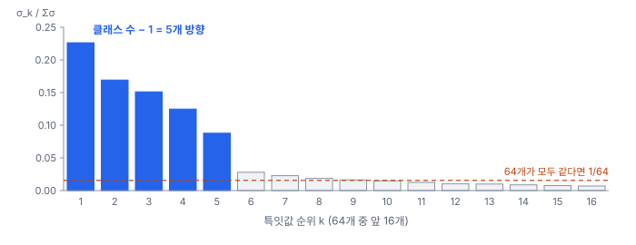
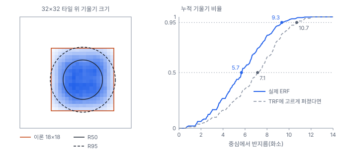
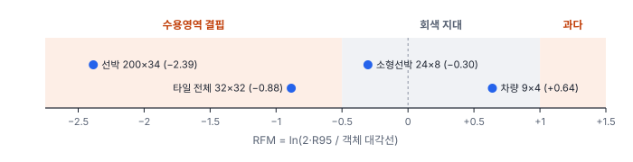

# 56강 표현이 무너질 때

## 이 강에서 얻는 것

- 특징이 실제로 쓰는 차원 수(유효 랭크·CUR)와 죽은 채널 비율을 재고, 작은 모델에서 이 값을 해석할 때의 한계를 말할 수 있음
- 뉴럴 콜랩스(NC1)가 무엇을 재는지, 차원 붕괴와 어떻게 다른지 구분할 수 있음
- 유효 수용영역을 객체 크기와 견주는 RFM과 어텐션 엔트로피를 읽고, 증상에 맞는 처방 방향을 고를 수 있음

## 1. 출력 말고 속을 봄

같은 장(H.rel)의 앞 절반인 확신의 품질, 즉 과신, 기대 보정 오차(ECE), 온도 스케일링, 몬테카를로 드롭아웃(MC Dropout)으로 나누는 우연적 불확실성과 인지적 불확실성은 55강에서 다룸. 이 강은 모델 **안쪽의 특징**을 봄. 정확도는 괜찮은데 특징이 몇 방향으로만 몰렸거나, 채널 절반이 죽었거나, 한 칸이 보는 범위가 객체보다 훨씬 좁다면 데이터가 조금만 바뀌어도 무너지기 쉬움.

Diagnostics 노트는 이 장을 PoC 구현으로 밝히지만 이 강의 범위는 일부만 구현됨(유효 랭크·죽은 채널은 구현, 수용영역·어텐션 분석은 확장 예정). 이 강의 수치는 이 체계를 5부 VD-CNN(27강)과 작은 ViT(32강)에 **직접 구현해 본 것**이며 Diagnostics의 구현물이 아님. 시드 0, CPU 한 스레드 기준임.

## 2. 유효 랭크와 차원 붕괴

특징 행렬 $A$(행 = 표본, 열 = 채널 $C$개)에 **특잇값 분해(SVD)**를 걸면, 자료가 퍼진 방향별 크기인 특잇값 $\sigma_1 \ge \sigma_2 \ge \dots \ge \sigma_C$가 나옴. 이를 합이 1인 비율로 바꾸고 엔트로피에 지수를 취한 것이 **유효 랭크(effective rank)**(업계 표준, 로이·베털리 2007)임. 원 정의는 행렬을 그대로 쓰지만 여기서는 채널 평균을 빼고 계산함. 채널 수로 나눈 비율이 **특성 용량 활용률(CUR)**(프로젝트 정의)임.

$$p_k = \frac{\sigma_k}{\sum_i \sigma_i}, \qquad \mathrm{Rank}_{\mathrm{eff}} = \exp\Big(-\sum_k p_k \ln p_k\Big), \qquad \mathrm{CUR} = \frac{\mathrm{Rank}_{\mathrm{eff}}}{C}$$

말로 하면 "특징이 사실상 몇 개의 독립된 방향을 쓰는가"임. 특잇값 넷이 모두 같으면 4, 하나만 있으면 1이고, (4, 2, 1, 1)이면 비율이 (0.5, 0.25, 0.125, 0.125), 엔트로피 1.213, 유효 랭크 3.36임. 채널이 많아도 특징이 좁은 부분공간으로 몰리는 현상이 **차원 붕괴(dimensional collapse)**임. 회귀에서 설명변수끼리 닮아 행렬이 사실상 몇 열만 쓰는 다중공선성(8강)과 같은 그림임.

```python
F = feats - feats.mean(0)          # (표본 수, 채널 수), 평균을 뺌
s = np.linalg.svd(F, compute_uv=False)
p = s / s.sum()
eff_rank = np.exp(-(p * np.log(p + 1e-12)).sum())
cur = eff_rank / F.shape[1]
```

기본 VD-CNN의 전역 평균 풀링 특징(64채널, 시험 900장)은 유효 랭크 12.9, CUR 20.2%임. 원문 본문은 20%, 처방 엔진의 참조 코드는 25%를 심한 붕괴 경고선으로 써서 대략 **20~25% 아래**가 경고 범위임(잠정치). 경고선을 25% 쪽으로 올려 잡으면 일찍·자주 경고해 오경보와 불필요한 재학습이 늘고, 20%보다 낮추면 확실한 붕괴만 잡는 대신 늦게 발견함.



그런데 이 모델은 시험 정확도 0.974로 멀쩡함. 클래스가 6개인 분류기의 마지막 특징은 클래스 평균 6개 주변에 모이고, 점 6개가 펼치는 방향은 최대 5개(클래스 수 − 1)임. 실제로 분산(σ²) 기준 위 5개 방향이 97.7%를 차지함. 클래스가 적은 작은 모델은 **CUR이 원래 낮게 나옴**. 원문의 "60% 이상이면 이상적"은 큰 백본의 중간층을 염두에 둔 값이라 그대로 견주지 않고, 같은 구조·같은 층의 이전 버전과 비교함. σ² 비율로 정의하면 같은 특징의 유효 랭크가 4.8로 나오므로, 정의를 함께 적음.

## 3. 죽은 채널과 뉴럴 콜랩스

**비활성 채널 비율(DCR)**(프로젝트 정의)은 검증 자료 전체에서 평균 절댓값 활성 $\mu_c$가 $\epsilon = 10^{-4}$보다 작은 채널의 비율임.

$$\mathrm{DCR} = \frac{1}{C}\sum_{c=1}^{C} \mathbf{1}(\mu_c < \epsilon)$$

ReLU 입력이 늘 음수가 되면 출력과 기울기가 모두 0이라 다시 살아나지 못함(죽은 ReLU, 27강). 원문은 **15% 안팎**을 넘으면 초기화 불량·죽은 ReLU·과한 학습률을 의심함(잠정치).

**뉴럴 콜랩스(neural collapse)**(업계 표준, 패피언 등 2020)는 학습 막바지(학습 오차가 0에 닿은 뒤에도 계속 학습할 때)에 같은 클래스 특징의 흩어짐이 클래스 평균 사이 간격에 비해 0으로 줄어드는 현상임. 그 정도를 재는 NC1은 다음과 같음.

$$\mathrm{NC1} = \frac{1}{K}\,\mathrm{tr}\big(\Sigma_W \Sigma_B^{\dagger}\big)$$

$\Sigma_W$는 클래스 안 공분산, $\Sigma_B$는 클래스 평균들의 공분산, $\dagger$는 유사역행렬, $K$는 클래스 수임. "클래스 안 흩어짐을 클래스 사이 간격의 눈금으로 잰 값"이라 작을수록 클래스가 단단히 뭉침.

배치 정규화(29강)를 빼고 학습률을 20배(Adam 0.02)로 올려 10에폭 학습한 모델과 비교했음.

| 지표 | 기본 VD-CNN | 정규화 없음·학습률 0.02 |
|---|---|---|
| 시험 정확도(best) | 0.974 | 0.936 |
| 유효 랭크 / CUR | 12.9 / 20.2% | 7.8 / 12.1% |
| DCR(블록 1·2·3, 시험 500장) | 0·0·0% | 6.3·59.4·42.2% |
| NC1(시험) | 0.146 | 0.278 |

죽은 채널은 블록 1이 16개 중 1개, 블록 2가 32개 중 19개, 블록 3이 64개 중 27개임. 블록 3에서 살아 있는 채널이 37개뿐이고 유효 랭크도 7.8로 떨어졌음. 배치 정규화는 매 배치 채널 평균을 빼서 ReLU 입력의 상당 부분을 양수 쪽에 남기는데, 이것이 없고 학습률이 크면 몇 걸음 만에 음수 쪽으로 밀린 채널이 그대로 죽는다는 설명이 그럴듯함(확인하지 않은 가설). 두 가지를 한꺼번에 바꿨고 에폭 수(10 대 30)도 달라 정확도 차이를 어느 한쪽 탓으로 읽지 않음.

기본 모델의 NC1은 학습 0.150, 시험 0.146으로 0과 거리가 멂. 학습 정확도가 0.965에 머물러 뉴럴 콜랩스가 일어나는 막바지에 닿지 않았기 때문임. 원문은 "NC1이 0에 가까우면 도메인 변화에 취약한 과적합"으로 보고 믹스업·컷믹스(45강)를 처방하는데, 이 해석과 처방은 프로젝트 쪽 가설이고, 패피언 등은 오히려 일반화·강건성에 이롭다고 보고했음. 이 실험에서는 오히려 NC1이 큰 쪽이 나쁜 모델이었음.

## 4. 유효 수용영역과 객체 크기

VD-CNN 마지막 합성곱 한 칸의 **이론 수용영역(TRF)**은 18×18화소임(30강). 하지만 그 안의 화소가 똑같이 기여하지는 않음. 출력 한 점을 입력 화소로 미분한 기울기 크기의 분포가 **유효 수용영역(ERF)**(업계 표준, 루오 등 2016)이고, 가운데가 두껍고 가장자리로 갈수록 옅음. 기울기 질량 95%를 담는 반지름이 원문의 실효 반경 $R_{95}$임. 이 자습서에서는 마지막 합성곱 가운데 칸 하나를 시험 300장으로 쟀고, 반지름은 기울기 무게중심에서 잼.



기울기의 절반이 반지름 5.7화소 안에 있음. 고르게 퍼졌다면 7.1이 나와야 하고, 이 원의 넓이는 이론 수용영역의 31%뿐임. 가운데 9×9(넓이 25%)에 기울기의 41%가 몰림. 반면 $R_{95}$는 9.3으로 이론 반폭 9와 거의 같아, 이렇게 얕은 망에서는 꼬리까지 세면 ERF가 TRF를 거의 다 씀. 층이 깊어질수록 ERF는 TRF보다 훨씬 느리게 커져 차이가 벌어짐(루오 등의 결과).

**수용영역-객체 스케일 불일치 지수(RFM)**(프로젝트 정의)는 ERF 지름과 객체 대각선 $S = \sqrt{w^2 + h^2}$의 비를 로그로 잰 것임.

$$\mathrm{RFM} = \ln\frac{2R_{95}}{S}$$

0이면 크기가 맞고, 음수면 객체가 더 커서 윤곽 대신 무늬만 보는 **수용영역 결핍**, 양수면 객체 주변 배경이 특징을 덮는 **수용영역 과다**임. 경계는 원문 안에서 엇갈림. 본문은 −0.5와 +1.0, 처방표는 "0보다 훨씬 작음·큼"이라고만 씀. 이 강에서는 −0.5 아래·+1.0 위를 뚜렷한 경고로, 그 사이를 회색 지대로 둠(잠정치). 경계를 0 쪽으로 당기면 구조 변경 처방이 자주 나가 재학습 비용이 늘고, 멀리 밀면 작은 객체 소실을 늦게 발견함.

$2R_{95} = 18.7$화소인 이 층이 6부 항만 영상(34강)의 객체를 화소 크기 그대로 본다고 가정해 계산해 봄.



선박(200×34)은 −2.39로 지름이 선박 대각선의 9%뿐임. 타일 전체(32×32)도 −0.88로 결핍인데 분류가 잘 되는 것은 전역 평균 풀링이 칸 64개를 모으기 때문임. 한 칸이 객체를 맡는 탐지에서 이 값이 더 중요함.

작은 객체는 RFM과 **소형 표적 판정을 따로** 함. RFM은 대각선(길이)으로 재지만, 소형 표적인지는 **넓이(화소²)**로 정함. 실제 넓이를 GSD²로 나눈 화소 수(EPS)가 16 미만(약 4×4화소)이면 형상 인식 한계, 1,024 미만(32²)은 COCO 소형임(57강). 차량 9×4는 넓이 36(√넓이 6화소)이라 COCO 소형이지만 형상 한계는 넘음. 넓이가 같은 6×6 정사각형은 대각선이 짧아 RFM이 +0.79로 더 큼. 그래서 보고서에는 넓이와 √넓이, 대각선을 함께 적음.

## 5. 어텐션 엔트로피

ViT는 수용영역 대신 어텐션 가중치를 봄(32강). 헤드 $h$의 **어텐션 엔트로피(attention entropy)**는 토큰 $N$개에 대한 가중치 행의 엔트로피 평균임.

$$\mathcal{H}(h) = -\frac{1}{N}\sum_{i=1}^{N}\sum_{j=1}^{N} A_{ij}\ln A_{ij}$$

최댓값은 $\ln N$임. $\ln N$에 가까우면 모든 토큰을 고르게 보는 분산 상태, 0에 가까우면 토큰 한두 개에만 매달리는 어텐션 싱크임. 엔트로피 자체는 연구에서 널리 쓰는 측정이고, 판정 구간은 프로젝트 정의임.

작은 ViT(토큰 65개)를 15에폭 학습해(시험 정확도 0.947) 시험 200장으로 쟀음. $\ln 65$로 나눈 값의 층별 헤드 평균은 1층부터 0.924, 0.873, 0.946, 0.964이고, 16개 헤드 모두 0.84~0.99임. 지수를 취하면 헤드 하나가 사실상 34~62개 토큰을 보는 셈임(유효 랭크와 같은 발상). 어텐션 싱크는 없지만 대부분 넓게 퍼짐. 토지피복 타일처럼 타일 전체가 한 클래스의 무늬인 과제에서는 넓게 보는 것이 자연스러워 이를 결함으로 읽지 않음. 작은 선박을 찾는 탐지라면 같은 값이 경고가 됨. 분할 마스크 안에 어텐션이 얼마나 떨어지는지 재는 정렬도(ASAI, 프로젝트 정의, 0.35 미만이면 배경 의존 의심, 잠정치)도 있으나 여기서는 재지 않았음.

## 6. 처방은 방향부터

| 증상 | 재학습 필요(P1) | 재학습 없음(P2)·경량화 |
|---|---|---|
| CUR 낮음 | 탈상관·직교 규제 손실 | 남는 채널 가지치기·저순위 근사 |
| DCR 높음 | GELU·SiLU 교체(27강), 정규화 층, 워밍업(46강) | 죽은 필터 가지치기 |
| RFM 결핍 | 팽창 합성곱(30강)·ASPP·변형 합성곱 | 다중 스케일 시험 추론 |
| RFM 과다 | 1/4 해상도 검출 헤드 추가 | 슬라이스 추론(37강) |

원문 처방표는 차원 붕괴에 "채널 수 축소(가지치기) 및 잔차 폭 확장"을 한 칸에 적어 방향이 반대로 보임. 둘은 목적이 다름. 붕괴 때문에 **성능이 모자라면** 표현을 펴는 쪽(규제 손실, 정규화·학습률 점검)이고, 성능은 충분한데 **용량이 남으면** 덜어내는 경량화(60강)임. 진단 결과에 성능 부족이 함께 있는지부터 봄.

## 현장에서는

0.5 m 항만 영상에서 소형 어선 재현율이 낮은 상황임(수치는 설명용 가상 값). 먼저 소형 어선 정답의 넓이를 봄. 중앙값이 150화소²(√ 약 12화소)로 COCO 소형이고, 일부는 넓이 12화소²(√ 약 3.5)로 형상 한계 16 미만임. 이 일부는 모델이 아니라 영상 해상도의 한계라 따로 집계함.

다음으로 탐지 층의 ERF를 재니 $2R_{95} \approx 150$화소였고, 24×8 어선(대각선 25.3)의 RFM은 $\ln(150/25.3) \approx 1.78$로 과다임. 재학습 없이 되는 슬라이스 추론(P2)으로 재현율 변화를 먼저 확인하고, 효과가 있으면 1/4 해상도 헤드를 붙인 재학습(P1)을 계획함.

## 헷갈리는 쌍

- **이론 수용영역 vs 유효 수용영역**: 이론 수용영역은 연결 구조로 정해지는 최대 범위, 유효 수용영역은 실제 기울기가 몰린 범위임. VD-CNN은 18×18 안에서 절반이 반지름 5.7화소에 몰림.
- **차원 붕괴 vs 뉴럴 콜랩스**: 차원 붕괴는 특징이 쓸 방향을 못 쓰는 결함 신호이고, 뉴럴 콜랩스는 잘 학습된 분류기가 막바지에 클래스별로 뭉치는 현상임. 뉴럴 콜랩스가 진행되면 특징이 클래스 수 − 1 방향으로 몰려 CUR도 낮아지므로 둘을 함께 봄.
- **비활성 채널 비율 vs 다크 채널 잔류도(57강)**: 원문은 대기 산란 쪽 다크 채널 잔류도도 DCR로 줄여 써서 약어가 겹침. 보고서에는 풀어 씀.
- **처방 등급 P2 vs P2 헤드**: 처방 등급 P2는 재학습 없는 조치이고, 검출기의 "P2 헤드"는 1/4 해상도 특징 층에 붙인 헤드라 재학습이 필요한 P1 조치임.

## 이렇게 지시받음

> 지시: "CUR 20% 밑이라고 경고 떴는데, 클래스 여섯 개짜리면 원래 그런 거 아냐? 지난 버전 같은 층이랑 비교해 봐."

절대 기준보다 상대 비교로 보라는 뜻임. 같은 구조·같은 층·같은 시험 자료에서 유효 랭크와 σ² 기준 상위 5방향 비율을 버전별로 나란히 놓고, 정확도가 함께 떨어졌는지 확인함.

> 지시: "BN 뺀 실험 모델, 죽은 채널부터 블록별로 세 봐."

DCR을 블록마다 따로 내라는 뜻임. 몇 채널 중 몇 개인지 함께 적고, 많으면 학습률을 낮추거나 정규화 층을 되살린 대조 실험을 하나씩만 바꿔 돌림.

> 지시: "작은 배 놓치는 거 수용영역 탓인지 RFM 뽑아 봐. 작은 배 기준은 넓이로."

탐지 층의 $R_{95}$를 재 객체별 RFM을 내고, 소형 판정은 넓이(화소²)로 함. 넓이 16 미만은 해상도 한계로 따로 보고하고, √넓이와 대각선도 병기함.

## 요약

- 유효 랭크는 특잇값 비율의 엔트로피를 지수로 바꾼 "실제로 쓰는 차원 수"이고, CUR은 이를 채널 수로 나눈 프로젝트 정의 비율임(경고 대략 20~25% 아래, 잠정치)
- 클래스 6개 VD-CNN은 CUR 20.2%로 경고선에 걸렸지만 분산의 97.7%가 클래스 수 − 1인 5방향에 몰린 정상 구조라, 같은 층의 버전끼리 비교함
- 정규화 없이 학습률 0.02로 학습하니 블록 2·3의 채널 59%·42%가 죽고 유효 랭크가 7.8로 줄었음. NC1은 0.146(기본)이라 뉴럴 콜랩스 막바지와 거리가 멂
- ERF는 TRF 18×18 안에서 가운데로 몰림(R50 5.7, R95 9.3). RFM은 ERF 지름과 객체 대각선의 로그 비이고, 소형 판정은 넓이로 따로 함
- 작은 ViT의 어텐션 엔트로피는 최댓값의 0.84~0.99로 넓게 퍼졌고, 처방은 성능 부족(표현 펴기)인지 용량 여유(경량화)인지부터 가름

## 핵심 용어

| 한글 | 영문 |
|---|---|
| 특잇값 분해 | Singular Value Decomposition (SVD) |
| 유효 랭크 | Effective Rank |
| 특성 용량 활용률 | Capacity Utilization Ratio (CUR) |
| 차원 붕괴 | Dimensional Collapse |
| 비활성 채널 비율 | Dead Channel Ratio (DCR) |
| 죽은 ReLU | Dying ReLU |
| 뉴럴 콜랩스 | Neural Collapse (NC1) |
| 이론 수용영역 / 유효 수용영역 | Theoretical / Effective Receptive Field (TRF / ERF) |
| 수용영역-객체 스케일 불일치 지수 | Receptive Field Mismatch (RFM) |
| 어텐션 엔트로피 | Attention Entropy |
| 어텐션 싱크 | Attention Sink |
