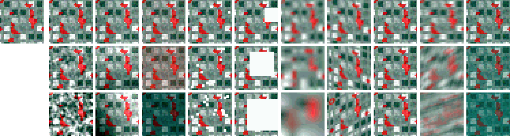
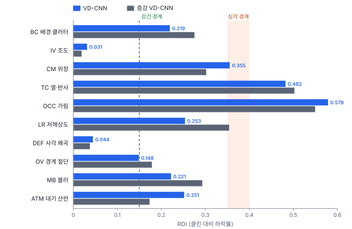

# 57강 환경 교란과 강건성

## 이 강에서 얻는 것

- 10대 외생 교란을 원격탐사 장면으로 떠올리고, 교란을 단계별로 넣어 모델의 한계를 재는 스트레스 시험을 설계할 수 있음
- CE·mCE(기준 모델 대비)와 RDI(자기 클린 대비 하락률)를 계산하고 서로 다른 답을 낼 때 읽을 수 있음
- 대기 산란·관측각·작은 표적을 물리량으로 재고, 데이터·모델·추론 세 계층의 처방을 고르고 부작용까지 확인할 수 있음

## 1. 교란과 교란 불변성

**교란 요인(nuisance factor)**은 정답과 상관없는데 영상을 바꾸는 촬영 조건(연무, 태양 고도, 관측각, 흔들림 등)임. 이것을 $Z$라 하면 바라는 성질은 다음임.

$$P(Y \mid X, Z) = P(Y \mid X)$$

영상 $X$를 보고 나면 촬영 조건 $Z$가 정답 $Y$에 대해 더 알려 주는 것이 없어야 한다는 뜻임. 실무로 옮기면 같은 장면을 맑은 날 찍든 연무 낀 날 찍든 판단이 같아야 함. 이것이 **교란 불변성(nuisance invariance)**임.

Diagnostics 노트는 원격탐사에서 자주 만나는 교란을 세 무리 열 개로 묶어 **10대 외생적 교란 요인**이라 부름(분류 체계는 프로젝트 정의). 노트 04장은 이 체계와 시험 절차를 설계만 마친 단계(미구현)라 임계값이 바뀔 수 있음. 아래 실험은 이 자습서가 작은 가상 자료로 직접 구현해 본 것임.

| 무리 | 약어 | 교란 | 원격탐사 예 | 주로 생기는 오차 |
|---|---|---|---|---|
| 광학·복사 | BC | 배경 클러터 | 흰 물결, 컨테이너 야적장 | 배경 오탐 |
| | IV | 조도 급변 | 낮은 태양 고도, 구름 그늘 | 위치 오차, 오탐 |
| | CM | 위장(대비 저하) | 갯벌 위 어두운 소형선박 | 미탐 |
| | TC | 열적 크로스오버·경면 반사 | 해면 태양 반사(선글린트) | 포화 오탐 |
| 기하·공간 | OCC | 가림·중첩 | 구름 조각, 밀집 계류 | 미탐, NMS 과잉 억제 |
| | LR | 극저해상도 | 3 m 영상의 소형선박 | 작은 표적 전멸 |
| | DEF | 사각 왜곡 | 고층 건물의 기울어짐 | 종횡비 왜곡, 혼동 |
| | OV | 경계 절단 | 타일 경계에 걸린 선박 | 잘린 객체 미탐 |
| 센서·매질 | MB | 모션 블러 | 드론 진동 | 경계 흐림 |
| | ATM | 대기 산란 | 여름 연무 | 대비 저하 |

## 2. 5단계 심각도와 CE·mCE

교란마다 세기를 **교란 심각도 단계(corruption severity level)** 1~5로 나눠 시험 자료에 넣음. 한 단계만 보면 우연이 섞이므로 다섯 단계를 모두 보고 곡선의 모양도 봄.

**평균 손상 오차(mCE)**(업계 표준)는 ImageNet-C(헨드릭스·디트리히, 2019년 발표)가 정한 방식임. 교란 $k$의 **CE**는 다섯 단계 오차(1 − 정확도, 탐지면 1 − mAP)의 합을 **기준 모델**의 같은 합으로 나눈 값이고, mCE는 교란들의 평균(ImageNet-C는 15개, 흔히 ×100)임.

$$\mathrm{CE}_k = \frac{\sum_{s=1}^{5} E_{k,s}}{\sum_{s=1}^{5} E^{\text{base}}_{k,s}}, \qquad \mathrm{mCE} = \frac{1}{10}\sum_{k} \mathrm{CE}_k$$

CE가 1보다 작으면 그 교란에서 기준 모델보다 덜 틀린 것임. ImageNet-C는 AlexNet을, 여기서는 27강의 화소 펼침 MLP를 다시 학습한 것(클린 0.700, 27강 표와는 다른 실행)을 기준으로 씀. 오차에 클린 오차까지 들어 있어 클린 성능이 좋은 모델이 유리함.

## 3. RDI: 클린 대비 하락률

**강건성 감쇠 지수(RDI)**(프로젝트 정의)는 기준 모델 없이 자기 클린 성능에서 얼마나 떨어졌는지를 봄. **낮을수록 강건함.**

$$\mathrm{RDI}_k = \frac{A_{\text{clean}} - \frac{1}{5}\sum_{s} A_{k,s}}{A_{\text{clean}}}$$

$A$는 정확도(탐지면 mAP)임. 04장은 0.15 아래를 강건, 0.35 이상을 심각한 취약점으로 둠. 61강 배포 게이트는 max RDI ≤ 0.40을 요구하므로, 심각 경계는 대략 0.35~0.40(잠정치)으로 봄. 원문 09장은 이 게이트를 "min RDI ≥ 0.60"으로 적었는데 방향이 반대라 유지율(1 − RDI) ≥ 0.60, 곧 max RDI ≤ 0.40으로 고쳐 씀.

경계를 낮게 잡으면 처방이 일찍·자주 나가 약점을 빨리 잡지만 흔들림 수준의 하락에도 재학습 비용을 씀. 높게 잡으면 확실한 약점만 잡지만 실제 결함을 늦게 발견함. 그 교란이 현장에 얼마나 자주 오는지, 재학습 비용, 배포 주기를 보고 정함.

## 4. VD-CNN 스트레스 시험

5부 시험 타일 900장(27강)에 10대 교란을 5단계로 넣고 VD-CNN(클린 0.974)을 평가함(시드 0, CPU 한 스레드 기준). 타일 분류라 따로 떨어진 표적이 없어서 교란 구현은 이 자습서에서 정함. 예를 들어 CM은 무작위 클래스 평균 분광과 10~50% 섞기, OCC는 반사율 0.4의 평평한 사각형(구름 조각 흉내)으로 넓이 10~50% 가리기, OV는 가장자리 3~16화소를 다른 타일로 바꾸기, DEF는 기울이기(전단), ATM은 투과율 0.9~0.5의 대기 산란 식(6절)임. 원문의 주입 값과는 다름.

| 교란 | VD-CNN RDI | VD-CNN CE | 증강 모델 RDI | 증강 모델 CE |
|---|---|---|---|---|
| BC | 0.219 | 0.800 | 0.275 | 0.989 |
| IV | 0.031 | 0.171 | 0.019 | 0.141 |
| CM | 0.355 | 0.904 | 0.302 | 0.782 |
| TC | 0.482 | 1.273 | 0.502 | 1.327 |
| OCC | **0.578** | 0.754 | **0.549** | 0.719 |
| LR | 0.253 | 0.907 | 0.354 | 1.239 |
| DEF | 0.044 | 0.224 | 0.037 | 0.209 |
| OV | 0.148 | 0.409 | 0.178 | 0.483 |
| MB | 0.221 | 0.796 | 0.293 | 1.031 |
| ATM | 0.251 | 0.680 | 0.173 | 0.494 |
| mCE | | 69.2 | | 74.1 |

- **가장 취약한 것은 OCC(0.578), 다음이 TC(0.482)와 CM(0.355)임.** 밝은 사각형·반점이 들어가면 예측이 시가지로 쏠림(OCC 5단계에서 900장 중 772장). 강건한 것은 IV(0.031)·DEF(0.044)·OV(0.148)임. CM과 OV는 경계 바로 옆이라 경계를 어디에 두느냐에 따라 등급이 바뀜
- **CE와 RDI는 다른 답을 냄.** OCC는 RDI가 가장 나쁘지만 기준 MLP가 더 무너져(5단계 0.170) CE는 0.754임. TC는 VD-CNN이 클린 성능이 훨씬 낮은 MLP보다 더 많이 틀려(5단계 정확도 0.317 대 0.446) CE가 1을 넘음. MLP는 BC·LR·MB에서 거의 그대로였는데, 무늬보다 분광 평균에 기대는 모델로 보임
- **LR은 0.800 → 0.591로 단계마다 내려감(RDI 0.253).** 1단계부터 시가지는 하나도 못 맞히고 77%를 나지로 봄. 격자 도로 무늬가 흐려지면 밝은 나지와 가를 단서가 사라짐
- **DEF는 1단계부터 0.921로 떨어진 뒤 평평함.** 반 화소 이동(보간만)으로도 0.816이 되므로 기울기보다 보간의 미세한 흐림 탓으로 보임. LR·MB와 함께, 이 모델이 고주파 무늬에 크게 기댄다는 신호임

## 5. 광학 증강 모델: mCE가 오히려 커짐

45강의 기하+광학 증강으로 새로 학습한 VD-CNN(클린 0.972)을 같은 시험에 넣음. ATM은 RDI 0.251 → 0.173, CE 0.680 → 0.494로 좋아졌고 IV·CM·OCC도 조금 나아짐. 그런데 LR(CE 0.907 → 1.239, RDI 0.253 → 0.354로 심각 경계 넘음), MB(0.796 → 1.031), BC(0.800 → 0.989)가 나빠져 **mCE는 69.2 → 74.1로 커짐.**

- ATM 이득은 예상된 것임. 증강의 산란광이 ATM 교란처럼 짧은 파장에 더 크게 더해지는 꼴이었음(45강)
- 나빠진 쪽은 가설임. 분광 값을 흔들어 가르치자 무늬에 더 기대게 되어, 무늬를 지우는 흐림·축소·잡음에 약해졌을 수 있음(확인하지 않음)
- 시드 하나씩이라 OV·TC 같은 작은 차이는 흔들림(49강) 안일 수 있음

한 교란을 겨냥한 처방이 다른 교란에서 값을 치를 수 있으므로 처방 뒤에는 열 개를 모두 다시 잼.

## 6. 교란을 재는 물리량

**신호 대 클러터 비(SCR)**는 표적과 배경의 밝기 차를 배경의 국소 흔들림(블록별 분산 평균의 제곱근 $C_{\text{RMS}}$)으로 나눈 값으로, 레이더·적외선 표적 탐지에서 널리 씀.

$$\mathrm{SCR} = \frac{\lvert \mu_t - \mu_b \rvert}{C_{\text{RMS}}}$$

선박 0.14, 잔잔한 바다 0.04(흔들림 0.008)면 12.5지만, 흰 물결 바다 0.05(흔들림 0.08)면 1.125임. 원문은 1.2 안팎 아래를 BC 위험 구간으로 둠(잠정치).

**오프나디르 각(off-nadir angle)**은 위성의 시선이 바로 아래(직하점)에서 기운 각임. 평평한 지형 근사로 시선이 기운 방향의 GSD는 $1/\cos^2\theta$배, 그와 직각 방향은 $1/\cos\theta$배가 됨. 0.5 m 영상이 30°에서는 0.67 m × 0.58 m, 45°에서는 1.0 m × 0.71 m가 됨. 높이 $h$인 건물은 $h\tan\theta$만큼 기울어 보여, 30 m 건물이 30°에서 17.3 m(0.5 m 영상에서 35화소) 누움.

**작은 표적은 넓이로 셈.** 유효 화소 넓이 EPS = 실제 넓이 / GSD²가 16화소²(약 4×4) 아래면 모양을 알아볼 수 없고, 1,024화소²(한 변 약 32화소) 아래는 COCO 소형임(39강). 15 m² 소형선박은 0.5 m 영상에서 60화소²(한 변 약 7.7)지만 3 m 영상에서는 1.67화소²라 점 하나로 다룸. 원문 두 곳의 "16×16 화소 미만"(한 변 기준)과 달라 넓이로 통일함.

**Koschmieder 대기 산란 모델**은 연무 낀 영상을 원래 반사 $J$와 대기광 $A$의 섞임으로 봄.

$$I = J\,t + A\,(1 - t), \qquad t = e^{-\beta d}$$

$t$는 투과율, $\beta$는 산란 계수, $d$는 빛이 지나는 거리임. 산림 청색 0.03은 $t = 0.5$, $A = 0.12$에서 0.075로 2.5배가 됨. 원문은 $t < 0.4$($\beta d > 0.92$)를 표적이 대기광에 묻히는 구간으로 둠(잠정치).

**다크 채널 사전정보(DCP)**(헤 등, 2009년 발표, 업계 표준)는 맑은 영상에서 하늘이 아닌 작은 창 안에는 적어도 한 밴드에 0에 가까운 화소가 있다는 관찰임. 창 안 모든 밴드의 최솟값(다크 채널)은 연무가 끼면 $A$ 쪽으로 커짐. 이 자료(4밴드, 3×3 창)의 중앙값은 0.032에서 ATM 5단계 0.059가 됨. 이 값으로 $t$와 $A$를 추정해 $J = (I - A)/t + A$로 되돌림. 원문의 "다크 채널 잔류도" 약어는 56강의 비활성 채널 비율과 겹쳐 약어 없이 씀.

## 7. 교란 극복 3계층 가이드

**교란 극복 3계층 가이드**(묶음은 프로젝트 정의, 개별 기법은 대부분 업계 기법)는 처방을 데이터·모델·추론 계층으로 나눔. 데이터·모델 계층은 재학습이 드는 조치(P1 성격), 추론 계층은 재학습 없는 조치(P2 성격)임(51강).

| 교란 | 데이터 | 모델·손실 | 추론 전후처리 |
|---|---|---|---|
| BC | 클러터만 있는 배경 타일 15~20% | 포컬 손실 $\gamma$ 상향 | 복잡한 장면에서 신뢰도 임계값 상향 |
| IV | 감마·밝기 증강 | 인스턴스 정규화 | CLAHE·스트레칭 |
| OCC | 가림 증강 | 반발 손실, NMS 프리 | Soft-NMS(37강) |
| LR | 복사-붙여넣기, GSD 맞춤 | 고해상도 헤드 | 슬라이스 추론(37강) |
| DEF | 원근 변환 증강 | 회전 박스(41강) | 정사보정(25강) |
| OV | 잘린 상자 표시 | 부분 형상 학습 | 타일 겹침 20% 이상 |
| MB | 블러 증강 | 다중 스케일 결합 | 디블러링 |
| ATM | 연무 합성 | 대비 불변 정규화 | 다크 채널 안개 제거 |

CM은 경계 강조 채널·경계 손실, TC는 광학+열적외 융합(58강)이 처방임. 배경 타일 비율은 원문에서 15~20%와 20%로 갈려 범위로 씀. RDI가 높은 교란부터, 재학습이 없는 추론 계층부터 시험해 봄.

## 현장에서는

여름 장면의 선박 탐지 폴리곤에서 미탐과 흰 물결 오탐이 늘어난 상황임. 맑은 검증 장면에 교란을 넣어 보니 ATM과 BC의 RDI가 심각 경계를 넘음. 먼저 재학습 없이 다크 채널 안개 제거를 추론 앞에 붙여 다시 재고, 흰 물결만 있는 배경 타일을 15~20% 넣어 재학습함. 그 뒤 열 개를 모두 다시 재고 max RDI ≤ 0.40 게이트(61강)를 확인함.

## 헷갈리는 쌍

- **CE vs RDI**: CE는 기준 모델 대비 오차 합의 비(클린 오차 포함, 낮을수록 좋음), RDI는 자기 클린 대비 하락률(낮을수록 강건)임. OCC처럼 RDI는 최악인데 CE는 1보다 작을 수 있음.
- **오프나디르 각 vs 입사각**: 오프나디르 각은 위성에서 잰 시선의 기울기, 입사각은 지표에서 잰 각임. 지구 곡률 때문에 입사각이 조금 더 큼.

## 이렇게 지시받음

> 지시: "OCC가 RDI 0.58이야. 구름 가림 증강부터 넣어 봐."

재학습이 드는 처방(P1 성격)임. 넣은 뒤 열 개를 모두 다시 재 mCE와 max RDI를 함께 봄(5절). 이 시험의 OCC는 평평한 밝은 사각형이라 실제 구름 장면 슬라이스(54강)로도 확인함.

> 지시: "저해상도 곡선이 2단계에서 올라가네. 저해상도엔 강한 거 아냐?"

심각도가 커지는데 정확도가 오르면 모델보다 구현부터 의심하라는 신호임. 보간의 테두리 처리 같은 구현 세부가 결과를 흔들 수 있으므로 교란 영상을 직접 열어 테두리·값 범위를 보고, 고친 뒤 다시 잼. 이 자습서의 첫 실행도 2단계가 0.891로 올랐는데 축소 보간이 끝 행·열을 0으로 채운 탓이었고, 고친 값이 4절 표임.

> 지시: "mCE 낮은 쪽으로 가자."

mCE는 기준 모델에 따라 달라지고 클린 성능이 좋은 모델이 유리함. 어떤 기준 모델인지 밝히고, 교란별 RDI와 max RDI를 같이 봐서 특정 교란에 무너지는 모델을 거름.

## 요약

- 교란 불변성은 촬영 조건이 바뀌어도 판단이 같은 성질이고, Diagnostics는 교란을 세 무리 열 개로 묶음(설계 단계, 임계값은 잠정치)
- CE·mCE(업계 표준)는 기준 모델 대비, RDI(프로젝트 정의)는 자기 클린 대비 하락률이며 강건 0.15 아래, 심각 0.35~0.40 위로 봄
- VD-CNN은 OCC(0.578)·TC·CM에 취약했고, 흐림·축소처럼 고주파 무늬를 지우는 교란에도 약했음
- 광학 증강은 ATM을 고쳤지만 LR·MB·BC가 나빠져 mCE가 69.2 → 74.1로 커짐
- SCR, 오프나디르 각, 넓이 기준 EPS, 투과율, 다크 채널로 교란을 재고, 3계층으로 처방한 뒤 열 개를 모두 다시 잼

## 핵심 용어

| 한글 | 영문 |
|---|---|
| 10대 외생적 교란 요인 | Ten Nuisance Factors |
| 교란 불변성 | Nuisance Invariance |
| 교란 심각도 단계 | Corruption Severity Level |
| 손상 오차 / 평균 손상 오차 | Corruption Error (CE) / mean Corruption Error (mCE) |
| 강건성 감쇠 지수 | Robustness Degradation Index (RDI) |
| 신호 대 클러터 비 | Signal-to-Clutter Ratio (SCR) |
| 오프나디르 각 | Off-Nadir Angle |
| 유효 화소 넓이 | Effective Pixel Scale (EPS) |
| Koschmieder 대기 산란 모델 | Koschmieder Law |
| 다크 채널 사전정보 | Dark Channel Prior (DCP) |
| 교란 극복 3계층 가이드 | Three-Tier Nuisance Mitigation Guideline |
