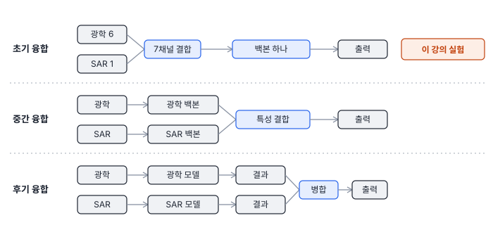
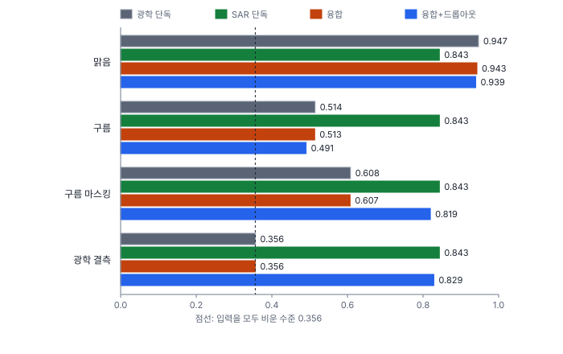
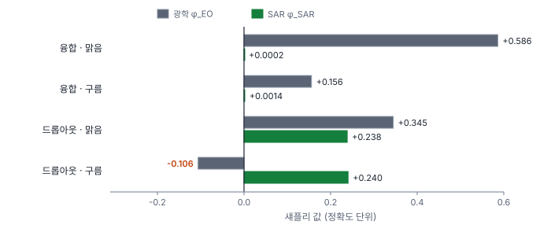

# 58강 다종 센서 정렬

## 이 강에서 얻는 것

- 융합 단계(초기·중간·후기)를 구분하고, 융합 모델이 한 센서만 쓰는 모달리티 붕괴를 결측 시험으로 찾을 수 있음
- 섀플리 값과 모달리티 편향 지수(MBR)로 센서별 기여를 나누고, 음의 전이의 두 정의가 왜 다른 답을 내는지 설명할 수 있음
- 모달리티 드롭아웃의 효과와 한계, 정렬 허용치(δ50)와 코사인 특성 불일치 지수를 읽을 때의 주의점을 알 수 있음

## 1. 융합 단계와 이 강의 실험

**다종 센서 융합(multimodal fusion)**은 광학(EO)·SAR·열적외(IR)·LiDAR처럼 성질이 다른 센서 입력을 한 모델에서 합치는 것임. 센서 하나하나를 **모달리티(modality)**라고 부름. 합치는 위치에 따라 세 단계로 나눔(업계 표준 분류).



- **초기 융합**: 입력 채널을 이어 붙임. 가장 싸지만 화소 단위로 겹쳐야 해서 정렬 오차에 가장 민감하다고 알려짐
- **중간 융합**: 센서별 백본의 특성 맵을 합침. 원문은 한 센서 특성이 지배하는 붕괴가 잘 생긴다고 봄(이 강의 초기 융합에서도 생김, 2절)
- **후기 융합**: 센서별 모델의 결과를 합침. 정렬에 덜 민감하지만 센서 사이의 미세한 상호작용은 못 씀

Diagnostics 노트 07장은 이 진단 체계를 설계까지만 마친 상태(미구현)임. 이 강의 수치는 그 체계를 작은 가상 자료로 직접 구현해 본 것이고, Diagnostics의 구현물이 아님. 4부 가상 연안 장면(20·22강)의 광학 6밴드와 SAR 로그 강도 1채널을 이어 붙인 **초기 융합**이고, 화소 중심 9×9 패치를 9클래스로 분류하는 작은 합성곱망(12에폭)임. 학습은 장면 위쪽 행 0~179에서 12,000개, 시험은 아래쪽 행 196~299에서 5,000개를 뽑아 공간으로 나눴음(15강). 시드 0, CPU 한 스레드 기준임.

## 2. 모달리티 붕괴와 MBR

광학만 쓴 모델, SAR만 쓴 모델, 둘을 합친 융합 모델을 같은 조건에서 비교했음. 결측은 그 센서 입력을 0(표준화한 평균값)으로 비운 것이고, 구름은 시험 영역의 40%에서 광학 밴드를 밝은 구름 값으로 덮은 것임(SAR는 그대로).



융합 모델은 SAR를 입력으로 받는데도 광학이 빠지면 0.356이 됨. 시험 화소의 35.6%인 농경지만 찍는 수준임. SAR 단독 모델은 0.843을 내므로 SAR에 정보가 없는 것이 아님. 학습하기 쉬운 광학 신호로 먼저 수렴해 SAR를 사실상 쓰지 않게 된 것으로 보이고, 이를 **모달리티 붕괴(modality collapse)**라고 부름(연구에서 쓰는 개념). 맑은 날 검증 점수만 보면 드러나지 않음.

Diagnostics는 이를 낙차비 $\mathrm{DR}_m$과 **모달리티 편향 지수(MBR, modality bias ratio)**로 잼(프로젝트 정의). $v(\cdot)$는 괄호 안 센서만 넣었을 때의 성능임.

$$\mathrm{DR}_m = \frac{v(N) - v(N \setminus \{m\})}{v(N)}, \qquad \mathrm{MBR} = \frac{\mathrm{DR}_{\mathrm{EO}}}{\mathrm{DR}_{\mathrm{SAR}}}$$

센서 $m$을 빼면 전체 성능의 몇 할이 사라지는지를 센서끼리 나눈 것임. 융합 모델은 $\mathrm{DR}_{\mathrm{EO}} = 0.622$, $\mathrm{DR}_{\mathrm{SAR}} = 0.0004$라서 MBR이 1,466임. 0.0004는 시험 5,000개 중 2개 차이라, 분모가 0에 가까우면 값이 폭주하고 0이면 정의되지 않음. 원문의 기준은 대략 5(경고)~15(치명) 범위의 잠정치이고, 원문이 붙인 "80% 이상 편향" 해석은 근거식이 없어 옮기지 않음. 낮게 잡으면 붕괴를 일찍 잡지만 센서가 중복일 뿐인 모델에도 경보가 나가 불필요한 재학습이 늘어남(4절의 드롭아웃 모델은 범위 위쪽 15마저 넘음). 높게 잡으면 늦게 발견함.

## 3. 모달리티 드롭아웃

**모달리티 드롭아웃(modality dropout)**은 학습 중 센서 입력을 통째로 확률적으로 비워, 한 센서만 남은 상황도 학습하게 하는 기법임(업계 표준). 원문 본문처럼 둘 다 유지 50%, 광학만 비움 25%, SAR만 비움 25%로 했음. 원문 처방표의 "p = 0.5"는 뜻이 정의되지 않았는데, 한 센서라도 비울 확률의 합으로 읽으면 이 설정과 같음.

```python
u = torch.rand(len(xb))                  # 배치 안 패치마다 난수 하나
xb[u < 0.25, :6] = 0                     # 25%: 광학 6채널을 비움
xb[(u >= 0.25) & (u < 0.5), 6:] = 0      # 25%: SAR 1채널을 비움
```

광학 결측 정확도가 0.356에서 0.829로 SAR 단독(0.843) 가까이 회복되고, 맑을 때는 0.943에서 0.939로 거의 그대로임. $\mathrm{DR}_{\mathrm{EO}}$는 0.622에서 0.118로 81% 줄었음. 그런데 구름(0.491)에서는 오히려 융합(0.513)보다 나빠짐. 학습 때 본 결측은 0인데 구름은 밝고 그럴듯한 틀린 값이라, 모델이 "광학이 없다"는 것을 알 수 없기 때문으로 보임(가설). 구름 마스크로 구름 낀 화소의 광학을 결측(0)으로 바꿔 넣으면 0.819가 되는 것이 이를 뒷받침함. 드롭아웃은 재학습이 드는 처방(P1), 마스킹으로 센서를 끄는 것은 재학습 없는 처방(P2, 51강)이고 둘이 짝을 이뤄야 효과가 났음.

## 4. 섀플리 값

**섀플리 값(Shapley value)**은 협력 게임 이론에서 참여자의 공정한 기여를 나누는 방법임(업계 표준). 센서 $i$가 다른 센서 조합 $S$에 합류할 때 늘어나는 성능을 가능한 모든 순서에 대해 평균함.

$$\phi_i = \sum_{S \subseteq N \setminus \{i\}} \frac{\lvert S\rvert!\,(\lvert N\rvert-\lvert S\rvert-1)!}{\lvert N\rvert!}\,\bigl[v(S\cup\{i\}) - v(S)\bigr]$$

센서가 둘이면 순서가 두 가지뿐이라 "먼저 들어갈 때의 기여"와 "나중에 들어갈 때의 기여"의 평균이 됨.

$$\phi_{\mathrm{EO}} = \tfrac12\bigl[v(\{\mathrm{EO}\}) - v(\varnothing)\bigr] + \tfrac12\bigl[v(N) - v(\{\mathrm{SAR}\})\bigr]$$

$\phi_{\mathrm{SAR}}$는 EO와 SAR를 바꿔 씀. 여기서는 $v(S)$를 같은 융합 모델에 $S$만 넣고 나머지를 0으로 비운 정확도로 정했음. 원문은 $v(\varnothing) = 0$으로 두지만 분류에서는 모두 비워도 0.356이 나오므로 실측값을 씀. 두 값의 합은 늘 $v(N) - v(\varnothing)$임.



맑을 때 융합 모델은 $\phi_{\mathrm{EO}} = 0.586$, $\phi_{\mathrm{SAR}} = 0.0002$로 기여의 거의 100%가 광학임. 드롭아웃 모델은 0.345와 0.238로 광학 몫이 59%가 됨. 그런데 이 모델의 MBR은 여전히 25로 원문 기준의 "치명적 붕괴"임. 광학이 있으면 SAR를 빼도 잃는 것이 거의 없어(중복) $\mathrm{DR}_{\mathrm{SAR}}$가 0.005에 그치기 때문임. 낙차비는 하나를 뺄 때만 보고, 섀플리 값은 혼자 있을 때의 기여까지 더함. 붕괴 판정은 MBR 하나보다 섀플리 값과 단독 성능을 함께 봄.

## 5. 음의 전이: 정의가 두 개

**음의 전이(negative transfer)**는 센서를 더했더니 오히려 나빠지는 것임. 전이학습에서 온 업계 표준 용어이고, 판정식은 Diagnostics가 정했음. 원문에는 판정식이 둘 있고 서로 같지 않음.

- 정의 A: 융합 성능 < 단일 센서 모델 가운데 최고. 별도로 학습한 모델과 비교함
- 정의 B: 어떤 센서의 섀플리 값 < 0. 한 모델 안에서 그 센서를 넣는 것이 평균적으로 해가 되는지 봄

| 경우 | 정의 A | 정의 B |
|---|---|---|
| 융합 · 맑음 | 0.943 < 0.947 (해당) | 두 값 모두 양수 (아님) |
| 융합 · 구름 | 0.513 < 0.843 (해당) | 두 값 모두 양수 (아님) |
| 드롭아웃 · 구름 | 0.491 < 0.843 (해당) | $\phi_{\mathrm{EO}} = -0.106$ (해당) |

맑음의 차이 0.004는 시험 5,000개에서 정확도 하나의 표준오차(약 0.003) 수준이라 사실상 동률임. 드롭아웃 모델의 구름 조건은 $\tfrac12(0.482 - 0.356) + \tfrac12(0.491 - 0.829) = -0.106$임. 광학이 먼저 들어갈 때의 기여(+0.063)보다 SAR 뒤에 들어갈 때의 손해(−0.169)가 큼. 맑은 화소에서는 돕지만 구름 화소에서 틀린 광학 값이 SAR 판단을 덮어쓴 것으로 보임. 정의 A는 "SAR 전용 모델을 따로 쓰는 게 나았나", 정의 B는 "이 모델 안에서 그 센서가 평균적으로 해가 되나"를 묻는 셈이라, 보고할 때 어느 정의인지 밝힘.

## 6. 정렬 허용치와 코사인 특성 불일치

**임계 정렬 허용치(δ50, critical alignment tolerance)**는 정렬된 자료에 변위를 단계별로 넣었을 때 성능이 정렬 상태의 절반이 되는 변위임(프로젝트 정의). 원문은 대략 2~4화소 이하면 취약(원문 간 2와 4로 다름), 16화소 이상이면 강건으로 보는 잠정치임. 취약 판정선을 낮게(2화소) 잡으면 정렬 보정을 미루다 현장에서 깨질 수 있고, 높게(4화소) 잡으면 필요 없는 정렬 모듈까지 넣게 됨. 화소 수는 해상도와 표적 크기에 따라 뜻이 달라지므로 둘을 함께 적음.

$$\mathrm{acc}(\delta_{50}) = 0.5 \times \mathrm{acc}(0)$$

SAR 패치를 대각선으로 0~8화소 밀어 넣었더니 융합 모델은 0.943에서 0.941, 드롭아웃 모델은 0.939에서 0.937로 거의 그대로였음. 절반 기준(0.471)까지 떨어지지 않아 δ50은 측정 범위(8화소) 밖임. 초기 융합이 정렬에 가장 민감하다는 통념과 다른 결과이고, 가설은 셋임. 첫째, 광학이 있을 때는 두 모델 모두 SAR를 거의 쓰지 않음($\mathrm{DR}_{\mathrm{SAR}}$ 0.005 이하). 안 쓰는 센서는 어긋나도 티가 안 나므로, 이 둔감함은 강건함이 아니라 붕괴의 다른 얼굴일 수 있음. 둘째, 이 장면은 바다·산림·농경지가 넓게 고르게 퍼져 8화소를 밀어도 중심 클래스가 그대로인 시험 화소가 85.5%임. 셋째, 9×9 패치를 전역 평균 풀링으로 요약해 정확한 위치보다 주변의 평균적 성질을 봄. 광학이 빠진 상태에서 SAR를 미는 시험이 진짜 시험인데, 이 실험에서는 하지 않았음.

**코사인 특성 불일치 지수(cosine feature misalignment index)**는 같은 위치의 두 센서 특성 벡터가 이루는 코사인 유사도를 평균해 1에서 뺀 값임(프로젝트 정의). 원문은 "상관계수"라 불렀지만 식은 불일치도이고, 경고선은 원문 간 0.40과 0.45로 다름(잠정치).

$$\mathcal{D}_{\text{align}} = 1 - \frac{1}{HW}\sum_{h,w} \frac{\langle F_{\mathrm{EO}}(h,w),\, F_{\mathrm{SAR}}(h,w)\rangle}{\lVert F_{\mathrm{EO}}(h,w)\rVert\,\lVert F_{\mathrm{SAR}}(h,w)\rVert}$$

이 식은 두 백본의 $k$번째 채널이 같은 뜻일 때(임베딩 공간을 공유할 때)만 의미가 있음. 따로 학습한 백본은 채널 순서와 뜻이 제각각임. 이 자습서에서 무작위 특성 맵(32채널)으로 만든 숫자 예에서 같은 특성의 채널 순서만 바꾸면 0.64로, 4화소 어긋남(0.61)이나 아예 무관한 특성(0.63)과 구분되지 않았음. 두 특성을 공통 공간으로 사영하도록 학습한 뒤에 씀. 이 강의 실험은 백본이 하나인 초기 융합이라 이 지수를 잴 수 없음.

## 현장에서는

광학+SAR 융합 모델로 연안 토지피복도를 매달 갱신하는데, 장마철 장면만 결과가 무너지는 상황임. 검증 자료가 맑은 장면 위주라 점수는 높았음. 먼저 광학을 비운 시험을 돌려 최다 클래스 수준까지 떨어지는지 보고, 섀플리 값으로 SAR 몫이 0에 가까운지 확인함. 붕괴가 맞으면 모달리티 드롭아웃으로 재학습하고, 추론 때는 구름 마스크로 구름 화소의 광학을 결측 처리함. 선박처럼 움직이는 표적은 두 영상의 촬영 시각 차이도 정렬 오차가 됨. 변위(화소)는 속도 × 시차 ÷ GSD라서, 6 m/s 선박이 5분 차이로 찍히면 10 m 영상에서 180화소가 어긋남. 이런 표적은 영상 정합으로 못 맞추므로 객체 단위로 합치는 후기 융합을 검토함.

## 헷갈리는 쌍

- **모달리티 붕괴 vs 음의 전이**: 붕괴는 센서를 안 쓰는 것(섀플리 값 ≈ 0), 음의 전이는 써서 해가 되는 것(섀플리 값 < 0 또는 융합 < 단일 최고)임
- **낙차비·MBR vs 섀플리 값**: 낙차비는 전체에서 하나를 뺄 때만 봐서 센서가 중복이면 0이 됨. 섀플리 값은 단독 기여까지 평균함
- **정렬 둔감 vs 정렬 강건**: 성능이 안 변해도 그 센서를 안 쓰고 있어서일 수 있음. 섀플리 값으로 사용 여부부터 확인함
- **결측 vs 오염**: 결측은 비어 있다고 알 수 있는 입력, 오염(구름)은 그럴듯한 틀린 값임. 드롭아웃은 결측에만 듣고, 오염은 마스킹으로 결측으로 바꿔야 함

## 이렇게 지시받음

> 지시: "MBR만 보지 말고 센서별 섀플리 값이랑 단독 성능도 같이 뽑아."

MBR은 센서가 중복일 때도 커지고 분모가 0이면 정의되지 않으므로, 섀플리 값과 센서별 단독 정확도($v(\{\mathrm{EO}\})$, $v(\{\mathrm{SAR}\})$)를 같은 표에 놓으라는 뜻임. 비울 때의 값(0인지 평균인지)과 $v(\varnothing)$도 적음.

> 지시: "광학 빠진 경우, 구름 낀 경우를 따로 나눠서 시험셋 다시 짜."

결측과 오염은 모델에 다른 입력이라 결과가 다름. 구름은 마스킹 전·후를 모두 재고, 맑은 장면만으로 된 검증 점수는 붕괴를 가린다는 점을 보고에 적음.

> 지시: "정렬 오차 스윕했는데 안 떨어지던데, 정합 안 해도 되는 거 맞지?"

바로 결론 내지 않음. 부 센서의 섀플리 값이 0에 가까우면 안 써서 둔감한 것이므로, 드롭아웃 모델로 주 센서를 비운 상태에서 다시 스윕함.

## 요약

- 융합은 초기(입력)·중간(특성)·후기(결과) 단계로 나뉘고, 이 강의 실험은 광학 6밴드와 SAR 1채널을 이어 붙인 초기 융합임
- 융합 모델은 맑을 때 0.943으로 광학 단독(0.947)과 거의 같지만 광학이 빠지면 0.356으로 무너졌고(모달리티 붕괴), SAR의 섀플리 값은 0.0002였음
- 모달리티 드롭아웃으로 광학 결측 정확도가 0.829로 회복됐지만, 구름은 마스킹으로 결측 처리해야 효과가 났음
- MBR은 중복 센서에서 커지고 분모가 0이면 정의되지 않으며, 음의 전이의 두 정의(융합 < 단일 최고, 섀플리 값 < 0)는 다른 답을 냄
- 정렬 오차 8화소까지 성능이 거의 그대로였는데, SAR를 거의 안 쓴 탓일 수 있음. 코사인 특성 불일치 지수는 임베딩 공간을 공유할 때만 의미가 있음

## 핵심 용어

| 한글 | 영문 |
|---|---|
| 다종 센서 융합 | Multimodal Fusion |
| 초기·중간·후기 융합 | Early / Middle / Late Fusion |
| 모달리티 붕괴 | Modality Collapse |
| 낙차비 | Drop Ratio (DR) |
| 모달리티 편향 지수 | Modality Bias Ratio (MBR) |
| 모달리티 드롭아웃 | Modality Dropout |
| 섀플리 값 | Shapley Value |
| 음의 전이 | Negative Transfer |
| 임계 정렬 허용치 | Critical Alignment Tolerance (δ50) |
| 코사인 특성 불일치 지수 | Cosine Feature Misalignment Index |
