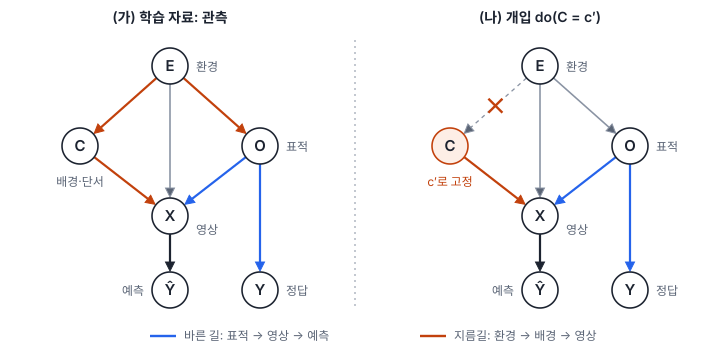
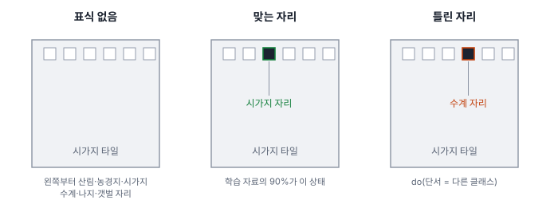
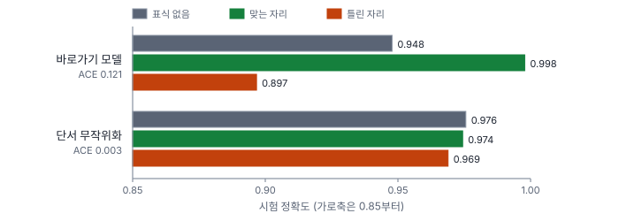

# 59강 인과와 바로가기 학습

## 이 강에서 얻는 것

- 바로가기 학습이 무엇이고 같은 분포 시험으로는 왜 드러나지 않는지, 구조적 인과 모델로 설명할 수 있음
- 관측 조건부·개입(do 연산자)·반사실을 구분하고, 단서만 바꾼 반사실 시험으로 ACE를 계산해 읽을 수 있음
- 단서 무작위화·IRM 처방과 맥락 편향비·맥락 유령 환각율의 정의, 기준값의 한계를 알 수 있음

## 1. 바로가기 학습

**바로가기 학습(shortcut learning)**은 모델이 표적 자체의 형상·분광 특성 대신, 학습 자료에서 클래스와 늘 같이 다니던 다른 단서를 배워 버리는 현상임(업계 표준 용어). 손실을 줄이는 데 쉬운 단서가 먼저 잡히기 때문으로 설명함.

Diagnostics 노트의 예는 바다 위 선박임. 선체가 아니라 수면 질감으로 선박을 알아보면 야적장에 올린 선박은 놓치고, 빈 바다에서 없는 선박을 찾아냄. 원격탐사에서는 이런 단서가 흔함.

- **지역**: 양식장 라벨을 한 해역에서만 따면 그 해역의 물색이 단서가 됨
- **계절**: 갯벌 타일이 모두 겨울 영상이면 겨울 색조가 단서가 됨
- **센서·처리 이력**: 한 클래스만 다른 센서·처리 과정에서 받아 no-data 띠·워터마크·밝기 차이가 남으면 그 표식이 단서가 됨

시험 자료도 같은 방식으로 모으면 같은 단서를 갖고 있어 점수가 높게 나옴. 단서가 깨지는 새 지역·계절·센서(분포 밖, OOD)에 가서야 무너짐. 분포가 바뀌면 떨어진다는 점은 도메인 이동(48강)과 같지만, 원인이 "모델이 엉뚱한 것을 배웠음"에 있음.

## 2. 구조적 인과 모델

**구조적 인과 모델(SCM)**은 변수 사이의 인과를 방향 그래프와 구조 방정식(각 변수 = 부모 변수의 함수)으로 적은 것임(펄(Pearl)의 체계, 업계 표준). 노트는 탐지 과제를 여섯 변수로 그림: 환경 $E$(지역·계절·기상·센서), 배경 맥락 $C$, 표적 본질 $O$(형상·고유 반사), 영상 $X = g(C, O, E)$, 정답 $Y = f(O)$, 예측 $\hat{Y} = f_\theta(X)$.

원문 그림은 이 정의와 어긋나는 곳이 있어 바로잡아 그림. 모델은 영상만 보므로 $\hat{Y}$로 들어가는 화살표는 $X \to \hat{Y}$ 하나뿐임(원문의 $C \to \hat{Y}$, $Y \to \hat{Y}$는 뺌). 또 원문이 적은 뒷문 경로가 성립하려면 $E \to O$가 있어야 함.

정답과 예측을 잇는 길 가운데 이 강에서 볼 것은 둘임(환경에서 영상으로 바로 가는 길도 있지만 여기서는 배경을 거치는 길만 봄).

- 바른 길: $Y \leftarrow O \rightarrow X \rightarrow \hat{Y}$
- 지름길(**뒷문 경로**, backdoor path): $Y \leftarrow O \leftarrow E \rightarrow C \rightarrow X \rightarrow \hat{Y}$

$C$는 $Y$의 원인이 아니지만, 공통 원인 $E$ 때문에 학습 자료에서 $Y$와 같이 다님. 교란변수가 만든 허위 상관(5강)이 모델 안으로 그대로 들어온 것임. 엄밀히 뒷문 경로는 원인 쪽 변수로 들어오는 화살표로 시작하는 길을 말하며, 이 가운데 $C \leftarrow E \rightarrow O \rightarrow Y$ 부분이 배경과 정답 사이의 뒷문 경로임.

## 3. do 연산자: 보는 것과 바꾸는 것

$P(Y \mid C=c)$는 $C=c$인 표본을 **골라서 본** 분포이고, $P(Y \mid \mathrm{do}(C=c))$는 $C$를 바깥에서 $c$로 **정해 버렸을 때**의 분포임. **do 연산자(do-operator)**는 이 개입을 나타내는 표기임. 개입하면 $C$로 들어오던 화살표($E \to C$)가 끊겨 $C$를 거치는 지름길이 사라지므로, 그때 남는 예측 변화는 $C$ 탓임. 교란변수가 있으면 두 분포는 일반적으로 다름. 이 SCM에서 배경은 정답의 원인이 아니므로 배경을 정해도 정답의 분포는 그대로지만, 골라서 보면 환경 때문에 배경에 따라 정답 비율이 달라짐. 진단에서 재는 것은 배경을 정했을 때 예측이 바뀌는지임.

펄은 인과 질문을 세 단의 사다리로 나눔.

| 단 | 질문 | 이 강의 예 |
|---|---|---|
| 1 연관(보기) | $C=c$이면 $Y$는 어떤가 | 표식이 시가지 자리인 타일은 대부분 시가지임 |
| 2 개입(하기) | $C$를 $c$로 정하면 어떻게 되나 | 모든 타일의 표식을 다른 자리로 옮기면 정확도가 얼마인가 |
| 3 반사실(상상하기) | 이미 본 바로 이 개체에서 $C$만 달랐다면 | 시가지로 맞힌 이 타일은 표식만 다른 자리였어도 시가지였을까 |

원문은 do(·)를 "반사실적 개입"이라 불렀지만, do는 2단 개입의 표기이고 **반사실(counterfactual)**은 3단이라 구분함. 실제 세계의 반사실(이 선박이 사막에 있었다면)은 관측할 수 없음. 그런데 진단 대상인 모델은 결정적 함수(같은 입력에 늘 같은 출력)라서, 같은 화소에 단서만 바꿔 다시 넣으면 이 영상에 대한 반사실 답이 바로 나옴. 모델 진단에서 반사실 시험이 가능한 이유이고, 영상마다 얻은 차이를 평균하면 2단의 평균 효과가 됨.

## 4. 반사실 스트레스 시험과 ACE

노트는 두 가지 개입을 둠(08장은 설계 완료·미구현 단계).

- **배경 교체** $\mathrm{do}(C = C')$: 표적 마스크 안 화소는 두고 배경을 전혀 다른 맥락으로 합성함
- **표적 소거** $\mathrm{do}(O = \varnothing)$: 표적 자리를 인페인팅(주변 무늬로 빈 곳 채우기)으로 지움(6절)

배경 교체의 효과는 **평균 인과 맥락 효과(ACE)**로 잼.

$$\mathrm{ACE}_C = \frac{1}{N}\sum_{i=1}^{N}\left(\mathrm{Conf}_i(X_i) - \mathrm{Conf}_i(\tilde{X}_i)\right)$$

원래 영상 $X_i$와 배경만 바꾼 $\tilde{X}_i$에서 같은 표적의 확신도(0~1)가 평균 얼마나 떨어지는지임. 0 근처면 배경에 흔들리지 않음. 평균 인과 효과라는 개념은 업계 표준이고, 배경 교체 전후 확신도 차로 정한 식과 경고선은 프로젝트 정의임.

경고선은 원문 안에 0.40과 0.35가 함께 나오므로 **0.35~0.40 안팎(잠정치)**으로 봄. 원문은 "확신도가 40% 증발"이라 풀었지만 식은 비율이 아니라 **절대 차의 평균**임. 0.40은 확신도가 평균 0.40 떨어진다는 뜻임(0.95 → 0.55). 경고선을 낮게 잡으면 맥락을 정당하게 쓰는 모델까지 걸려 불필요한 재학습이 늘고, 높게 잡으면 아래 실험처럼 일부 표본만 크게 흔들리는 바로가기를 놓침.

이 자습서에서는 이 개념을 5부 타일과 VD-CNN(27강)으로 직접 구현해 봄(Diagnostics의 구현물이 아님). 배경 대신 인공 단서를 씀. 타일 위쪽 가장자리에 밝은 3×3 표식(네 밴드 모두 반사율 0.35)을 찍고, 학습·검증 타일의 90%는 클래스마다 정해진 자리(6곳), 10%는 무작위 자리에 둠. 센서·처리 이력 표식을 흉내 낸 것임. 시험 타일 900장은 세 가지로 만듦.

맞는 자리가 노트의 $X_i$, 틀린 자리가 $\tilde{X}_i$(단서를 다른 클래스로 정한 개입)에 해당함. ACE는 정답 클래스의 소프트맥스 확률로 계산함(시드 0, CPU 한 스레드 기준).

| 모델 | 표식 없음 | 맞는 자리 | 틀린 자리 | 단서 쪽 뒤집힘 | 예측 바뀜 | ACE |
|---|---|---|---|---|---|---|
| 바로가기 | 0.948 | 0.998 | 0.897 | 5.8% | 10.1% | 0.121 |
| 단서 무작위화 | 0.976 | 0.974 | 0.969 | 0.8% | 0.8% | 0.003 |

정확도 세 열 다음의 "단서 쪽 뒤집힘"은 틀린 자리가 가리키는 클래스로 예측한 비율, "예측 바뀜"은 맞는 자리와 틀린 자리에서 예측이 달라진 비율임.

- **같은 분포 시험(맞는 자리)은 0.998로 거의 완벽함.** 학습 때와 같은 단서를 가진 시험으로는 바로가기를 볼 수 없음
- **단서만 옮기자 0.897로 떨어지고, 52장(5.8%)은 단서가 가리키는 클래스로 뒤집힘**
- **표식 없는 타일도 0.948로, 단서 무작위화 모델(0.976)이나 원래 VD-CNN(0.974)보다 낮음.** 표식 없는 입력은 두 모델 모두 처음 보는 것이라 그 탓만은 아니고, 단서에 기대느라 분광 특징을 덜 배운 것으로 보임
- **ACE는 0.121로 원문 경고선보다 한참 낮음.** 대부분 타일은 분광만으로도 확실해 확신도가 거의 안 변하고 일부만 크게 흔들려 평균이 묽어진 것으로 보임. ACE와 예측 바뀜 비율을 같이 봄

## 5. 처방: 단서 무작위화와 IRM

**단서 무작위화**는 학습 때 표식 자리를 라벨과 무관하게 무작위로 두는 것임. 학습 자료 자체에 개입을 가해 단서와 클래스의 연결을 끊는 셈이고, 노트의 맥락 셔플링(표적과 배경을 서로 바꿔 붙여 $P(C, O)$를 $P(C)\,P(O)$로 만드는 증강)과 같은 생각임. 결과는 위 표처럼 ACE 0.003, 예측 바뀜 0.8%로 거의 0이 되었고, 표식 없는 타일도 원래 수준(0.976)으로 돌아옴.

실제 자료에서는 표식을 옮길 수 없으므로 클래스마다 지역·계절·센서를 고르게 섞고, 알려진 표식(no-data 띠·워터마크)을 지우고, 표적을 다른 배경에 붙이는 복사-붙여넣기 증강(45강)을 씀. 시험은 지역·장면 단위로 떼어 냄(15·43강). 노트의 처방표는 맥락 셔플링을 1차(P0), IRM을 2차(P1)로 적었지만, 51강의 등급 설명으로 보면 둘 다 재학습이 드는 P1이고 자료를 고르게 다시 모으거나 표식을 지우는 쪽이 자료 결함을 고치는 P0에 가까움. 배경 특징의 기여를 빼는 이원화 헤드(프로젝트 정의)도 제안하지만 개념 단계임.

단서를 미리 모르면 무작위화할 수 없음. 이때 쓰는 것이 **불변 위험 최소화(IRM)**임(Arjovsky 등, 2019, 업계 표준). 학습 자료를 환경 $e$(지역·계절·센서)로 나누고 다음을 최소화함.

$$\min_{\Phi}\ \sum_{e} R^{e}(w \cdot \Phi) + \lambda \sum_{e} \left\lVert \nabla_{w \mid w=1.0}\, R^{e}(w \cdot \Phi) \right\rVert^2$$

$\Phi$는 학습하는 모델(특징 추출부와 분류 헤드), $R^e$는 환경 $e$의 손실, $w$는 모델 출력에 곱하는, 1.0에 고정한 가짜 배율임. 앞 항은 보통 학습(**ERM**, 경험적 위험 최소화)의 손실 합이고, 뒤 항은 "배율을 조금 바꾸면 어느 환경의 손실이 더 줄어드는가"에 벌점을 줌. 벌점이 0이면 배율 1.0이 모든 환경에서 이미 최적이라는 뜻임. 환경마다 쓸모가 다른 단서는 이 조건을 깨므로 밀려남. 다만 환경 구분이 있어야 하고, 단서가 모든 환경에 똑같이 있으면 거르지 못함. 여러 도메인 일반화 방법을 같은 조건에서 비교한 연구(Gulrajani와 Lopez-Paz의 DomainBed, 2020년 공개)에서는 잘 조율한 ERM보다 뚜렷이 낫지 않았다는 보고도 있음. 이 자습서에서는 실험하지 않음.

## 6. 맥락 편향비와 맥락 유령 환각율

**맥락 편향비(CBR)**는 정상 맥락 대비 이질적 맥락에서 성능이 얼마나 떨어지는지임(프로젝트 정의).

$$\mathrm{CBR} = \frac{\mathrm{mAP}_{\text{in}} - \mathrm{mAP}_{\text{out}}}{\mathrm{mAP}_{\text{in}}}$$

ACE와 달리 상대 하락률임. 원문 기준(잠정치)은 0.15 이하 강건, 0.15~0.40 정상적 맥락 활용, 0.40 초과 맥락 과적합 경고, 0.70 초과 치명적 허위 상관임. 선박처럼 맥락을 쓰는 것이 정당한 클래스가 있어 클래스별로 다시 맞춰야 한다고 원문도 밝힘.

이 실험을 mAP 대신 정확도로 넣으면 $(0.998 - 0.897)/0.998 \approx 0.10$으로 "강건" 구간에 듦. 그러나 이 단서는 클래스와 무관한 인공 표식이라 의존이 조금이라도 있으면 결함임. 기준값은 자연스러운 맥락을 염두에 둔 것이므로, 정당성이 없는 단서는 기준과 상관없이 뒤집힘이 보이면 고침.

**맥락 유령 환각율(CHR)**은 표적을 지운 영상에서 지운 자리에 여전히 박스가 나오는 영상의 비율임(프로젝트 정의).

$$\mathrm{CHR} = \frac{1}{N}\sum_{i=1}^{N}\mathbb{I}\left[\max_{b}\mathrm{IoU}(b, B_i) \ge 0.5 \ \wedge\ s_b \ge \tau\right]$$

$\mathbb{I}$는 조건이 참이면 1인 지시 함수, $B_i$는 지운 표적의 박스, $s_b$는 예측 박스 $b$의 점수임. 원문은 글에서는 점수 기준을 $\tau$로, 식에서는 0.50으로 고정해 둘이 어긋남. 이 자습서에서는 $\tau$를 실제 운영점(38강)의 점수 임계값과 맞추고 값을 함께 적기를 권함. 기준은 0%가 정상, 5% 초과가 경고(잠정치)임. 낮게 잡으면 인페인팅 흔적에 반응한 몇 개만으로도 경보가 나고, 높게 잡으면 배경만 보고 표적을 지어내는 모델을 놓침. 높은 CHR은 고신뢰 배경 오탐(52강)으로 드러남. 이 강의 분류 실험에는 박스가 없어 CHR은 재지 않았음.

## 현장에서는

태양광 패널 탐지 모델이 학습 지역에서는 잘 맞는데 다른 지역에서 미탐이 많은 상황임. 학습 라벨이 대부분 한 지역의 봄 영상에서 온 것을 확인함. 학습 지역 시험 장면의 패널 주변을 다른 지역 지붕·농지로 바꿔 배경 교체 시험을 하고, 패널을 지운 영상으로 CHR을 잼. ACE와 예측 바뀜 비율이 크면 지역·계절을 고르게 다시 모으고 복사-붙여넣기 증강을 넣음. 지역을 환경으로 나눌 수 있으면 IRM도 비교하고, 시험은 지역 단위로 떼어 냄.

## 헷갈리는 쌍

- **개입 vs 반사실**: 개입은 "정하면 어떻게 되나"를 집단 평균으로 묻고(do), 반사실은 "이미 본 이 개체에서 그것만 달랐다면"을 물음. 모델 진단에서는 같은 영상을 다시 넣어 반사실을 직접 계산함.
- **바로가기 학습 vs 과적합**: 과적합은 같은 분포의 새 자료에서도 떨어짐(14강). 바로가기는 같은 분포에서는 오히려 잘 맞고(0.998) 단서가 깨질 때 떨어짐(0.897).
- **ACE vs CBR**: ACE는 확신도의 절대 차 평균, CBR은 성능의 상대 하락률임. 둘 다 평균이라 일부 표본만 크게 흔들리면 작게 나옴.
- **정당한 맥락 vs 바로가기**: 선박 주변의 물처럼 실제로 함께 있는 맥락을 쓰는 것은 정당할 수 있음. 클래스와 무관한 처리 표식에 기대는 것은 결함임.

## 이렇게 지시받음

> 지시: "이거 배 말고 바다 보고 맞히는 거 아냐? 배경 바꿔서 돌려 봐."

배경 교체 개입 $\mathrm{do}(C = C')$를 하라는 뜻임. 선박 마스크 안은 두고 배경을 육상·부두로 바꿔 ACE와 예측 바뀜 비율을 원래 점수와 나란히 적음.

> 지시: "시가지 타일만 신형 센서라 걸려. 센서 섞어서 다시 돌려."

한 클래스에만 붙은 센서 흔적이 바로가기가 될 수 있다는 판단임. 클래스마다 센서를 고르게 섞거나 표식을 지우고 다시 학습한 뒤, 센서를 바꾼 시험에서 예측 바뀜이 0 가까이 되는지 확인함.

> 지시: "선박 지운 영상에서 박스 나오는 비율 뽑아. 점수 기준도 같이 적고."

CHR을 재라는 뜻임. IoU 0.5와 함께 점수 임계값 $\tau$를 밝히고, 인페인팅 흔적에 반응한 것인지 지운 자리를 열어 확인함.

## 요약

- 바로가기 학습은 클래스와 같이 다니던 단서(지역·계절·센서 표식)를 표적 대신 배우는 것이고, 같은 분포 시험으로는 드러나지 않음
- SCM에서 모델은 영상만 보며($X \to \hat{Y}$), 공통 원인 $E$를 거친 뒷문 경로가 지름길이 됨
- do 연산자는 개입(2단) 표기이고 반사실(3단)과 구분함. 모델은 결정적 함수라 같은 영상에 단서만 바꿔 반사실을 직접 계산함
- 표식 실험에서 단서를 옮기자 정확도 0.998 → 0.897, ACE 0.121이었고, 단서 무작위화 뒤 ACE 0.003이 되었음
- ACE·CBR·CHR 경고선은 프로젝트 정의의 잠정치이고, 정당성 없는 단서는 기준과 상관없이 고침. IRM은 환경을 나눠 불변 표현을 배우는 업계 표준 방법임

## 핵심 용어

| 한글 | 영문 |
|---|---|
| 바로가기 학습 | Shortcut Learning |
| 구조적 인과 모델 | Structural Causal Model (SCM) |
| 뒷문 경로 | Backdoor Path |
| do 연산자(개입) | Do-Operator (Intervention) |
| 반사실 | Counterfactual |
| 반사실 스트레스 시험 | Counterfactual Stress Test |
| 평균 인과 맥락 효과 | Average Causal Effect of Context (ACE) |
| 맥락 편향비 | Contextual Bias Ratio (CBR) |
| 맥락 유령 환각율 | Contextual Hallucination Rate (CHR) |
| 경험적 위험 최소화 | Empirical Risk Minimization (ERM) |
| 불변 위험 최소화 | Invariant Risk Minimization (IRM) |
