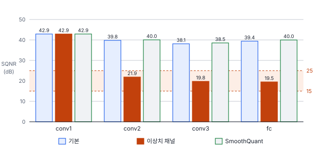
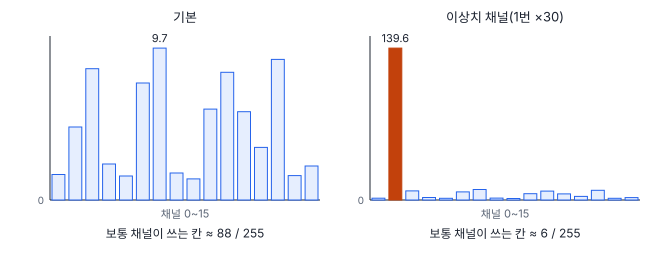
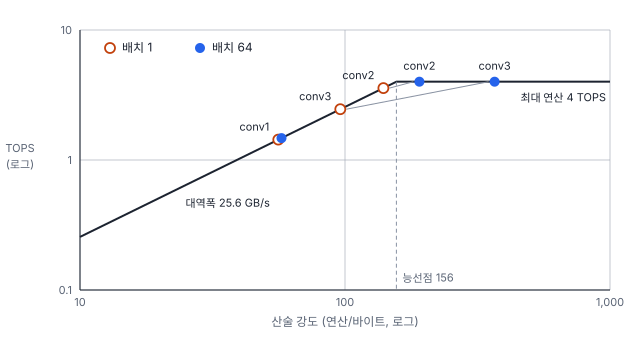

# 60강 하드웨어와 양자화 진단

## 이 강에서 얻는 것

- 학습 후 양자화의 손실을 층별 SQNR로 재고, 앞 층에서 쌓여 온 오차와 그 층의 오차를 나눠 볼 수 있음
- PAR과 채널 간 범위 비가 각각 무엇을 재는지 알고, per-tensor 활성 양자화를 망치는 이상치 채널을 SmoothQuant로 다룰 수 있음
- 루프라인으로 층이 메모리 한계인지 연산 한계인지 판정하고, 오퍼레이터 융합 결손도를 계산할 수 있음

## 1. 학습 후 양자화와 가짜 양자화

**학습 후 양자화(PTQ, post-training quantization)**는 학습이 끝난 모델을 재학습 없이, 보정 자료로 범위(축척·영점)만 정해 int8로 바꾸는 방식임(업계 표준). 50강에서 VD-CNN을 이렇게 바꿨더니 정확도가 그대로였음. 그런데 정확도가 떨어지면 어느 층이 원인인지 알아야 고칠 수 있음. Diagnostics 노트 06장이 이 진단을 다루며, 06장은 식과 처방만 정해 둔 **로드맵 단계**(진단 도구 미구현)임. 이 강의 실험은 이 자습서가 5부 VD-CNN(27강)에 직접 구현해 본 것이고, Diagnostics의 실제 구현물이 아님.

int8로 바꾸는 식은 두 가지임. **비대칭(아핀)**은 50강의 식으로, 범위 양 끝을 −128과 127에 맞춤.

$$s = \frac{x_{\max} - x_{\min}}{255}, \qquad z = \operatorname{round}\!\left(-128 - \frac{x_{\min}}{s}\right)$$

**대칭**은 영점을 0에 고정하고 절댓값 최대를 127에 맞춤(원문에는 이 식이 빠져 있음).

$$s = \frac{\max \lvert x \rvert}{127}, \qquad z = 0, \qquad q \in [-127, 127]$$

ReLU 뒤 활성처럼 0 이상인 값은 비대칭이 칸을 두 배로 씀. 가중치는 0을 중심으로 퍼져 대칭을 흔히 씀.

실험은 **가짜 양자화(fake quantization)**로 함. 값을 int8로 반올림·잘라 낸 뒤 곧바로 실수로 되돌려($\hat{x} = s(q - z)$) 계산을 이어 가는 방식으로, 정수 연산 장치 없이 양자화 오차만 그대로 흉내 냄. 가중치는 출력 채널마다 대칭, 각 층의 입력 활성은 층 전체에 축척 하나(**per-tensor**)로 비대칭, 범위는 학습 타일 500장의 최솟값~최댓값으로 정함. 시험 정확도는 fp32와 int8 모두 0.974(900장 중 877장)였음.

## 2. SQNR: 층마다 잡음을 dB로

**신호 대 양자화 잡음비(SQNR)**는 층 출력 $X_l$의 신호 전력을 양자화 전후 차이의 전력으로 나눠 dB로 나타낸 값임(통신 공학에서 온 업계 표준 지표).

$$\mathrm{SQNR}_l = 10 \log_{10} \frac{\mathbb{E}[X_l^2]}{\mathbb{E}\big[(X_l - \hat{X}_l)^2\big]}$$

10 dB 낮아지면 잡음 전력이 신호 대비 10배 커진 것임. 기본 모델은 conv1·conv2·conv3·fc가 42.9·39.8·38.1·39.4 dB였음. 원문 기준(잠정치)으로는 35 dB 이상이면 무시할 만하고, 25~35 dB는 허용 범위임. 혼합 정밀도(그 층만 FP16으로 남김) 대상의 기준은 원문 안에서 15 dB와 25 dB로 엇갈려, 여기서는 **대략 15~25 dB 아래**로 씀. 25 dB 쪽으로 잡으면 일찍·자주 걸려 손실을 빨리 막지만 FP16 층이 늘어 속도 이득이 줄고, 15 dB 쪽으로 잡으면 심한 층만 걸려 실제 손실을 놓칠 수 있음.

주의할 점은 이 SQNR이 **모든 층을 int8로 바꾼 모델**에서 잰 값이라 앞 층 오차가 쌓여 있다는 것임. 그래서 원문은 **단일 층 민감도**(흔히 쓰는 방법, 그 층만 int8, 나머지는 fp32로 두고 손실을 잼)로 범인을 가리게 함.

## 3. 무엇이 per-tensor 활성 양자화를 망치는가

일부러 이상치 채널을 만들어 봄. conv2 입력이 되는 1번 채널(앞 배치 정규화의 출력)을 30배 키우고 conv2 가중치의 그 채널을 30으로 나눔. ReLU·최대 풀링은 양의 배율과 순서를 바꿔도 같아서 fp32 출력은 그대로임(로짓 차이 최대 $1.4 \times 10^{-6}$). 그런데 int8 정확도는 0.942로 29장 줄었고, conv2 SQNR이 21.9 dB로 18 dB 떨어졌음. conv3·fc도 19.8·19.5 dB로 떨어졌지만, 하나씩만 int8로 바꾸면 conv3는 45.3 dB, fc는 51.3 dB로 멀쩡해 앞 층에서 물려받은 오차였음. conv2만 바꿨을 때는 21.9 dB, 정확도 0.939였음.

원인을 재는 지표가 둘임. **피크 대 평균비(PAR, peak-to-average ratio)**는 채널마다 절댓값 최대를 절댓값 평균으로 나눈 값임(신호 처리의 개념을 채널에 적용, 판정 기준 15는 Diagnostics의 잠정치).

$$\mathrm{PAR}_c = \frac{\max \lvert A_c \rvert}{\operatorname{mean} \lvert A_c \rvert}$$

**채널 간 범위 비**는 채널별 최댓값 가운데 가장 큰 것을 중앙값으로 나눈 값임(이 자습서에서 정함). PAR은 한 채널 **안**의 뾰족함이고, 채널 간 범위 비는 채널 **사이**의 차이임.

| conv2 입력 | PAR(최대) | 채널 간 범위 비 | conv2 SQNR (dB) | int8 정확도 |
|---|---|---|---|---|
| 기본 | 19.5 | 3.4 | 39.8 | 0.974 |
| 이상치 채널 | 19.5 | 51.3 | 21.9 | 0.942 |
| SmoothQuant | 19.5 | 2.7 | 40.0 | 0.974 |

PAR은 채널 하나의 최대와 평균을 같은 배율로 키우므로 30배를 해도 그대로임. 반면 per-tensor 축척은 가장 넓은 채널이 정함. 축척이 0.038에서 0.548로 14배 굵어져, 보통 채널(최댓값이 중앙값인 채널)이 255칸 중 88칸 쓰던 것이 6칸(약 2.6비트)으로 줄었음. 즉 이 실험에서 per-tensor 활성 양자화를 망친 것은 **채널 사이의 범위 차이**이고, 이는 PAR로는 보이지 않음. 원문은 PAR > 15를 이 징후로 보지만, 기본 모델도 conv2·conv3의 PAR이 19.5·24.4인데 손실이 없었음. PAR이 높다는 것은 채널 안에 드문 큰 값이 있다는 뜻이라, 범위를 최댓값까지 잡을지 일부를 잘라 낼지(반올림 잡음과 잘림 잡음의 균형)를 따질 신호에 가까움.

## 4. SmoothQuant: 어려움을 가중치로 옮김

활성에 채널마다 다른 축척을 주면 좋겠지만, 그 축척은 합성곱이 더하는 축(입력 채널)에 걸려 정수 누산 뒤 한 번에 되돌릴 수 없어 흔한 정수 행렬곱 커널이 지원하지 않음. 가중치는 출력 채널마다 축척을 줘도 되므로 쉬움. **SmoothQuant**(업계 표준, Xiao 외 2023)는 활성 채널 $j$를 $c_j$로 나누고 가중치에서 그 채널에 곱해지는 값($W_j$)에 같은 값을 곱해 출력을 그대로 둠.

$$Y = XW = \big(X\,\mathrm{diag}(c)^{-1}\big)\big(\mathrm{diag}(c)\,W\big), \qquad c_j = \frac{\max \lvert X_j \rvert^{\alpha}}{\max \lvert W_j \rvert^{1-\alpha}}$$

$\alpha$는 옮기는 강도로, 0.5면 활성과 가중치의 채널 범위가 같아짐. 원문은 비전 모델에 0.5가 최적이라 쓰지만 이 강은 0.5 하나만 써 봄. 나눗셈은 앞 배치 정규화에 미리 접어 넣어 추론 비용이 없음. 채널 간 범위 비가 2.7로 줄고 conv2 SQNR 40.0 dB, 정확도 0.974로 회복됐음. 재학습이 없으므로 처방 등급은 P2(51강) 성격이고, 양자화 인식 학습(50강)은 P1임. 원문 처방표의 P0·P1은 1차·2차 순서라 SmoothQuant가 P1에 있는데, 8부의 등급(조치 성격)과는 뜻이 다름.

## 5. 루프라인: 메모리 한계와 연산 한계

깊이별 분리 합성곱(30강)으로 연산량을 크게 줄여도 그만큼 빨라지지 않는 일이 흔함. **루프라인 모델(roofline model)**은 층의 **산술 강도** $I$(전송 1바이트당 연산 수)로 이를 설명함(업계 표준, Williams 외 2009).

$$P = \min\left(P_{\text{peak}},\; I \cdot B\right), \qquad I^* = \frac{P_{\text{peak}}}{B}$$

$P_{\text{peak}}$는 최대 연산 성능, $B$는 메모리 대역폭임. $I$가 **능선점** $I^*$보다 작으면 메모리 한계, 크면 연산 한계임. 단위를 맞추려고 int8 연산(곱·더하기를 각 1회, 2·MAC)과 바이트를 씀. 원문은 FLOPs/Byte와 int8 TOPS를 섞어 썼음.

가상 장치(최대 4 TOPS, 대역폭 25.6 GB/s, 실제 제품 수치 아님)의 능선점은 156임. 바이트는 입력·출력·가중치를 1바이트씩 한 번 옮긴다고 셈.

| 층 | 배치 1의 $I$ | 판정 | 배치 64의 $I$ | 판정 |
|---|---|---|---|---|
| conv1 | 56 | 메모리 | 58 | 메모리 |
| conv2 | 140 | 메모리 | 191 | 연산 |
| conv3 | 96 | 메모리 | 367 | 연산 |

배치가 커지면 가중치를 한 번 읽어 64장에 다시 쓰므로 $I$가 오름. conv3는 배치 1에서 바이트의 75%가 가중치라 크게 올랐고, conv1은 바이트 대부분이 활성이라 거의 그대로임. 원문 예시 장치(능선점 약 588)의 표는 3×3 합성곱($I$ 30~150)과 1×1 합성곱(15~60)을 연산 한계 쪽으로 적었지만, 정의상 메모리 한계임. 실제로는 캐시 때문에 전송량이 달라 배포 장비의 프로파일러로 확인함.

## 6. 오퍼레이터 융합 결손도

메모리 한계 층에서는 전송을 줄여야 빨라짐. 합성곱→배치 정규화→ReLU를 따로 실행하면 중간 텐서를 메모리에 썼다 다시 읽음. 이를 한 커널로 합치는 것이 융합이고, 50강에서 배치 정규화가 합성곱에 합쳐진 것도 그 예임. **오퍼레이터 융합 결손도(FDR, fusion deficiency ratio)**는 합치지 못해 생긴 낭비를 잼(프로젝트 정의).

$$\mathrm{FDR} = \frac{T_{\text{비융합}} - T_{\text{융합}}}{T_{\text{융합}}}$$

$T$는 메모리 전송량임. conv2 블록(배치 1)은 합치면 16,896바이트, 따로 하면 배치 정규화와 ReLU가 각각 출력 크기만큼 한 번씩 읽고 써 49,664바이트라 FDR은 1.94임. 원문은 FDR = 2.0을 "최대 300% 증가"라 썼지만, 정의상 트래픽 3배, 즉 **200% 증가**임. 처방표의 경고선 FDR > 1.0(트래픽 2배)은 잠정치임. 낮게 잡으면 사소한 비융합까지 걸려 손볼 곳이 늘고, 높게 잡으면 메모리 한계 층의 낭비를 늦게 찾음. 약어가 거짓 발견율(FDR, 4강)과 같아 보고서에는 풀어 씀.

## 현장에서는

드론에 실은 엣지 장치로 양식장 시설을 실시간 분할하려고 int8로 바꿨더니, 연무 장면에서 mIoU가 눈에 띄게 떨어진 상황임. 층별 SQNR을 뽑아 처음 급락한 층을 찾고, 단일 층 민감도로 그 층이 범인인지 확인함. 그 층 입력의 채널 간 범위 비가 크면 SmoothQuant, 아니면 그 층만 FP16으로 남김. 보정 자료에 연무 장면을 넣고 맑은·연무 장면을 따로 다시 잼. 실시간이라 배치 1이어서 메모리 한계 층이 많기 쉬우므로, 엔진이 합성곱·정규화·활성화를 합쳤는지 프로파일러로 확인함.

## 헷갈리는 쌍

- **PAR vs 채널 간 범위 비**: PAR은 한 채널 안의 최대/평균이라 채널 배율에 무관함. per-tensor 활성 양자화를 망치는 채널 사이의 차이는 채널 간 범위 비가 잡음.
- **가중치 채널별 양자화 vs 활성 채널별 양자화**: 가중치 축척은 출력 채널에 걸려 쉽게 되돌리고, 활성 축척은 더하는 축에 걸려 흔한 정수 커널이 지원하지 않음. 그래서 SmoothQuant가 필요함.
- **메모리 한계 vs 연산 한계**: 산술 강도가 능선점보다 낮으면 연산을 줄여도 빨라지지 않음. 같은 층도 배치에 따라 바뀜.
- **FDR(융합 결손도) vs FDR(거짓 발견율)**: 앞은 Diagnostics의 메모리 전송 지표, 뒤는 다중검정의 오류율(4강).

## 이렇게 지시받음

> 지시: "int8로 바꿨더니 정확도 3%p 빠졌어. 층별로 어디서 깨지는지 봐."

모든 층을 int8로 둔 채 층별 SQNR을 뽑고, 처음 크게 떨어진 층부터 단일 층 민감도로 확인하라는 뜻임. 뒤 층들의 낮은 SQNR은 물려받은 오차일 수 있음. 범인 층 입력의 채널 간 범위 비와 PAR을 같이 보고함.

> 지시: "SQNR 25 dB 밑인 층은 FP16으로 빼."

원문 기준 가운데 엄격한 쪽(15~25 dB 범위의 위 끝)을 쓰겠다는 뜻임. FP16 층 수와 그만큼 줄어든 속도 이득, 회복된 정확도를 함께 표로 남기고, 너무 많이 걸리면 SmoothQuant나 보정 범위 조정을 먼저 검토함.

> 지시: "연산량 반으로 줄인 모델이 왜 안 빨라져? 루프라인으로 봐."

층마다 산술 강도를 계산해 배포 장비의 능선점과 비교하라는 뜻임. 메모리 한계 층이 많으면 연산량보다 전송량이 시간을 정하므로, 배치·융합·텐서 형식을 먼저 봄. 장비 수치는 그 제품의 사양서로 다시 셈.

## 요약

- PTQ는 재학습 없이 보정 자료로 범위만 정함. 비대칭은 최소~최대를, 대칭은 영점 0과 절댓값 최대를 씀
- 층별 SQNR은 모든 층을 int8로 둔 값이라 앞 층 오차가 쌓임. 단일 층 민감도로 범인 층을 가림. 혼합 정밀도 기준은 대략 15~25 dB(잠정치)
- 이상치 채널 실험에서 per-tensor 활성 양자화를 망친 것은 채널 사이의 범위 차이였음. PAR은 채널 배율에 무관해 이를 못 봄
- SmoothQuant는 채널 배율 $c_j$로 활성의 어려움을 가중치로 옮겨 출력은 그대로 두고 회복함(재학습 없음)
- 루프라인은 산술 강도와 능선점으로 메모리·연산 한계를 가르고, 배치로 판정이 바뀜. FDR = 2.0은 트래픽 200% 증가임

## 핵심 용어

| 한글 | 영문 |
|---|---|
| 학습 후 양자화 | Post-Training Quantization (PTQ) |
| 가짜 양자화 | Fake Quantization |
| 대칭 / 비대칭 양자화 | Symmetric / Asymmetric (Affine) Quantization |
| 텐서 단위 / 채널 단위 양자화 | Per-Tensor / Per-Channel Quantization |
| 신호 대 양자화 잡음비 | Signal-to-Quantization-Noise Ratio (SQNR) |
| 단일 층 민감도 | Single-Layer Sensitivity |
| 혼합 정밀도 | Mixed Precision |
| 피크 대 평균비 / 채널 간 범위 비 | Peak-to-Average Ratio (PAR) / Inter-Channel Range Ratio |
| 스무스퀀트 | SmoothQuant |
| 루프라인 모델 / 산술 강도 / 능선점 | Roofline Model / Arithmetic Intensity / Ridge Point |
| 메모리 한계 / 연산 한계 | Memory-Bound / Compute-Bound |
| 오퍼레이터 융합 결손도 | Fusion Deficiency Ratio (FDR) |
