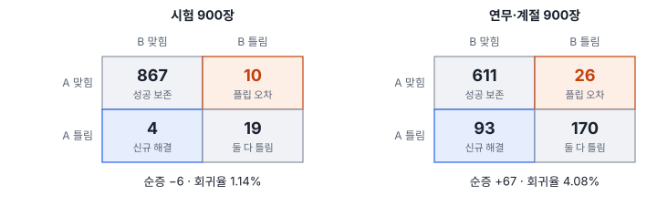
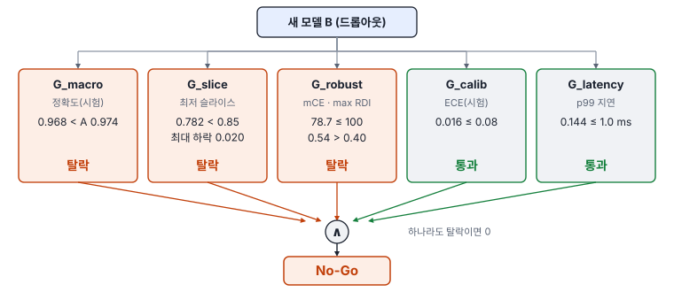
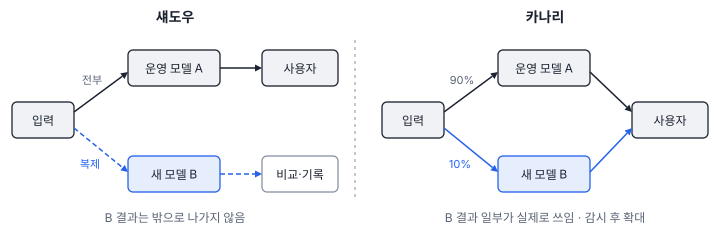

# 61강 배포 게이트와 MLOps

## 이 강에서 얻는 것

- 새 모델이 운영 모델을 대신해도 되는지를 다섯 게이트의 논리곱으로 판정하고, 어느 게이트가 막았는지 읽을 수 있음
- 오차 상속 행렬로 플립 오차와 회귀율을 세어, 평균이 오른 업데이트에서도 잃은 것을 찾을 수 있음
- 예외 승인, 섀도우·카나리 배포, 꼬리 지연시간으로 배포 전후의 위험을 나눠 관리할 수 있음

## 1. 평균이 올랐으니 바꾸자?

**MLOps**는 모델의 학습·검증·배포·감시를 소프트웨어 배포처럼 자동화하고 기록하는 운영 방식임. 소프트웨어에서는 시험을 통과하지 못한 빌드가 나가지 않도록 **품질 게이트(quality gate)**를 둠(업계 관행). Diagnostics 노트 09장은 이 생각을 8부의 진단 지표와 엮어, "전체 mAP가 올랐으니 교체"라는 판단을 다섯 관문으로 나눔. 09장은 노트 스스로 **로드맵 단계**(지표 정의만 있고 파이프라인은 미구현)라고 밝힌 장이고, 이 강의 실험은 그 정의를 작은 가상 자료로 직접 구현해 본 것임.

두 모델은 운영 중이라고 가정한 **A**(5부 VD-CNN, 27강)와 교체 후보 **B**(드롭아웃 0.3으로 다시 학습한 VD-CNN, 55강)임. 시험 타일 900장에서는 A 0.974, B 0.968이고, 같은 타일에 연무·계절 변화를 넣은 연무·계절 시험(48강)에서는 A 0.708, B 0.782로 B가 7.4%p 높음. 연무가 잦은 철을 앞두고 있다면 바꾸고 싶어지는 숫자임.

## 2. 오차 상속 행렬과 플립 오차

평균 두 개만 비교하면 "무엇을 맞히다 틀리게 되었나"가 보이지 않음. **오차 상속 행렬(error inheritance matrix)**(프로젝트 정의)은 표본마다 A와 B의 정답 여부를 짝지어 2×2로 셈. $N_{11}$은 둘 다 맞힘, $N_{10}$은 A만 맞힘, $N_{01}$은 B만 맞힘(신규 해결), $N_{00}$은 둘 다 틀림임. 탐지에서는 정답 객체 하나하나를 셈.

$N_{10}$이 **플립 오차(negative flip)**임. 운영자에게는 "어제까지 잡던 것을 오늘 못 잡는" 일이라 평균이 올라도 신뢰를 깎음. 노트는 이를 **회귀율(regression rate, RR)**로 정리함(프로젝트 정의).

$$\Delta N_{\text{net}} = N_{01} - N_{10}, \qquad \mathrm{RR} = \frac{N_{10}}{N_{11} + N_{10}} \times 100\,[\%]$$

순증은 새로 맞힌 수에서 잃은 수를 뺀 것이고, 회귀율은 A가 맞히던 것 가운데 B가 잃은 비율임. 연구에서는 분모를 전체 표본 수로 둔 negative flip rate도 쓰므로 기준을 옮길 때 분모를 확인함. 약어 RR은 통계의 상대위험(relative risk)과도 겹침.



시험 자료에서는 4장을 새로 맞히고 10장을 잃어 순증 −6(−0.67%p), 회귀율 1.14%임. 연무·계절 자료에서는 93장을 새로 맞혔는데 26장(수계 10, 시가지 9, 산림 7)을 잃어, 순증 +67(+7.44%p)과 회귀율 4.08%가 함께 나옴. **평균이 크게 올라도 예전에 맞히던 표본을 틀리는 일은 따로 생김.**

원문 기준은 회귀율 2% 이하 허용, 5% 초과면 평균이 올라도 거부(잠정치)인데 **2~5% 사이의 처리가 없음**. 4.08%가 바로 이 공백에 떨어짐. 이 자습서에서는 이 구간을 "검토 구간"으로 두어 $N_{10}$ 표본을 열어 원인을 찾고 사람이 판정하게 함. 기준을 낮게(1% 안팎) 잡으면 잡음 수준의 흔들림에도 교체가 자주 막히고, 높게(5% 이상) 잡으면 한 클래스를 통째로 잊어도 통과함.

안전 필수 클래스는 $N_{10}^{\text{critical}} = 0$(한 건도 불허)으로 둠. 수계 지도가 침수 판단에 쓰여 수계를 필수로 정했다면 시험 3장, 연무·계절 10장이 걸려 바로 차단됨. 원문은 $N_{10}$의 원인을 앞 진단으로 되짚게 함: NMS에서 지워졌는지(53강), 소형 객체(넓이 1,024화소² 미만)에 몰렸는지(52강), 배경이 바뀌어 확신이 떨어졌는지(59강).

$N_{10}$과 $N_{01}$은 두 모델을 같은 표본으로 비교하는 **맥니마 검정**(McNemar, 업계 표준)의 재료이기도 함. 시험 자료의 10 대 4는 정확 검정 p = 0.18이라, 0.67%p 하락은 우연과 구별되지 않음(17강).

## 3. 종합 배포 적격성 판정식

노트의 **종합 배포 적격성 판정식**(프로젝트 정의)은 다섯 게이트를 모두 통과해야 1(Go)이 되는 논리곱임.

$$\text{Gate} = \mathbb{I}\left(G_{\text{macro}} \land G_{\text{slice}} \land G_{\text{robust}} \land G_{\text{calib}} \land G_{\text{latency}}\right)$$

$\mathbb{I}$는 괄호 안이 참이면 1, 거짓이면 0이고 $\land$는 "그리고"임. 이 예제는 mAP 대신 정확도를, 슬라이스로 클래스 6개와 연무·계절 시험을 씀.

| 게이트 | 지표 | 기준 범위(잠정치) | 이 예제 기준 | B 값 | 판정 |
|---|---|---|---|---|---|
| $G_{\text{macro}}$ | 전체 성능 | A 이상 | A 0.974 이상 | 0.968 | 탈락 |
| $G_{\text{slice}}$ | 최저 슬라이스 / A 대비 최대 하락 | 최저선 τ(원문 예 mAP 0.35) / 0.03 안팎 | 0.85 / 0.03 | 0.782 / 0.020 | 탈락 |
| $G_{\text{robust}}$ | mCE / 최대 RDI | 100 이하 / 0.35~0.40 이하 | 100 / 0.40 | 78.7 / 0.54 | 탈락 |
| $G_{\text{calib}}$ | ECE | 0.08~0.12 이하 | 0.08 | 0.016 | 통과 |
| $G_{\text{latency}}$ | p99 지연 / 최대 메모리 | 요구 시간(원문 예 25 ms) / 장비 메모리 이하 | 1.0 ms | 0.144 ms | 통과 |

원문 09장은 강건성을 "min RDI ≥ 0.60"으로 썼는데, RDI(57강)는 하락률이라 방향이 반대임. 유지율 $1 - \mathrm{RDI} \ge 0.60$을 뜻한 것으로 보고 **max RDI ≤ 0.40**으로 고쳐 씀. ECE 범위는 게이트 0.08과 처방 엔진의 0.10·0.12를, RDI 범위는 51강 처방 규칙을 따름. 기준을 엄하게 잡으면 교체가 자주 막혀 재학습 비용이 늘고, 느슨하게 잡으면 퇴보한 모델이 섞여 나감.

```json
"gates": {"G_macro": false, "G_slice": false, "G_robust": false,
          "G_calib": true, "G_latency": true},
"decision": "No-Go"
```



연무·계절에서 크게 올랐는데도 막힌 이유는 셋임. $G_{\text{macro}}$는 시험 정확도가 0.67%p 낮아 탈락함. 앞의 검정으로는 우연과 구별 안 되는 차이지만 판정식에 허용 폭이 없음. $G_{\text{slice}}$는 연무·계절 슬라이스가 0.708 → 0.782로 가장 많이 오른 곳인데도 최저선 0.85에 못 미쳐 탈락함. 최저선은 A와의 비교가 아니라 절대 기준이라 "나아졌나"가 아니라 "쓸 만한가"를 물음. $G_{\text{robust}}$는 가림·중첩(OCC)의 RDI가 0.54라 탈락함. mCE는 기준 안이지만 A의 69.2보다 나빠져, 연무·계절에 강해진 것이 교란 전반의 강건성으로 이어지지 않았음. 이유는 이 실험만으로는 가릴 수 없음.

A도 최저 슬라이스 0.708, 최대 RDI 0.578이라 같은 절대 기준을 넘지 못함. 운영 모델도 못 넘는 기준이면 기준이 모델 규모에 맞는지부터 따짐. $G_{\text{calib}}$도 시험 자료로 잰 값이고 A의 연무·계절 ECE는 0.203(55강)이라, 어느 자료로 재느냐에 따라 통과가 바뀜. 그래서 어느 자료로 게이트를 잴지는 결과를 보기 전에 정함(4강의 p-해킹과 같은 이유).

## 4. 게이트 예외 승인 절차

엄격한 논리곱은 지연이 조금 넘었지만 성능이 크게 오른 모델까지 버림. 노트의 **게이트 예외 승인 절차(gate waiver protocol)**(프로젝트 정의)는 게이트를 둘로 나눔.

- **Hard 게이트**(예외 불가): 전체 성능 하락, 안전 필수 클래스 $N_{10} > 0$, 메모리 초과(실행이 죽음)
- **Soft 게이트**(심의 가능): 지연 소폭 초과(+15%까지, 성능 +0.03 이상일 때), ECE 초과(온도 스케일링 재조정 조건), 비핵심 슬라이스 소폭 하락(영향 자료 5% 미만)

Soft만 걸렸으면 이득을 수치로 보이고 조건을 붙여 책임자가 서명하면 조건부 배포(Conditional Go)가 됨. 다만 이 표는 판정식과 일대일로 맞지 않음. $G_{\text{robust}}$는 어느 쪽에도 없고, 안전 필수 $N_{10}$은 다섯 항 밖이며, 핵심 슬라이스 하락의 소속도 밝히지 않음. 이 자습서에서는 소속이 정해지지 않은 항목을 Hard처럼 다루는 편이 안전하다고 봄.

B는 Hard인 $G_{\text{macro}}$에서 탈락해 심의 대상이 아님. 길은 예외가 아니라 처방임. 51강 처방 엔진에 넣으면 최대 RDI 0.54가 규칙 범위를 넘어, 가림을 겨냥한 증강이 P1(재학습이 필요한 조치)으로 나옴. 원문의 CI 예시는 지연 기준 인자가 없고 회귀율을 2%에서 끊어, 판정식과 항목을 하나씩 맞춰 써야 함.

## 5. 섀도우·카나리 배포와 꼬리 지연시간

게이트를 통과해도 현장 자료는 계속 변함. **섀도우 배포(shadow deployment)**는 실제 입력을 복제해 B에도 넣되 결과를 내보내지 않고 A와 비교·기록만 함. 사용자 영향이 없지만 계산이 두 배이고, B 결과가 실제로 쓰였을 때의 반응은 못 봄. **카나리 배포(canary deployment)**는 입력 일부(원문 예 10%)를 B가 실제로 처리해 내보내고, 이상이 없으면 비율을 늘려 전면 전환함(원문 예: 48시간 이상이 없으면 100%). 둘 다 업계 표준이고, 원문 도식은 둘을 한 분기로 그렸지만 결과를 내보내느냐가 다름.



감시 지표는 두 모델의 예측 일치율, 입력 특성 분포의 $W_1$(54강, 원문 경고선 0.25는 특성의 척도를 정하지 않아, 쓰려면 표준화한 특성 기준으로 다시 정해야 함), 예측 확률 엔트로피 급증($\Delta H$ 0.4 초과)임. 이상이 보이면 B로 가는 몫을 0%로 되돌리고, 이상 입력을 떠 두고, 진단을 돌려 원인과 재학습 자료를 넘김.

**꼬리 지연시간(tail latency)**은 지연 분포의 위쪽 꼬리이고, p99는 요청의 99%가 끝나는 시간임(업계 표준). B를 ONNX로 내보내(50강) onnxruntime CPU 1스레드, 배치 1로 2,000번 잰 결과임. 이 실행 환경 기준이라 장비가 바뀌면 달라지고, 같은 장비에서도 잴 때마다 흔들림(50강).

| p50 | p95 | p99 | 최대 | 평균 |
|---|---|---|---|---|
| 0.080 ms | 0.121 ms | 0.144 ms | 0.211 ms | 0.084 ms |

평균은 0.084 ms로 중앙값과 비슷하지만 p99는 중앙값의 1.8배, 최대는 2.6배임. 2,000번이면 p99 위에 약 20번만 놓이므로, 꼬리를 안정되게 보려면 그보다 많이 잼. 원문 기준은 대상 장비에서 INT8·FP16으로 컴파일해 잰 p99 25 ms(40 FPS) 이하이고, 1.0 ms는 이 작은 모델에 맞춘 잠정치임. 드론 영상처럼 프레임마다 마감이 있으면 p99를, 장면 일괄 처리는 처리량(50강)을 봄.

## 6. 진단에서 배포까지: 8부를 마치며

50강이 모델을 내보내 재는 법이었다면 이 강은 그 숫자로 교체를 결정하는 법이고, No-Go가 나면 51강의 처방 엔진으로 돌아감. 8부의 진단은 모두 게이트의 어느 항으로 들어감. 오차 분해와 슬라이스(52~54강)는 $G_{\text{macro}}$·$G_{\text{slice}}$와 $N_{10}$의 원인 추적에, 신뢰도(55강)는 $G_{\text{calib}}$에, 환경 교란(57강)은 $G_{\text{robust}}$에, 하드웨어(60강)는 $G_{\text{latency}}$에, 표현·센서·인과(56·58·59강)는 탈락 원인을 좁히는 데 쓰임. 진단은 "얼마나 좋은가"보다 "어디서 왜 나쁜가"를 묻고, 게이트는 그 답을 배포 결정으로 바꾸는 마지막 단계임. 기준값은 모두 잠정치라 데이터 규모·재학습 비용·배포 주기에 맞춰 다시 정함.

## 현장에서는

분기마다 갱신하는 토지피복도의 분류 모델을 바꾸려는 상황임. 새 모델을 한 분기 섀도우로 돌려 기존 지도와 클래스별 면적 차이와 $N_{10}$을 표로 냄. 침수 분석에 쓰이는 수계를 필수 클래스로 정해 두어, 수계 $N_{10}$이 한 건이라도 나오면 표본을 열어 원인을 찾기 전까지 교체하지 않음. 게이트를 통과하면 몇 개 시군에만 카나리로 납품해 민원과 일치율을 보고, 산출물 메타데이터(50강)에 모델 버전을 적어 면적 변화가 모델 교체 때문인지 가림.

## 헷갈리는 쌍

- **섀도우 vs 카나리**: 섀도우는 새 모델 결과를 내보내지 않고 비교만, 카나리는 일부를 실제로 내보냄. 섀도우는 안전하지만 실제 사용 반응을 못 봄.
- **회귀율 vs 정확도 하락**: 정확도가 7.44%p 올라도 회귀율은 4.08%였음. 회귀율은 잃은 것만 셈.
- **Hard vs Soft 게이트**: Hard는 예외 없이 차단, Soft는 이득을 보이고 서명하면 조건부 배포 가능함.
- **평균 지연 vs p99**: 평균은 가끔 튀는 지연을 가려 버리고, p99는 100번 중 가장 느린 1번의 수준을 보여 줌.

## 이렇게 지시받음

> 지시: "새 모델 정확도 올랐으면 바로 올려."

전체 정확도 하나로 교체하지 말고 다섯 게이트 판정과 오차 상속 행렬을 함께 내라는 뜻으로 받음. 어느 자료(시험, 연무·계절)로 잴지를 먼저 정하고, 탈락한 게이트와 회귀율, 클래스별 $N_{10}$을 표로 붙임.

> 지시: "업데이트하고 나서 예전에 잘 잡던 양식장을 놓친대. 플립 뽑아 봐."

정답 객체마다 두 모델의 탐지 여부를 짝지어 $N_{10}$ 목록을 뽑음. NMS에서 지워졌는지, 작은 시설에 몰렸는지, 배경이 다른 곳인지로 나눠 원인을 보고함.

> 지시: "p99가 기준을 조금 넘었는데 성능이 많이 올랐으니 예외로 올려."

Soft 게이트 예외 심의임. 다른 게이트를 모두 통과했는지, 초과폭이 15% 안인지, 성능 이득이 0.03 이상인지 확인하고, p99를 대상 장비에서 다시 재어 서명과 함께 기록함.

## 요약

- 종합 배포 적격성 판정식은 거시 성능·최저 슬라이스·강건성(max RDI ≤ 0.40)·보정·지연 다섯 게이트의 논리곱이고, 기준은 모두 범위로 둔 잠정치임
- 오차 상속 행렬의 $N_{10}$이 플립 오차이고, 회귀율은 A가 맞히던 것 중 잃은 비율임. 2~5% 구간은 원문이 정하지 않음
- 실험에서 B는 연무·계절 정확도가 7.4%p 올랐지만 회귀율 4.08%였고, 거시 성능·최저 슬라이스·강건성 게이트에서 막혀 No-Go였음
- Hard 게이트는 예외 없이 막고 Soft 게이트만 조건부 배포를 심의함. 원문 분류는 판정식과 다 맞지 않음
- 섀도우는 비교만, 카나리는 일부를 실제로 내보내며, 지연은 평균이 아니라 대상 장비의 p99로 봄

## 핵심 용어

| 한글 | 영문 |
|---|---|
| 품질 게이트 | Quality Gate |
| 종합 배포 적격성 판정식 | Go/No-Go Deployment Gate Function |
| 게이트 예외 승인 절차 | Gate Waiver Protocol |
| 오차 상속 행렬 | Error Inheritance Matrix |
| 플립 오차 | Negative Flip (Flipped-FN) |
| 회귀율 | Regression Rate (RR) |
| 맥니마 검정 | McNemar's Test |
| 섀도우 배포 / 카나리 배포 | Shadow / Canary Deployment |
| 꼬리 지연시간 | Tail Latency (P99) |
